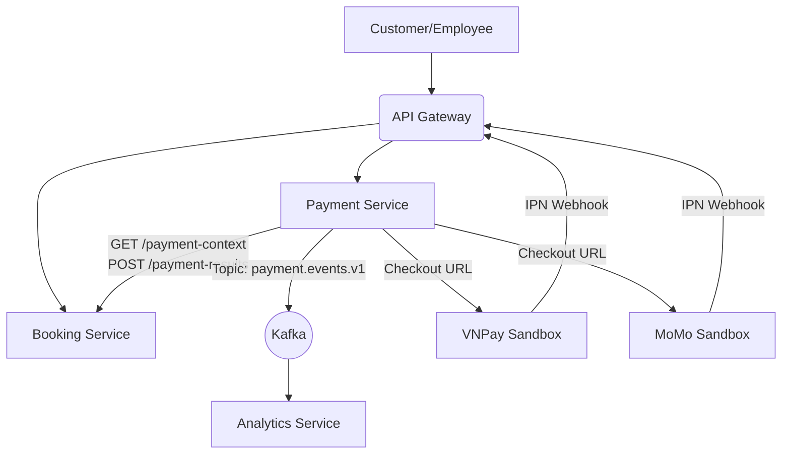
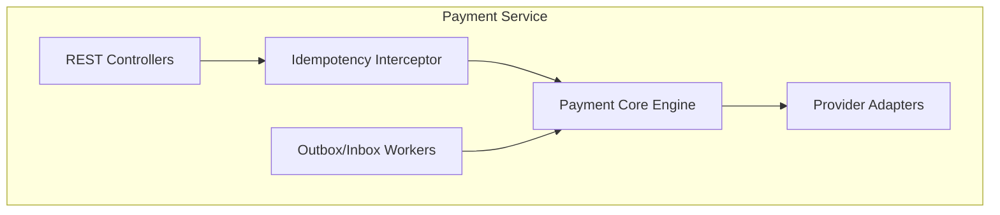
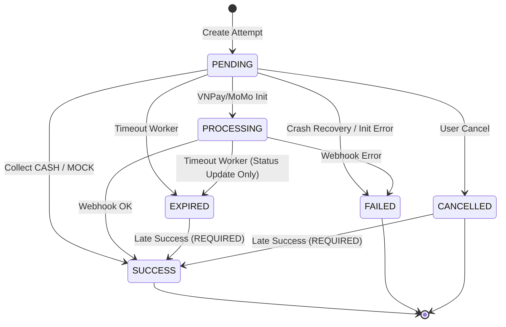
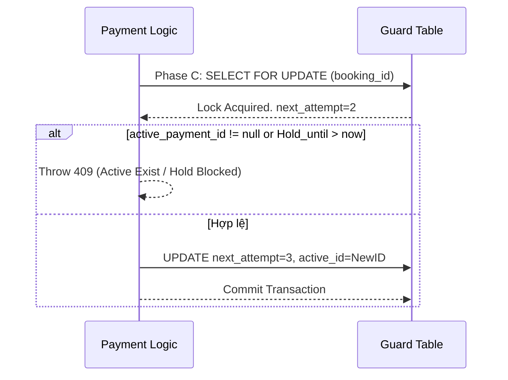
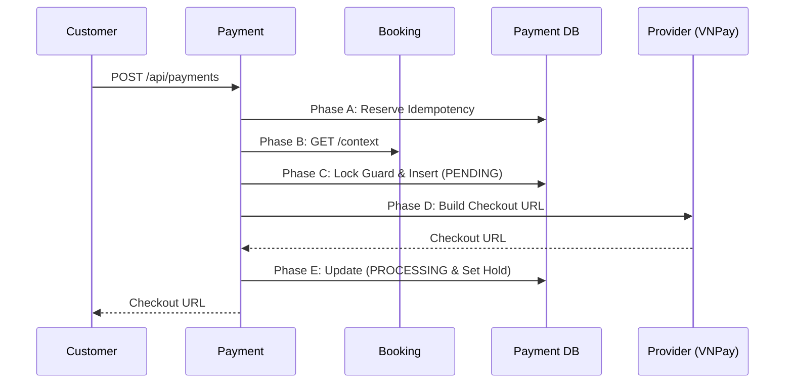
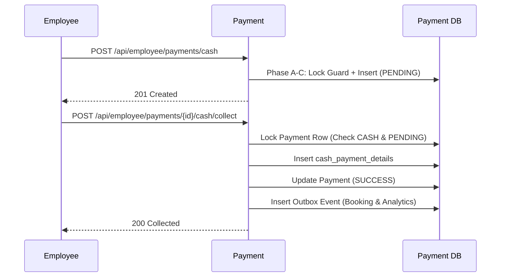
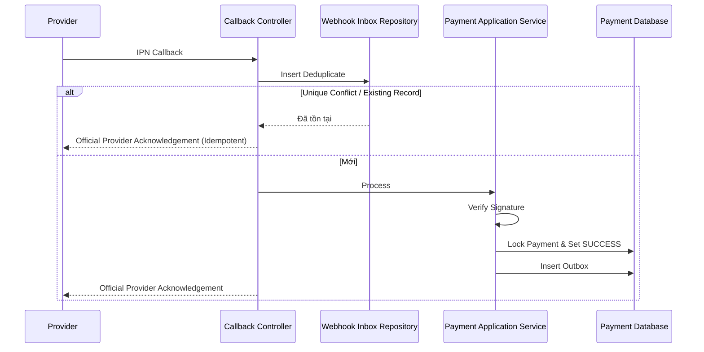
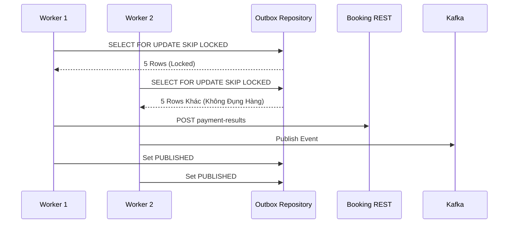

# LoraFilm Payment Service
# Software Requirements Specification & Architecture Design

## 1. Document Control
| Field | Value |
|---|---|
| Project | LoraFilm |
| Service | payment-service |
| Document Type | SRS & Architecture Specification |
| Service Owner | Dương Thiện Nhân |
| Contract Owner | Dương Thiện Nhân |
| Related Issue | #156 |
| Related Roadmap | #155 |
| Reviewed Branch | docs/payment-architecture-contracts |
| Reviewed Commit | 5878fd088a935405da303ff28a7329fa796c54c1 |
| Release | Product Release 1 |
| Status | PROPOSED — READY FOR REVIEW |
| Last Updated | 2026-07-03 |
| Language | Vietnamese |
| Source of Truth | latest develop source + approved contracts |

**Revision History**:
| Version | Date | Author | Change | Status |
|---|---|---|---|---|
| 1.0 | 2026-07-03 | Dương Thiện Nhân | Targeted Final Corrections | PROPOSED |

## 2. Table of Contents
- [1. Document Control](#1-document-control)
- [2. Table of Contents](#2-table-of-contents)
- [3. Executive Summary](#3-executive-summary)
- [4. Current State Evidence & Readiness Summary](#4-current-state-evidence--readiness-summary)
- [5. Introduction](#5-introduction)
- [6. Product Context](#6-product-context)
- [7. Service Responsibility Boundary](#7-service-responsibility-boundary)
- [8. Product Release 1 Scope](#8-product-release-1-scope)
- [9. Business Rules](#9-business-rules)
- [10. Functional Requirements](#10-functional-requirements)
- [11. Non-Functional Requirements](#11-non-functional-requirements)
- [12. Security Requirements](#12-security-requirements)
- [13. Domain Model](#13-domain-model)
- [14. Payment State Machine](#14-payment-state-machine)
- [15. Multiple-Attempt and Guard Design](#15-multiple-attempt-and-guard-design)
- [16. Detailed Method Flows](#16-detailed-method-flows)
- [17. Booking Integration](#17-booking-integration)
- [18. Persistent Idempotency](#18-persistent-idempotency)
- [19. Webhook Inbox](#19-webhook-inbox)
- [20. Transactional Outbox](#20-transactional-outbox)
- [21. CASH Counter Requirements](#21-cash-counter-requirements)
- [22. Analytics Requirements](#22-analytics-requirements)
- [23. API Requirements Summary](#23-api-requirements-summary)
- [24. Data Requirements](#24-data-requirements)
- [25. Physical Database Design](#25-physical-database-design)
- [26. Error Model](#26-error-model)
- [27. Observability and Audit](#27-observability-and-audit)
- [28. Deployment and Configuration Requirements](#28-deployment-and-configuration-requirements)
- [29. Testing Requirements](#29-testing-requirements)
- [30. Architecture Decision Records](#30-architecture-decision-records)
- [31. Issue and Requirement Traceability](#31-issue-and-requirement-traceability)
- [32. Acceptance Criteria](#32-acceptance-criteria)
- [33. Open Verification Items](#33-open-verification-items)

## 3. Executive Summary
Tài liệu định nghĩa kiến trúc lõi, API Contracts, Database Schema cho Payment Service của hệ thống LoraFilm. Hệ thống Payment được tách biệt hoàn toàn khỏi Booking Service nhằm đảm bảo phân định rõ trách nhiệm tài chính, kiểm soát xử lý ngoại lệ đồng thời, và giảm thiểu rủi ro thất thoát doanh thu kép (Double Charge). Dịch vụ hỗ trợ VNPAY, MOMO, CASH và cấu trúc tự động phát hành kết quả (Outbox Pattern) với Idempotency chặt chẽ.

## 4. Current State Evidence & Readiness Summary

### Phân loại Evidence
- **STATIC EVIDENCE**: Dấu hiệu tĩnh (File mã nguồn, cấu hình hoặc chú thích đang tồn tại trên nhánh). Không khẳng định tính đúng đắn khi runtime.
- **CURRENT AND VERIFIED**: Bằng chứng runtime đã được kiểm chứng thông qua việc thực thi lệnh thành công (Unit/Integration Test Pass).
- **PROPOSED DECISION**: Lựa chọn kiến trúc nằm trên bản thảo chờ duyệt, chưa có mã nguồn vật lý.
- **REQUIRES VERIFICATION**: Nội dung logic cần đội ngũ lập trình viên kiểm chứng thực tế tại môi trường vận hành (Runtime).
- **REQUIRES OFFICIAL PROVIDER DOCUMENT VERIFICATION**: Yêu cầu bắt buộc phải trích xuất tham số từ tài liệu chính hãng của nhà cung cấp dịch vụ (VNPay/MoMo) trước khi code.

### Nguồn kiểm chứng
- Nhánh mã nguồn: `develop` + `docs/payment-architecture-contracts`
- Lớp vỏ chuẩn hóa API: `ApiResponse.java` (STATIC EVIDENCE)
- Swagger Security Config: Đã thiết lập qua JWT Bearer (CURRENT AND VERIFIED trong Auth/Booking Service)

### Readiness Summary
| Hạng mục / Dịch vụ | Mức độ hoàn thiện (Readiness) |
|---|---|
| **Payment Service (Docs)** | APPROVE-READY (Thiết kế hoàn thiện). |
| **Payment Core Code** | PROPOSED DECISION (Sẽ thi công từ Issue #157). |
| **Booking Service API** | PROPOSED DECISION (Chưa thi công internal API Context & Result). |
| **Gateway Routing** | REQUIRES VERIFICATION (Cần đảm bảo Block các Endpoint nội bộ và MOCK profile trên Prod). |
| **Auth/Security JWT** | CURRENT AND VERIFIED (Nền tảng Token phân quyền đã được nghiệm thu #152). |
| **Database Migration** | PROPOSED DECISION (Áp dụng Flyway theo Issue #157). |

## 5. Introduction
Tài liệu là hợp đồng kiến trúc (Architecture Contract) chính thức, thay thế cho mọi cuộc thảo luận không chính thống trước đó. Dành cho lập trình viên Payment, Booking, kiểm thử viên (QA) và Reviewer.

**Glossary**:
| Thuật ngữ | Ý nghĩa |
|---|---|
| Payment | Một nỗ lực (attempt) thanh toán cụ thể |
| Booking Guard | Cơ chế khóa Row trong Database nhằm giới hạn truy cập đồng thời |
| Idempotency Key | UUID cung cấp từ Client để chống lặp request |
| Webhook Inbox | Bảng tiếp nhận và kiểm soát trùng lặp dữ liệu IPN ngoại vi |
| Transactional Outbox | Pattern lưu Event cần phát hành CÙNG transaction đổi Status |
| Settlement Hold | Thời gian chờ khóa không cho tạo Attempt mới khi Attempt cũ đang xử lý online |
| Analytics Snapshot | Bảng lưu Data vé không đổi từ Booking |
| Provider Order ID | Mã tham chiếu đơn hàng nội bộ gửi sang Provider |
| External Transaction ID | Mã tham chiếu giao dịch độc nhất từ Provider trả về |

## 6. Product Context
**Actors**:
| Tác nhân | Vai trò |
|---|---|
| CUSTOMER | Khách hàng khởi tạo Checkout Online |
| EMPLOYEE | Nhân viên phòng vé xử lý thu tiền mặt |
| ADMIN | Quản trị viên tra cứu, rà soát nghiệp vụ |
| Booking Service | Quản lý giỏ hàng và ghế ngồi |
| Analytics Service | Dịch vụ tổng hợp doanh thu |
| VNPay / MoMo | Đối tác thanh toán thẻ/ví điện tử |
| Operations Reviewer | Nhân viên Kế toán đối soát thủ công các lỗi ngoại lệ |

**System Context Diagram**:

## 7. Service Responsibility Boundary
| Item | Trách nhiệm |
|---|---|
| Owned by Payment | Vòng đời Attempt, Idempotency, Webhook Inbox, Outbox Notification, Tiền thừa CASH, Snapshot doanh thu, Settlement Hold |
| Owned by Booking | Vòng đời ghế, Giá trị Amount ủy quyền, Chủ sở hữu Booking |
| Owned by Gateway/Auth | Chặn IP, Decode JWT lấy UserId |
| Owned by Analytics | Tổng hợp bảng doanh thu theo thời gian thực |
| Owned by Provider | Trạng thái cuối cùng (Authoritative) của tiền tệ Online |
| Explicitly not owned by Payment | Giữ ghế, tự sửa vé, tính toán số lượng tiền (Phải lấy từ Booking) |

**Domain Component Diagram**:

## 8. Product Release 1 Scope
- **Included**: MOCK (dev/test only profile), CASH (Employee/Admin), VNPAY (Sandbox), MOMO (Sandbox). Tích hợp Inbox, Outbox, Persistent Idempotency.
- **Deferred**: Refund (Hoàn tiền), Credit Card Direct, Installments (Trả góp).
- **Provider verification dependencies**: Cần tham chiếu tài liệu hãng về Callback Endpoint HTTP Method, Cấu trúc Acknowledgement, Tham số Hash của VNPay/MoMo (REQUIRES OFFICIAL PROVIDER DOCUMENT VERIFICATION).

## 9. Business Rules
| ID | Business Rule | Rationale | Related Issues |
|---|---|---|---|
| BR-001 | 1 Booking chỉ được có duy nhất 1 Active Payment Attempt (PENDING/PROCESSING). | Giảm rủi ro hệ thống bị charge tiền kép. | #159 |
| BR-002 | Booking có thể sở hữu nhiều Historical terminal attempts (SUCCESS, FAILED, CANCELLED, EXPIRED). | Hỗ trợ User thử lại thanh toán nếu trước đó thất bại. | #159 |
| BR-003 | Tổng tiền thanh toán (Amount) tuyệt đối lấy từ `GET /payment-context` của Booking Service. | Ngăn chặn rủi ro Request Tampering (Làm giả Amount). | #158 |
| BR-004 | Một Attempt đã vào Terminal State thì không bao giờ được phép quay ngược lại PENDING. | Đảm bảo tính nhất quán của luồng State Machine. | #159 |
| BR-005 | Trách nhiệm phát hành thông báo chốt vé Booking thuộc về luồng nội bộ Outbox Worker. | Đảm bảo tính đồng nhất trạng thái hệ thống. | #161, #158 |
| BR-006 | Phải ghi nhận sự kiện Late Success (Thành công từ Provider nhưng Payment cũ đã EXPIRED/CANCELLED cục bộ). | Bảo vệ quyền lợi tài chính hợp lệ. | #161 |
| BR-007 | Nếu Late Success xảy ra, trạng thái Attempt cũ cập nhật thành SUCCESS, bật cờ `reconciliationStatus = REQUIRED`. | Báo hiệu có dữ liệu ngoại lệ cần kiểm toán thủ công. | #169 |
| BR-008 | (Late Success vs Newer Attempt) Dù Late Success bị ghi nhận `REQUIRED`, thông báo Result vẫn được phát hành tới Booking. Nếu Booking đã bị confirm bởi Newer attempt, Booking giữ vé, trả kết quả HTTP 200 (ALREADY_CONFIRMED). Không sinh vé đúp, không tự Refund. | Tránh hệ lụy vé kép và vòng lặp Refund phức tạp trong Release 1. | #169 |
| BR-009 | Giao dịch CASH chỉ được cấp quyền tạo bởi Account có Role EMPLOYEE/ADMIN. | Quản trị quyền thu ngân. | #160 |
| BR-010 | Thao tác User quay về từ cổng thanh toán (Browser Return) là Non-authoritative (Không mang tính quyết định). | Trạng thái chính xác phải dựa vào Webhook IPN. | #162 |
| BR-011 | Settlement Hold: Giao dịch Online PENDING/PROCESSING thiết lập thuộc tính `settlement_hold_until`. Trong thời gian này, cấm khởi tạo Attempt mới (Trả mã lỗi 409). Trạng thái EXPIRED cục bộ KHÔNG TỰ ĐỘNG nhả Guard khóa (không tự động release guard) nếu khoảng Hold chưa hết. Khóa Guard chỉ được giải tỏa khi: Hold hết hạn, Provider trả kết quả Non-success Authoritative, hoặc có tác động Operations/Recovery thủ công. | Ngăn rủi ro User spam khởi tạo giao dịch mới khi hệ thống Provider đang có độ trễ lớn. | #159 |

> LƯU Ý BẢO MẬT: Chính sách một-lượt-active, Settlement Hold, Idempotency và Guard Locking có tác dụng giới hạn tối đa rủi ro charge tiền kép, nhưng **không thể loại bỏ hoàn toàn** rủi ro do độ trễ xử lý (Late-settlement) từ Provider nếu không có API Authoritative Cancellation từ chính hãng.

## 10. Functional Requirements
| ID | Yêu cầu chức năng |
|---|---|
| FR-010 | Tạo online Payment attempt (Lấy URL qua Provider). |
| FR-011 | Lấy chi tiết Payment (Get Payment detail cho Customer). |
| FR-012 | Polling Payment status (Frontend phục vụ Browser Return). |
| FR-013 | Tra cứu danh sách attempts theo Booking ID. |
| FR-014 | Khách hàng chủ động Cancel eligible Payment (Trạng thái PENDING, chưa có Session). |
| FR-020 | Tạo CASH attempt tại quầy (Employee/Admin). |
| FR-021 | Ghi nhận thu tiền mặt (Collect CASH) và xuất thông số tiền thừa. |
| FR-022 | Hủy CASH attempt (Chưa thu tiền). |
| FR-030 | Tiếp nhận Provider Callback Webhook. |
| FR-031 | Xác thực chữ ký (Signature verification). |
| FR-040 | Cung cấp Booking Context (REST GET nội bộ). |
| FR-041 | Thông báo kết quả chốt vé (REST POST qua Outbox Worker). |
| FR-050 | Áp dụng Persistent Idempotency cho mọi lệnh POST đổi trạng thái. |
| FR-060 | Đánh dấu EXPIRED các giao dịch quá hạn thời gian. |
| FR-070 | Xử lý Outbox Event để đảm bảo Guaranteed Delivery. |
| FR-080 | Đóng băng Analytics Snapshot. |
| FR-090 | Tra cứu đối soát (Reconciliation List) cho Admin. |
| FR-100 | Hỗ trợ Operations thao tác cập nhật Reconciliation (`REQUIRED` -> `RESOLVED`). |

## 11. Non-Functional Requirements
| ID | Yêu cầu phi chức năng |
|---|---|
| NFR-001 | (Transaction Boundaries) Việc giao tiếp Network với Booking hoặc Provider không được nằm trong vòng khóa Database Transaction kéo dài (Long-running DB transaction). Phải cắt thành nhiều Phase ngắn. |
| NFR-002 | Các Provider Callback bị lặp `deduplication_key` phải được xác nhận không thực thi side-effect kép, nhưng vẫn phản hồi lại Acknowledgement chuẩn theo hãng. |
| NFR-003 | Observability: Mọi Event phát ra Outbox/Kafka đều phải mang `traceId`. |
| NFR-004 | Worker Stale Lock Recovery: Outbox Worker phải hỗ trợ xử lý đa luồng (Worker Concurrency) thông qua Row-level locking (SKIP LOCKED), tự bỏ qua khóa chết nếu instance lỗi mạng. |
| NFR-005 | Crash Recovery Worker: Phục hồi những trường hợp PENDING mồ côi do lỗi hạ tầng khi khởi tạo Provider Session (Không được lưu trữ vĩnh viễn ở PENDING). Hướng giải quyết: Đánh `FAILED` hoặc quét dọn ngầm. |
| NFR-006 | Auditability: Mọi thay đổi trạng thái phải được thêm vào bảng Audit Log theo định dạng Append-Only. |

## 12. Security Requirements
| ID | Yêu cầu bảo mật |
|---|---|
| SEC-001 | API của hệ thống phải xác thực Authorization Header (JWT). |
| SEC-002 | Khách hàng chỉ thao tác trên Booking mà `userId` sở hữu. |
| SEC-003 | Internal Route bắt buộc truyền Header `X-Internal-Token`. |
| SEC-004 | DEV MOCK Profile hoàn toàn cô lập khỏi Production Gateway và Kafka Topic. |
| SEC-005 | Chữ ký Provider phải được xác thực nghiêm ngặt để chống giả mạo. Tham số Hash phải kiểm chứng từ Docs của hãng (REQUIRES OFFICIAL PROVIDER DOCUMENT VERIFICATION). |
| SEC-006 | Dữ liệu cá nhân (PII), Full Credit Card, Secret Key nghiêm cấm lưu dạng plain-text vào Database (Privacy rules). |

## 13. Domain Model
| Entity/Table | Purpose | Owner | Lifecycle | Key Constraints |
|---|---|---|---|---|
| `booking_payment_guards` | Khóa Attempt, Đảm bảo giới hạn truy cập đồng thời. | Payment | Tồn tại song song Booking | PK: `booking_id` |
| `payments` | Thông tin Attempt và Settlement Hold | Payment | PENDING -> SUCCESS/FAILED | PK: `id`, UNIQUE: `(booking_id, attempt_number)` |
| `cash_payment_details` | Lưu trữ tiền thừa CASH | Payment | Append at Collect | PK: `payment_id` |
| `payment_idempotency_records`| Lưu Hash Canonical SHA-256 chống lặp Request | Payment | Khuyên dùng lưu 24-72h | UNIQUE: `(account_id, operation, idempotency_key)` |
| `payment_outbox_events` | Pattern Outbox Event | Payment | PENDING -> PUBLISHED | PK: `id` |
| `payment_webhook_events` | Pattern Inbox Webhook | Payment | PENDING -> PROCESSED | UNIQUE: `(provider, deduplication_key)` |
| `payment_analytics_snapshots`| Lưu data Ticket không đổi | Payment | Sinh ra cùng Payment | PK: `payment_id` |

## 14. Payment State Machine
**Status Definitions**:
- `PENDING`: Vừa tạo, chưa có session URL (Online) hoặc chưa thu tiền (CASH).
- `PROCESSING`: Đã Redirect sang trang thanh toán. Đang trong kỳ Settlement Hold.
- `SUCCESS`: Webhook báo thành công / Đã thu CASH.
- `FAILED`: Webhook báo lỗi / Provider session lỗi.
- `CANCELLED`: User huỷ bỏ.
- `EXPIRED`: Worker quét quá hạn.

**State Machine Diagram**:

## 15. Multiple-Attempt and Guard Design
**Guard and attempt allocation Diagram**:

## 16. Detailed Method Flows
### Customer online checkout (Transaction Boundaries)
**Quy trình 5 Bước cắt nhỏ Transaction nhằm tránh kẹt mạng IO**:
1. **Phase A (Idempotency Reserve - Short DB Txn)**: Bắt đầu Txn, tra cứu `payment_idempotency_records`. Validate Canonical SHA-256 Hash. Đặt trạng thái `PROCESSING`. Commit Txn.
   *(Ngoại lệ)*:
   - *Nếu Booking từ chối logic (ví dụ Hết hạn)*: Lưu trạng thái FAILED vào Idempotency record, trả mã lỗi báo lỗi cố định (deterministic error response).
   - *Nếu Booking Service lỗi mạng tạm thời*: Lưu FAILED với cấu trúc retryable hoặc triển khai worker dọn rác (stale recovery).
2. **Phase B (Fetch Context - Out of DB Txn)**: Gọi REST `GET /payment-context` lấy Amount, Movie Data từ Booking. Validate Owner.
3. **Phase C (Reserve Attempt - Short DB Txn)**: Lock `booking_payment_guards` (FOR UPDATE). Kiểm tra cờ Active và Settlement Hold. Cấp `next_attempt_number`. Insert `payments` ở trạng thái `PENDING`. Insert Snapshot & PaymentLog. Update Guard. Commit Txn.
4. **Phase D (Provider Session - Out of DB Txn)**: Gọi Provider lấy URL.
   *(Ngoại lệ)*:
   - *Nếu Session Creation Failed*: **Tuyệt đối KHÔNG xóa** Idempotency Record. Phải đánh dấu Idempotency -> FAILED, đánh dấu Payment -> FAILED, dọn dẹp cờ active trong Guard (nếu trỏ đúng ID này), lưu lỗi cố định, ghi PaymentLog.
   - *Nếu Crash Sụp Nguồn Kẹt ở PROCESSING/PENDING*: Phục hồi thông qua Worker quét rác ở Issue #165.
5. **Phase E (Finalize Session - Short DB Txn)**: Lock Payment. Chuyển `PENDING` -> `PROCESSING` (Nếu có URL). Lưu Provider Order ID, set `settlement_hold_until`. Ghi Log. Cập nhật Idempotency thành COMPLETED. Trả kết quả cho Frontend. Commit Txn.

### Employee CASH create and collect

## 17. Booking Integration
- **`GET /internal/bookings/{bookingId}/payment-context`**: Lấy `amount`, `accountId`, và `analyticsSnapshot`. 
- **`POST /internal/bookings/{bookingId}/payment-results`**: 
  Payment Service cung cấp 1 Outbox Worker bắn Event (mang cờ SUCCESS/FAILED) sang Booking Service để chốt kết quả vé.
  **Booking Trả Về Deterministic Responses**:
  1. *Duplicate eventId*: Sự kiện lặp, Booking trả về HTTP 200 `{ "success": true, "data": { "applied": false, "duplicate": true, "result": "ALREADY_PROCESSED" } }`.
  2. *Late success nhưng Booking đã chốt bởi 1 attempt mới khác*: Booking giữ vé cho attempt mới, trả HTTP 200 `{ "success": true, "data": { "applied": false, "duplicate": false, "result": "ALREADY_CONFIRMED_BY_ANOTHER_PAYMENT" } }`. (Payment Worker coi như đã phát hành thành công Outbox `PUBLISHED`, đổi trạng thái Payment cũ thành `SUCCESS`, và giữ trạng thái `reconciliation_status = REQUIRED` để báo Kế toán. Không xuất hiện vé kép).
  3. *Successful application*: Chốt vé thành công, HTTP 200 `{ "success": true, "data": { "applied": true, "duplicate": false, "result": "BOOKING_CONFIRMED" } }`.

## 18. Persistent Idempotency
- **Header**: Yêu cầu `Idempotency-Key` (UUID) trên mọi thao tác POST tạo mới/thay đổi trạng thái.
- **Thuật toán Hash**: **Canonical SHA-256** (Cấu trúc hash bao gồm `accountId`, `operation`, `bookingId`, và chuẩn hóa `normalized request body` không kèm khoảng trắng rỗng hoặc headers bảo mật). Tránh lỗ hổng Request Tampering.

## 19. Webhook Inbox
**Callback Processing Model**:
- Kiến trúc Payment hỗ trợ 2 cơ chế:
  1. *Synchronous-required provider*: Ký nhận, khóa Payment đổi state, lưu Outbox, trả Acknowledgement ngay lập tức.
  2. *Durable-acknowledgement provider*: Lưu Inbox, trả Acknowledgement, Worker Asynchronous tự rà soát.
- **Lưu ý**: Chế độ xử lý của VNPay và MoMo bắt buộc phải xác nhận qua thông báo từ hãng (REQUIRES OFFICIAL PROVIDER DOCUMENT VERIFICATION).

**Duplicate Callback Logic**:
Khi phát hiện trùng `deduplication_key` trong Webhook Inbox, hệ thống Payment sẽ bỏ qua việc tác động (acknowledge without repeating side effects) và phản hồi lại nguyên mẫu chuỗi Acknowledgement chính thức mà Provider kỳ vọng. Không dùng JSON `ApiResponse` của nội bộ để trả lại cho Webhook từ đối tác.

**Provider callback Diagram**:

## 20. Transactional Outbox
**Outbox worker multiple instances (SKIP LOCKED)**:

## 21. CASH Counter Requirements
- Hỗ trợ nghiệp vụ quầy vé. Khách đưa tiền mặt `received_amount`, hệ thống tự tính và lưu `change_amount` (Bảng `cash_payment_details`).

## 22. Analytics Requirements
- Sự kiện Outbox sử dụng `aggregateType = PAYMENT`, `aggregateId = paymentId`. `bookingId` dùng làm message partition key để đảm bảo Order trên Kafka.
- Luồng MOCK phải bị cách ly sang cấu trúc mạng (topic) riêng biệt. Production Topic `payment.events.v1` hoàn toàn không nhận doanh thu do MOCK sinh ra.
- Sự kiện Late Success được cấp kèm `reconciliationStatus = REQUIRED`, và Analytics Service KHÔNG được tự ý tính nó vào Doanh thu chính, mà phải lưu riêng để Kế toán xử lý.

## 23. API Requirements Summary
Tất cả endpoint bao gồm GET, POST, Webhook Callback và cấu trúc JSON Errors đều được liệt kê chi tiết, không viết tắt, tại file `docs/api/payment-service-api.md`. 

## 24. Data Requirements
| ID | Yêu cầu Dữ liệu |
|---|---|
| DATA-001 | Giá trị tiền tệ lưu bằng `DECIMAL(12,2)`. |
| DATA-002 | Normalize dữ liệu tiền mặt ra bảng CASH riêng. |
| DATA-003 | Bảng `payment_logs`, `payment_analytics_snapshots`, `cash_payment_details` áp dụng Foreign Key bảo vệ khóa chính bằng rule (RESTRICT), cấm xóa cứng (Hard deletion). |
| DATA-004 | Sử dụng Snapshot đóng băng data vé lúc tạo Payment. |
| DATA-005 | Sử dụng Persistent Guard bảo vệ truy cập đồng thời Booking. Không cài đặt Foreign Key ở bảng Guard nhằm hạn chế lỗi phụ thuộc vòng tuần hoàn (Circular Dependency). |

## 25. Physical Database Design
Tham khảo file `docs/database/mysql/payment-service-schema.sql`. (Schema chứa cột `settlement_hold_until`, index `idx_payments_settlement_hold` hợp lệ).

## 26. Error Model
| HTTP | Lỗi nghiệp vụ (Mã Error) |
|---|---|
| 400 | `VALIDATION_ERROR`, `IDEMPOTENCY_KEY_REQUIRED` |
| 401 | `UNAUTHORIZED`, `INTERNAL_TOKEN_INVALID` |
| 403 | `FORBIDDEN` |
| 409 | `PAYMENT_ACTIVE_ATTEMPT_EXISTS`, `CASH_AMOUNT_INSUFFICIENT`, `PAYMENT_RETRY_TEMPORARILY_BLOCKED`, `PAYMENT_LATE_SUCCESS_RECONCILIATION_REQUIRED` |
| 502 | `PAYMENT_SESSION_CREATION_FAILED`, `WEBHOOK_PROCESSING_MODE_UNVERIFIED` |

## 27. Observability and Audit
- MDC Log gắn `traceId` và `eventId`. Webhook lỗi chữ ký bắt buộc kích hoạt cảnh báo Security Log.

## 28. Deployment and Configuration Requirements
- Cấu hình Flyway migration (Mục tiêu bắt đầu từ Issue #157). Cấm sử dụng cấu hình ddl-auto rủi ro cao ở Prod.

## 29. Testing Requirements
| ID | Kịch bản Test |
|---|---|
| TEST-001 | Transaction boundary tests (Đảm bảo việc gọi mạng ngắt rời với Db Lock). |
| TEST-002 | Orphaned provider-session recovery (Worker xử lý rác khi mạng chết nửa chừng). |
| TEST-003 | Settlement Hold (Chặn tạo mới theo mốc thời gian quy định). |
| TEST-004 | Late success with newer attempt (Đảm bảo chỉ có 1 vé Booking thành công). |
| TEST-005 | Booking acknowledgement result (Đọc đúng cấu trúc JSON 3 trường hợp). |
| TEST-006 | MOCK production isolation (Xác thực rule chặn Gateway). |
| TEST-007 | Analytics reconciliation behavior (Lưu ngoại lệ, không cộng tổng). |
| TEST-008 | Two outbox workers (Xác nhận cơ chế SKIP LOCKED làm việc tốt). |
| TEST-009 | Duplicate callback (Acknowledge mà không dính side-effects). |

## 30. Architecture Decision Records
| ADR | Quyết định | Lý do (Rationale) | Hậu quả (Consequences) | Related Issues | Tình trạng |
|---|---|---|---|---|---|
| ADR-001 | 1 Active attempt | Hạn chế charge tiền đúp, giảm stress Booking. | Yêu cầu Guard. | #159 | PROPOSED |
| ADR-002 | Booking guard DB Lock | Xác thực an toàn trực tiếp từ lõi Database. | Tăng I/O nhưng tin cậy. | #157 | PROPOSED |
| ADR-003 | Persistent attempt | Có cơ sở tra cứu tuần tự giao dịch. | Phải lưu mảng. | #157 | PROPOSED |
| ADR-004 | Persistent Idempotency| Bảo vệ toàn hệ thống khởi động lỗi sụp nguồn. | Tốn storage log. | #157 | PROPOSED |
| ADR-005 | Tách bảng CASH riêng | Tránh làm ô nhiễm Entity Payment Online. | Dữ liệu quy củ. | #160 | PROPOSED |
| ADR-006 | Analytics snapshot | Tránh IO Request kẹt mạng Booking lúc cao điểm. | Thêm 1 bước lưu. | #166 | PROPOSED |
| ADR-007 | Webhook Inbox | Ngăn chặn request trùng, phân định trách nhiệm. | Tăng độ an toàn. | #161 | PROPOSED |
| ADR-008 | Transactional Outbox | Đảm bảo tính nhất quán DB State và Message Kafka. | Worker Outbox. | #164 | PROPOSED |
| ADR-009 | 1 Analytics Topic duy nhất| Đảm bảo Order cho các update của cùng 1 Booking. | Khó tách Topic. | #166 | ACCEPTED FOR IMPLEMENTATION |
| ADR-010 | Áp dụng Flyway | Version control Database, quản trị rollback. | Yêu cầu setup script.| #157 | TARGET |
| ADR-011 | Browser Return Non-Auth | URL FrontEnd có thể bị điều hướng giả mạo. | Bắt buộc Polling. | #162 | PROPOSED |
| ADR-012 | Late Success Recon. | Ghi nhận tài chính thật để Kế toán xử lý. | Không tự refund. | #169 | PROPOSED |
| ADR-013 | Settlement Hold | Ngăn User khởi tạo dồn dập khi Provider trễ. | Trải nghiệm an toàn. | #159 | PROPOSED |

## 31. Issue and Requirement Traceability
| Req ID | Tóm tắt Requirement | Implementation Issue |
|---|---|---|
| SEC-003, SEC-001 | Cấu trúc phân quyền, Token lõi | #158, #159 |
| ADR-002, DATA-005 | Khởi tạo Schema DB an toàn | #157 |
| FR-010 đến FR-014 | Customer Endpoints, Logic Checkout | #159 |
| FR-020 đến FR-022 | Logic Thanh Toán CASH tại quầy | #160 |
| FR-030, FR-070 | Core Worker: Outbox & Inbox | #161, #164, #165 |
| FR-030 | VNPay & MoMo Adapter Integration | #162, #163 |
| FR-080, EVT-001 | Đồng bộ Analytics Kafka Events | #166 |
| FR-090, FR-100 | Operations: Bảng điều khiển đối soát | #169 |

## 32. Acceptance Criteria
- [x] Phân tách ranh giới Transaction không bao hàm Network IO.
- [x] Hỗ trợ Settlement Hold và Recovery cho Orphaned Session.
- [x] Thiết kế Guard bảo vệ truy cập đồng thời.
- [x] Ràng buộc Idempotent mọi thao tác qua Canonical SHA-256.
- [x] Khép kín mọi kịch bản Late Success, MOCK Isolation và Analytics Reconciliation.

## 33. Open Verification Items
1. Thuật toán Callback Signature, Tên tham số và HTTP Method của VNPay (REQUIRES OFFICIAL PROVIDER DOCUMENT VERIFICATION).
2. Chuỗi Acknowledgement Text của MoMo/VNPay (REQUIRES OFFICIAL PROVIDER DOCUMENT VERIFICATION).
3. Kiểm tra tính tương thích của Runtime Gateway Routing đối với các Internal APIs và MOCK (REQUIRES VERIFICATION).
4. Xác nhận sự tương thích của MySQL Engine với cú pháp `FOR UPDATE SKIP LOCKED` tại môi trường Deployment Production (REQUIRES VERIFICATION).
