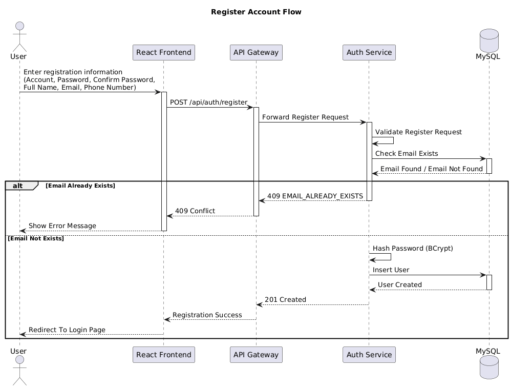
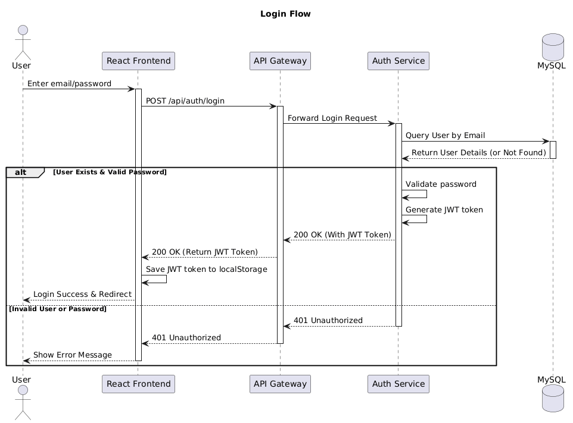

# Sequence Diagrams

This document describes the sequence diagrams used in the Movie Theater Management System.

---

# Register Flow

## Description

This sequence diagram describes the account registration process in the Movie Theater Management System.

## Participants

* User
* React Frontend
* API Gateway
* Auth Service
* MySQL

## Main Flow

### 1. User enters registration information

The user opens the registration page and enters the required information, including:

* Username
* Password
* Confirm Password
* Full Name
* Email
* Phone Number

After completing the form, the user submits the registration request.

### 2. Frontend sends request to API Gateway

The React Frontend performs basic client-side validation and sends the registration request to the API Gateway.

**Request**

```http
POST /api/auth/register
```

### 3. API Gateway forwards request to Auth Service

The API Gateway receives the request and routes it to the Auth Service responsible for user authentication and account management.

### 4. Auth Service validates request

Auth Service validates all required fields and verifies that the request data meets business rules.

Validation includes:

* Required fields are present
* Email format is valid
* Password meets security requirements
* Confirm password matches password

### 5. Auth Service checks email in MySQL

Auth Service queries MySQL to determine whether the provided email address already exists.

**Database Query**

```sql
SELECT * FROM users
WHERE email = ?
```

If an existing account is found, the registration process is stopped and an error response is returned.

### 6. Auth Service hashes password

If the email does not exist, Auth Service hashes the password using BCrypt before storing it in the database.

The original plain-text password is never stored.

### 7. Auth Service stores new user in MySQL

Auth Service creates a new user record and saves it to MySQL.

Stored information includes:

* Username
* Hashed Password
* Full Name
* Email
* Phone Number
* Account Status
* Created Date

**Database Insert**

```sql
INSERT INTO users (...)
VALUES (...)
```

### 8. Registration success response

MySQL confirms that the user record has been created successfully.

Auth Service returns:

```http
HTTP/1.1 201 Created
```

The response is forwarded through API Gateway to the React Frontend.

### 9. Frontend redirects user

The React Frontend displays a success message and redirects the user to the Login page.

---

## Alternative Flow

### Email Already Exists

1. Auth Service checks the email address.
2. MySQL returns an existing record.
3. Auth Service returns:

```http
HTTP/1.1 409 Conflict
```

4. Frontend displays an error message:

```text
Email already exists.
```

---

## Sequence Diagram



---

## Diagram Flow Summary

```text
User
→ React Frontend
→ API Gateway
→ Auth Service
→ MySQL
→ Auth Service
→ API Gateway
→ React Frontend
→ User
```

---

# Login Flow

## Description

This sequence diagram describes the login process using email/password and retrieving a JWT token in the Movie Theater Management System.

## Participants

* User
* React Frontend
* API Gateway
* Auth Service
* MySQL

## Main Flow

### 1. User enters login information

The user opens the login page and enters:

* Email
* Password

### 2. Frontend sends request to API Gateway

The React Frontend sends the login request to the API Gateway.

**Request**

```http
POST /api/auth/login
```

### 3. API Gateway forwards request to Auth Service

The API Gateway routes the request to the Auth Service.

### 4. Auth Service checks user in MySQL

Auth Service queries MySQL by email to check if the user exists.

### 5. Auth Service validates password

If the user is found, Auth Service validates the provided password against the stored hash.

### 6. Auth Service generates JWT token

Upon successful validation, Auth Service generates a JWT token for the user session.

### 7. Auth Service returns response

Auth Service returns a 200 OK response with the JWT token, forwarded through API Gateway to the Frontend.

### 8. Frontend saves JWT token

The React Frontend receives the JWT token, saves it to `localStorage`, and redirects the user upon successful login.

---

## Alternative Flow

### Invalid User or Password

1. Auth Service checks the email address or validates the password.
2. If the user is not found or the password does not match, Auth Service returns:

```http
HTTP/1.1 401 Unauthorized
```

3. Frontend displays an error message to the user.

---

## Sequence Diagram



---

## Diagram Flow Summary

```text
User
→ React Frontend
→ API Gateway
→ Auth Service
→ MySQL
→ Auth Service
→ API Gateway
→ React Frontend
→ User
```
