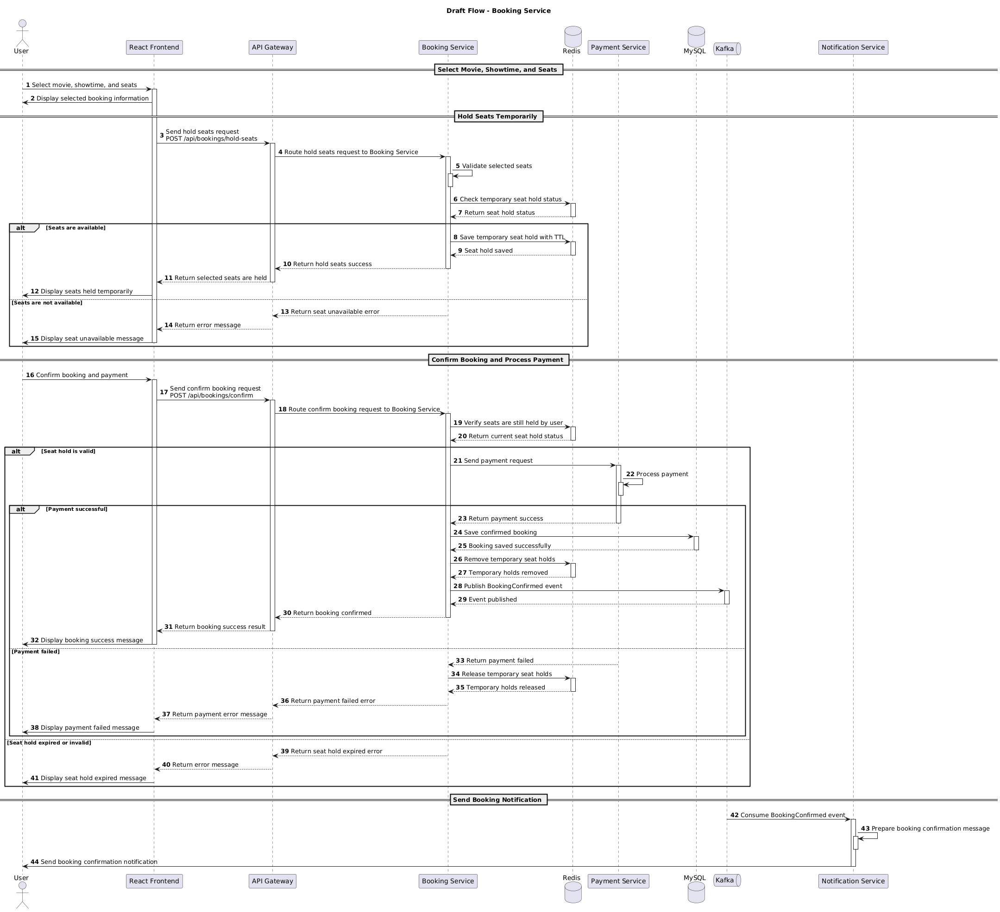

# Luồng Nghiệp Vụ Đặt Vé Xem Phim - Sequence Diagram

Tài liệu này mô tả chi tiết sơ đồ tuần tự và luồng xử lý nghiệp vụ cho tính năng **Đặt Vé Xem Phim** của hệ thống Đặt Vé Xem Phim Trực Tuyến.

*   **Thành viên phụ trách:** Hoàng
*   **Trạng thái tài liệu:** Đang thực hiện (In-progress)

---

## 1. Mục Đích (Purpose)

Tài liệu thiết kế chi tiết quy trình đặt vé xem phim của khách hàng, bao gồm việc chọn phim, suất chiếu, ghế ngồi, khóa giữ chỗ tạm thời bằng Redis Cache, phối hợp thanh toán, cập nhật trạng thái đơn hàng và gửi email xác nhận.

---

## 2. Phạm Vi Hệ Thống (Scope)

Bao gồm các thành phần: Client React, API Gateway, booking-service, payment-service, MySQL DB, Redis Cache, Apache Kafka và notification-service.

---

## 3. Thành Phần Tham Gia (Participants)

Dưới đây là danh sách chi tiết các đối tượng và dịch vụ xuất hiện trong sơ đồ tuần tự:

| Thành Phần (Participant) | Loại (Actor / Service / DB / Cache) | Vai Trò & Nhiệm Vụ Trong Luồng |
| :--- | :--- | :--- |
| **Khách hàng** | Actor | Người dùng thực hiện chọn vé, ghế và thanh toán. |
| **Client (React)** | Client | Giao diện hiển thị sơ đồ ghế, thời gian giữ ghế và xử lý các sự kiện click đặt chỗ. |
| **API Gateway** | Gateway | Định tuyến các request API đến các microservice nghiệp vụ thích hợp. |
| **booking-service** | Service | Xử lý nghiệp vụ chọn vé, giữ ghế tạm thời, cập nhật trạng thái đặt vé và tạo hóa đơn. |
| **payment-service** | Service | Tiếp nhận thông tin và xử lý giao dịch tài chính với đối tác thanh toán. |
| **Redis Cache** | Cache | Lưu trữ khóa giữ ghế tạm thời (seat reservation lock) với thời hạn tự giải phóng (TTL). |
| **MySQL (Booking DB)** | DB | Lưu trữ thông tin hóa đơn đặt vé và sơ đồ ghế cố định. |
| **Apache Kafka** | Broker | Truyền nhận thông điệp sự kiện đặt vé thành công (`booking.success`). |
| **notification-service** | Service | Tiêu thụ event từ Kafka để gửi email xác nhận đặt vé thành công. |

---

## 4. Sơ Đồ Sequence Diagram (Diagram Image)

---

## 5. Mô Tả Luồng Xử Lý Chính (Main Flow Steps)

1.  **Bước 1:** Khách hàng chọn bộ phim, suất chiếu và một hoặc nhiều ghế từ giao diện Client React.
2.  **Bước 2:** Client gửi yêu cầu giữ ghế tạm thời (POST `/api/bookings/seat-lock`) qua API Gateway đến booking-service.
3.  **Bước 3:** API Gateway chuyển tiếp request định tuyến tới booking-service.
4.  **Bước 4:** booking-service truy vấn MySQL để kiểm tra xem các ghế đã chọn đã được mua từ trước chưa.
5.  **Bước 5:** Nếu ghế còn trống, booking-service thiết lập khóa tạm thời trên Redis (Key format: `seat_lock:{showtimeId}:{seatId}`) với thời gian hết hạn (TTL) từ 5-10 phút để tránh tình trạng người dùng khác chọn trùng.
6.  **Bước 6:** Khi giữ ghế thành công trên Redis, Client nhận phản hồi và hiển thị màn hình thanh toán cho người dùng.
7.  **Bước 7:** Khách hàng xem xét thông tin hóa đơn và xác nhận thanh toán.
8.  **Bước 8:** Client gửi yêu cầu xử lý thanh toán qua API Gateway tới payment-service.
9.  **Bước 9:** Sau khi thanh toán thành công, booking-service cập nhật trạng thái đơn vé sang "Đã thanh toán" và ghi nhận vào MySQL.
10. **Bước 10:** booking-service thực hiện xóa khóa giữ ghế tạm thời tương ứng trên Redis.
11. **Bước 11:** booking-service bắn sự kiện đặt vé thành công (`booking.success`) lên Kafka Broker.
12. **Bước 12:** notification-service tiêu thụ (consume) event đặt vé thành công từ Kafka và tiến hành gửi email xác nhận vé điện tử kèm mã QR Code cho khách hàng.
13. **Bước 13:** Client hiển thị màn hình kết quả đặt vé thành công kèm mã đặt vé.

---

## 6. Luồng Xử Lý Thay Thế / Ngoại lệ (Alternative/Error Flows)

### Lỗi A: Ghế đã bị đặt trước đó (MySQL check)
*   **Mô tả:** Ghế được chọn đã được người khác thanh toán thành công trước đó.
*   **Xử lý:** booking-service trả về mã lỗi `409 Conflict`. Client yêu cầu người dùng chọn ghế khác.

### Lỗi B: Ghế đang bị tạm giữ bởi người khác (Redis check)
*   **Mô tả:** Ghế được chọn đang trong trạng thái khóa tạm thời bởi một khách hàng khác cũng đang thanh toán.
*   **Xử lý:** booking-service trả về lỗi tạm giữ. Client thông báo lỗi và yêu cầu chọn ghế khác.

### Lỗi C: Hết thời gian giữ ghế (Seat Lock Expired)
*   **Mô tả:** Người dùng mất quá nhiều thời gian để hoàn thành thanh toán khiến TTL trên Redis hết hạn và tự động giải phóng ghế.
*   **Xử lý:** Khách hàng phải thực hiện quy trình chọn ghế và đặt vé lại từ đầu.

### Lỗi D: Giao dịch thanh toán thất bại
*   **Mô tả:** Người dùng hủy thanh toán hoặc tài khoản không đủ số dư.
*   **Xử lý:** Đơn hàng chuyển trạng thái thất bại, booking-service xóa lock Redis của các ghế tương ứng để trả ghế lại cho sơ đồ trống.

---

## 7. Ghi Chú Thiết Kế (Design Notes)

*   **Redis Key Format:** `lock:seat:{showtimeId}:{seatId}` với TTL mặc định là 600 giây (10 phút).
*   **Kafka Event Payload:** Message sự kiện cần chứa thông tin tối giản (`bookingId`, `userId`, `email`, `seats`) để đảm bảo tốc độ truyền tin.

---

## 8. Checklist Tự Kiểm Tra (Self-Checklist)

Lập trình viên phụ trách phải tự tích chọn kiểm tra trước khi yêu cầu review:

- [x] Sơ đồ UML được vẽ rõ ràng, không bị chồng chéo các đường lifelines.
- [x] Các HTTP status code trả về được ghi nhận cụ thể (`200 OK`, `409 Conflict`, v.v.).
- [x] Đã mô tả đầy đủ các bước kiểm tra tính hợp lệ dữ liệu (Validation).
- [x] Không có microservice nào truy cập chéo database của nhau.
- [x] Đã nhúng đúng đường dẫn ảnh tương đối tới thư mục `diagrams/`.

---

> [!NOTE]
> **Lưu ý:** Sequence Diagram này đại diện cho thiết kế kiến trúc ban đầu của tính năng và có thể được điều chỉnh linh hoạt trong quá trình phát triển thực tế để phù hợp với các cải tiến công nghệ.