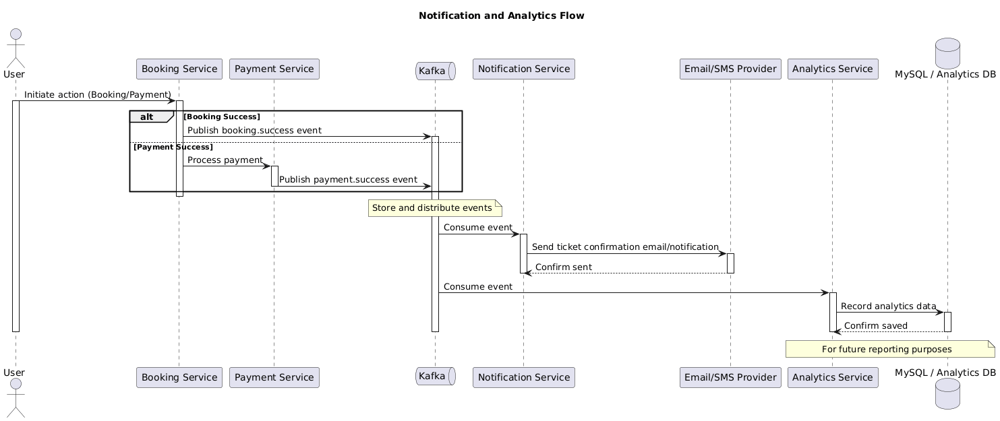

# Luồng Nghiệp Vụ Thông Báo & Thống Kê - Sequence Diagram

Tài liệu này mô tả chi tiết sơ đồ tuần tự và luồng xử lý nghiệp vụ cho tính năng **Thông Báo & Thống Kê** của hệ thống Đặt Vé Xem Phim Trực Tuyến.

*   **Thành viên phụ trách:** Thành
*   **Trạng thái tài liệu:** Đang thực hiện (In-progress)

---

## 1. Mục Đích (Purpose)

*Mô tả ngắn gọn mục tiêu của luồng nghiệp vụ này (ví dụ: mô tả quy trình gửi email xác nhận đặt vé thành công kèm mã QR Code cho người dùng qua Kafka event, đồng thời thu thập các số liệu thống kê giao dịch phục vụ báo cáo doanh thu).*

---

## 2. Phạm Vi Hệ Thống (Scope)

*Liệt kê các thành phần, hệ thống nội bộ hoặc bên thứ ba trực tiếp tham gia vào luồng xử lý này (ví dụ: Client React, API Gateway, booking-service, notification-service, analytics-service, Apache Kafka broker).*

---

## 3. Thành Phần Tham Gia (Participants)

Dưới đây là danh sách chi tiết các đối tượng và dịch vụ xuất hiện trong sơ đồ tuần tự:

| Thành Phần (Participant) | Loại (Actor / Service / DB / Cache) | Vai Trò & Nhiệm Vụ Trong Luồng |
| :--- | :--- | :--- |
| **Khách hàng / Admin** | Actor | Người nhận thông báo hoặc người quản lý xem số liệu thống kê. |
| **booking-service** | Service | Phát sinh sự kiện thanh toán đặt vé thành công và publish event lên Kafka. |
| **Apache Kafka Broker** | Message Broker | Kênh trung chuyển thông điệp bất đồng bộ (event-driven broker). |
| **notification-service** | Service | Lắng nghe event từ Kafka, thực hiện biên tập nội dung và gửi email/SMS. |
| **analytics-service** | Service | Thu thập dữ liệu giao dịch từ Kafka để xử lý phân tích và báo cáo số liệu doanh thu. |
| **Dịch vụ SMTP (Mail Server)** | Third-party | Dịch vụ gửi email (ví dụ: SendGrid, Gmail SMTP) tới hòm thư người dùng. |
| **MySQL (Analytics DB)** | DB | Lưu trữ các dữ liệu lịch sử phục vụ báo cáo, phân tích hành vi người dùng. |

---

## 4. Sơ Đồ Sequence Diagram (Diagram Image)

*Nhúng hình ảnh sơ đồ tuần tự đã xuất dưới dạng file PNG tại đây. Đảm bảo file ảnh được lưu trữ tại thư mục `docs/architecture/diagrams/`.*

---

## 5. Mô Tả Luồng Xử Lý Chính (Main Flow Steps)

Dưới đây là các bước tương tác trong luồng xử lý thành công (Happy Path):

1.  **Bước 1:** `booking-service` hoàn tất giao dịch đặt vé của khách hàng và đẩy sự kiện `booking.success` lên Apache Kafka topic `booking-events`.
2.  **Bước 2:** `notification-service` và `analytics-service` (đóng vai trò Consumers) đồng thời nhận được bản tin sự kiện từ Kafka topic.
3.  **Bước 3:** `notification-service` xử lý parse dữ liệu, lấy thông tin email người dùng, dựng template email xác nhận kèm mã vé QR Code và gọi dịch vụ SMTP gửi đi.
4.  **Bước 4:** Song song đó, `analytics-service` phân tích thông điệp để cập nhật dữ liệu thống kê doanh số bán vé theo phim/rạp chiếu vào Database lưu trữ.
5.  **Bước 5:** Khi Admin truy cập trang Dashboard, Client gửi request truy vấn doanh thu qua Gateway và `analytics-service` kết xuất dữ liệu báo cáo hiển thị trực quan lên màn hình.

---

## 6. Luồng Xử Lý Thay Thế / Lỗi (Alternative/Error Flows)

Quy trình xử lý các trường hợp ngoại lệ, lỗi logic hoặc lỗi kết nối:

### Lỗi A: Dịch vụ SMTP Mail Server bị gián đoạn kết nối
*   **Mô tả:** Hệ thống notification không kết nối được tới dịch vụ gửi email bên thứ ba.
*   **Xử lý:**
    1.  notification-service không gửi được email và bắt được lỗi kết nối.
    2.  Hệ thống ghi nhận log lỗi chi tiết, không bỏ qua message mà thực hiện cơ chế Retry (thử lại) sau một khoảng thời gian cấu hình sẵn.
    3.  Nếu quá số lần retry thất bại, message được chuyển vào Dead Letter Queue (DLQ) trên Kafka để xử lý thủ công sau.

### Lỗi B: Lỗi xử lý bản tin (Malformed Event Message)
*   **Mô tả:** Message nhận được từ Kafka có cấu trúc dữ liệu không hợp lệ hoặc thiếu trường thông tin bắt buộc.
*   **Xử lý:**
    1.  Consumer validate dữ liệu event bị thất bại.
    2.  Consumer ghi log cảnh báo dữ liệu xấu và bỏ qua message để tránh treo luồng tiêu thụ (infinite loop retry).

---

## 7. Ghi Chú Thiết Kế (Design Notes)

*Ghi lại các lưu ý kỹ thuật quan trọng liên quan đến hiệu năng, bảo mật hoặc đồng bộ trạng thái:*
*   **Kafka Configuration:** Cần cấu hình đảm bảo At-least-once delivery để không bị mất thông tin đặt vé, đồng thời phía notification cần check trùng lặp (Idempotent Consumer) để tránh gửi nhiều email cho cùng một vé.
*   **QR Code generation:** Mã QR Code được sinh động dựa trên thông tin mã vé bảo mật đã được mã hóa để tránh tình trạng giả mạo vé tại rạp.

---

## 8. Checklist Tự Kiểm Tra (Self-Checklist)

Lập trình viên phụ trách phải tự tích chọn kiểm tra trước khi yêu cầu review:

- [ ] Sơ đồ UML được vẽ rõ ràng, không bị chồng chéo các đường lifelines.
- [ ] Các HTTP status code trả về được ghi nhận cụ thể (`200 OK`, `400 Bad Request`, v.v.).
- [ ] Đã mô tả đầy đủ các bước kiểm tra tính hợp lệ dữ liệu (Validation).
- [ ] Không có microservice nào truy cập chéo database của nhau.
- [ ] Đã nhúng đúng đường dẫn ảnh tương đối tới thư mục `diagrams/`.

---

> [!NOTE]
> **Lưu ý:** Sequence Diagram này đại diện cho thiết kế kiến trúc ban đầu của tính năng và có thể được điều chỉnh linh hoạt trong quá trình phát triển thực tế để phù hợp với các cải tiến công nghệ.
