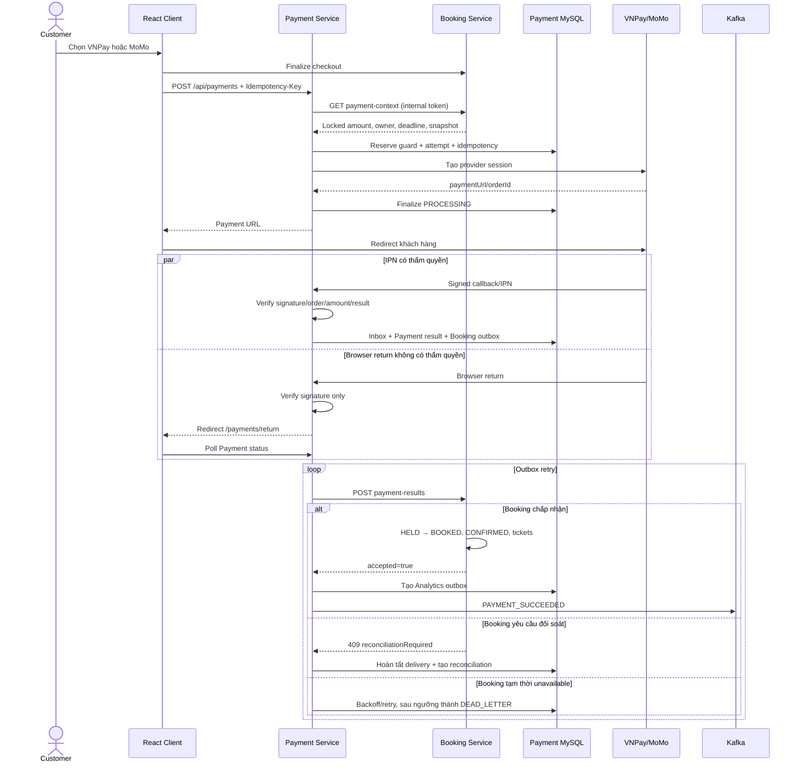
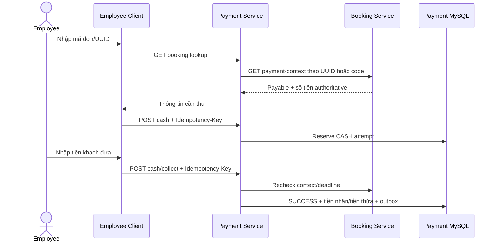
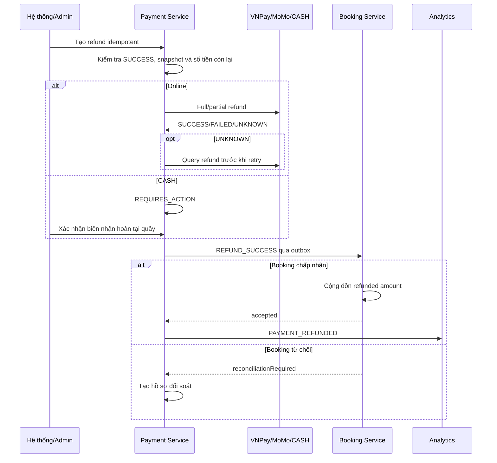

# Payment Release 1 — Luồng nghiệp vụ

## Thanh toán online

Booking/MySQL `seat_reservations` là nguồn giữ ghế dài hạn duy nhất. Payment
không đọc Redis, không giải phóng ghế và không kéo dài deadline. FAILED/CANCELLED
attempt không hủy Booking; khách có thể thử attempt mới trước deadline gốc khi
kết quả provider đã chắc chắn.

## Callback trùng và mâu thuẫn

- Provider + deduplication key + cùng raw-body hash: ACK idempotent, không lặp
  transition hoặc outbox.
- Cùng deduplication key nhưng hash khác: trả conflict/ACK phù hợp provider và
  tạo reconciliation.
- Chữ ký sai: lưu inbox đã sanitize để audit, không thay đổi Payment và không
  cho replay.
- SUCCESS đến sau deadline vẫn ghi nhận sự thật tài chính ở Payment, nhưng
  Booking không tự xác nhận; case được chuyển sang đối soát.

## CASH tại quầy

Thiếu tiền bị từ chối. Duplicate collect/cancel dùng cùng idempotency key trả lại
kết quả cũ. CASH cũng đi qua đúng outbox Booking và Analytics như provider thật.

## Recovery

- Provider request chạy ngoài DB transaction.
- Order/request ID ổn định cho cùng attempt.
- Mất response hoặc timeout đặt settlement hold; scheduler query provider trước
  khi cho retry.
- Outbox dùng owner token + lease; network call chạy ngoài transaction.
- Replay giữ nguyên event ID để downstream dedupe.

## Hoàn tiền

Refund tự động được tạo khi thanh toán thành công đến trễ, Booking từ chối xác
nhận, thu trùng hoặc suất chiếu bị hủy. Admin chỉ tạo hoàn một phần cho bắp nước,
chênh lệch giá và điều chỉnh nghiệp vụ. Chưa có hoàn riêng từng vé; refund không
thay đổi sức chứa phòng hoặc mở lại ghế `BOOKED`.
