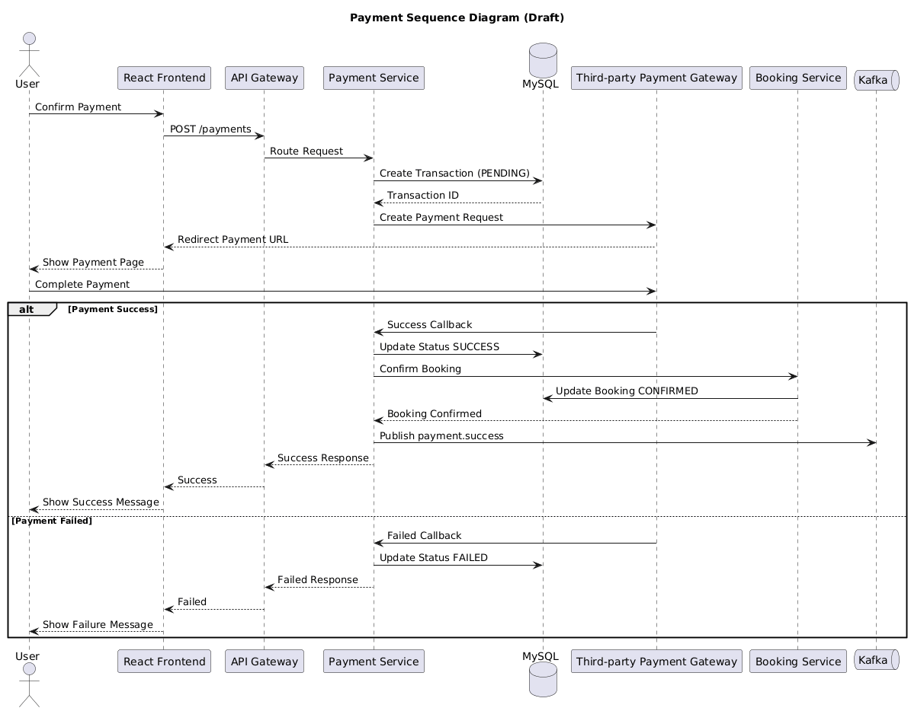

# Luồng Nghiệp Vụ Thanh Toán - Sequence Diagram

Tài liệu này mô tả chi tiết sơ đồ tuần tự và luồng xử lý nghiệp vụ cho tính năng **Thanh Toán** của hệ thống Đặt Vé Xem Phim Trực Tuyến.

*   **Thành viên phụ trách:** Vinh
*   **Trạng thái tài liệu:** Đang thực hiện (In-progress)

---

## 1. Mục Đích (Purpose)

*Mô tả ngắn gọn mục tiêu của luồng nghiệp vụ này (ví dụ: mô tả quy trình thực hiện giao dịch thanh toán hóa đơn đặt vé qua cổng thanh toán bên thứ ba như VNPay/Momo, cập nhật trạng thái thanh toán và giải phóng ghế trên hệ thống).*

---

## 2. Phạm Vi Hệ Thống (Scope)

*Liệt kê các thành phần, hệ thống nội bộ hoặc bên thứ ba trực tiếp tham gia vào luồng xử lý này (ví dụ: Client React, API Gateway, booking-service, payment-service, cổng thanh toán VNPay).*

---

## 3. Thành Phần Tham Gia (Participants)

Dưới đây là danh sách chi tiết các đối tượng và dịch vụ xuất hiện trong sơ đồ tuần tự:

| Thành Phần (Participant) | Loại (Actor / Service / DB / Cache) | Vai Trò & Nhiệm Vụ Trong Luồng |
| :--- | :--- | :--- |
| **Khách hàng** | Actor | Thực hiện các thao tác xác nhận thanh toán hóa đơn đặt vé. |
| **Client (React)** | Client | Hiển thị thông tin hóa đơn và chuyển hướng người dùng tới trang cổng thanh toán. |
| **API Gateway** | Gateway | Kiểm duyệt bảo mật, phân quyền định tuyến các API request. |
| **payment-service** | Service | Xử lý logic tạo giao dịch, tích hợp cổng thanh toán bên thứ ba và tiếp nhận IPN callback. |
| **booking-service** | Service | Quản lý trạng thái hóa đơn, sơ đồ ghế đặt chỗ và gửi tín hiệu giải phóng/khóa ghế. |
| **Cổng thanh toán VNPay** | Third-party | Xử lý cổng giao dịch tài chính ngân hàng, ví điện tử. |
| **MySQL (Payment DB)** | DB | Lưu trữ lịch sử giao dịch và trạng thái thanh toán. |

---

## 4. Sơ Đồ Sequence Diagram (Diagram Image)

*Nhúng hình ảnh sơ đồ tuần tự đã xuất dưới dạng file PNG tại đây. Đảm bảo file ảnh được lưu trữ tại thư mục `docs/architecture/diagrams/`.*

---

## 5. Mô Tả Luồng Xử Lý Chính (Main Flow Steps)

Dưới đây là các bước tương tác trong luồng xử lý thành công (Happy Path):

1.  **Bước 1:** Người dùng chọn phương thức thanh toán VNPay và nhấn nút "Thanh toán" từ màn hình thanh toán trên Client.
2.  **Bước 2:** Client gửi yêu cầu khởi tạo thanh toán qua API Gateway tới payment-service.
3.  **Bước 3:** payment-service tạo bản ghi giao dịch tạm thời trong MySQL DB và gọi API của VNPay để lấy liên kết thanh toán (Payment URL).
4.  **Bước 4:** payment-service trả Payment URL về cho Client qua API Gateway. Client chuyển hướng người dùng sang trang thanh toán của VNPay.
5.  **Bước 5:** Người dùng thực hiện các bước xác thực và thanh toán thành công trên VNPay.
6.  **Bước 6:** VNPay thực hiện redirect người dùng về trang Client, đồng thời gửi thông tin thông báo trạng thái thanh toán qua kênh IPN (Instant Payment Notification) tới payment-service.
7.  **Bước 7:** payment-service kiểm tra chữ ký kiểm thử giao dịch hợp lệ, cập nhật trạng thái giao dịch sang "Thành công" trong DB, và thông báo cho booking-service để giải phóng khóa tạm thời trên Redis và cập nhật trạng thái đặt vé sang "Thành công".

---

## 6. Luồng Xử Lý Thay Thế / Lỗi (Alternative/Error Flows)

Quy trình xử lý các trường hợp ngoại lệ, lỗi logic hoặc lỗi kết nối:

### Lỗi A: Thanh toán thất bại hoặc người dùng hủy giao dịch tại cổng thanh toán
*   **Mô tả:** Người dùng chủ động hủy thanh toán trên giao diện VNPay hoặc tài khoản không đủ số dư.
*   **Xử lý:**
    1.  VNPay trả kết quả giao dịch thất bại về payment-service.
    2.  payment-service cập nhật trạng thái giao dịch trong DB là "Thất bại".
    3.  payment-service thông báo cho booking-service để giải phóng khóa ghế trên Redis giúp người khác có thể chọn.
    4.  Client hiển thị thông báo thanh toán không thành công và cho phép người dùng thử lại hoặc đổi phương thức thanh toán.

### Lỗi B: Lỗi xác thực chữ ký (Signature Verification Failed) từ IPN
*   **Mô tả:** Response gửi từ VNPay về backend bị sai chữ ký bảo mật hoặc bị giả mạo.
*   **Xử lý:**
    1.  payment-service validate hash signature của VNPay bị lỗi.
    2.  Hệ thống ghi log cảnh báo bảo mật, không cập nhật giao dịch sang thành công và trả về mã lỗi thích hợp cho VNPay.

---

## 7. Ghi Chú Thiết Kế (Design Notes)

*Ghi lại các lưu ý kỹ thuật quan trọng liên quan đến hiệu năng, bảo mật hoặc đồng bộ trạng thái:*
*   **Bảo mật:** Tham số giao dịch gửi sang VNPay bắt buộc phải được mã hóa chữ ký (Secure Hash SHA256) bằng Secret Key do cổng thanh toán cấp.
*   **Trùng lặp sự kiện:** Dịch vụ IPN callback cần được thiết kế có tính chất Idempotent để đảm bảo không bị xử lý cộng tiền hai lần cho cùng một mã giao dịch.

---

## 8. Checklist Tự Kiểm Tra (Self-Checklist)

Lập trình viên phụ trách phải tự tích chọn kiểm tra trước khi yêu cầu review:

- [ ] Sơ đồ UML được vẽ rõ ràng, không bị chồng chéo các đường lifelines.
- [ ] Các HTTP status code trả về được ghi nhận cụ thể (`200 OK`, `400 Bad Request`, v.v.).
- [ ] Đã mô tả đầy đủ các bước kiểm tra tính hợp lệ dữ liệu (Validation).
- [ ] Không có microservice nào truy cập chéo database của nhau.
- [ ] Đã nhúng đúng đường dẫn ảnh tương đối tới thư mục `diagrams/`.

---

> [!NOTE]
> **Lưu ý:** Sequence Diagram này đại diện cho thiết kế kiến trúc ban đầu của tính năng và có thể được điều chỉnh linh hoạt trong quá trình phát triển thực tế để phù hợp với các cải tiến công nghệ.
