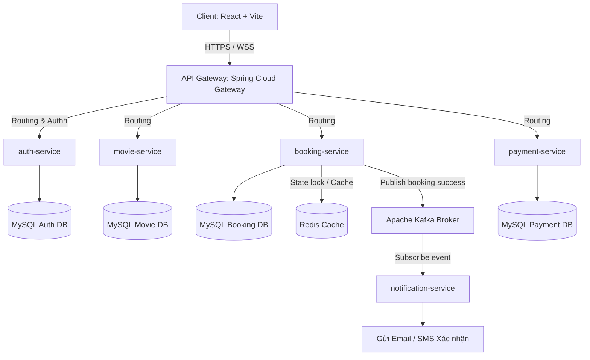
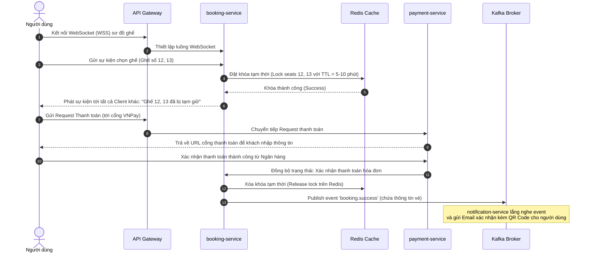

# Tài Liệu Thiết Kế Hệ Thống (System Design Document)

Tài liệu này là nguồn thông tin chính thức (single source of truth) về mặt kiến trúc cho hệ thống Đặt Vé Xem Phim Trực Tuyến. Đây là tài liệu thiết kế ban đầu phục vụ cho **Sprint 1 - Authentication & User Management** và sẽ được cập nhật liên tục qua các sprint tiếp theo.

---

## 1. Tổng Quan Hệ Thống (System Overview)

Hệ thống Đặt Vé Xem Phim Trực Tuyến là một nền tảng phân tán được thiết kế theo kiến trúc microservices. Hệ thống cho phép khách hàng thực hiện tìm kiếm phim, xem lịch chiếu, chọn rạp, giữ ghế trống thời gian thực, thực hiện thanh toán trực tuyến bảo mật và nhận vé điện tử qua email/SMS. 

> [!NOTE]
> **Lưu ý thiết kế:** Tài liệu này phản ánh thiết kế kiến trúc tổng quan của toàn bộ hệ thống, với trọng tâm triển khai và tích hợp bảo mật ban đầu cho **Sprint 1 (Xác thực và Quản lý người dùng)**. Tài liệu sẽ được cập nhật phiên bản theo hình thức cuốn chiếu khi nhóm bước vào các sprint phát triển tính năng đặt vé (Booking) và thanh toán (Payment).

---

## 2. Mục Tiêu Hệ Thống (System Objectives)

Kiến trúc hệ thống được xây dựng nhằm đáp ứng các mục tiêu cốt lõi sau:

### Mục tiêu Chức năng (Functional Goals)
*   **Quản lý người dùng & Bảo mật:** Đăng ký, đăng nhập và phân quyền truy cập vai trò (Client, Admin, Staff).
*   **Trải nghiệm đặt vé trực quan:** Cho phép người dùng xem vị trí ghế trực quan và thực hiện giữ ghế trong suốt quá trình thanh toán.
*   **Thanh toán đa nền tảng:** Kết nối ổn định với các dịch vụ cổng thanh toán trực tuyến.
*   **Thông báo tự động:** Xác nhận giao dịch đặt vé tức thì kèm vé điện tử chứa mã QR Code.

### Mục tiêu Phi chức năng (Non-Functional Goals)
*   **Tính sẵn sàng cao (High Availability):** Kiến trúc microservices đảm bảo lỗi cục bộ ở một service (ví dụ: `notification-service`) không làm sập toàn bộ hệ thống bán vé.
*   **Đồng bộ thời gian thực (Real-time Synchronization):** Đảm bảo tính nhất quán của trạng thái ghế ngồi (seat layout) giữa các client đồng thời nhằm tránh lỗi trùng ghế (double booking).
*   **Bảo mật thông tin:** Mã hóa mật khẩu người dùng, bảo mật các giao dịch thanh toán và xác thực an toàn thông qua JWT.
*   **Khả năng mở rộng (Scalability):** Dễ dàng nhân rộng các service độc lập khi lượng truy cập tăng cao vào các khung giờ cao điểm có phim hot.

---

## 3. Kiến Trúc Tổng Quan (High-Level Architecture)

Sơ đồ dưới đây mô tả luồng request của người dùng từ Client đi qua lớp API Gateway bảo mật đến các microservices nghiệp vụ ở phía Server:



### Nguyên lý định tuyến Request:
1.  **Client** gửi request qua cổng giao tiếp HTTPS hoặc WebSockets (WSS).
2.  **API Gateway** đóng vai trò là cổng đón tiếp trung tâm (entry point). Nó kiểm tra tính hợp lệ của mã JWT token đính kèm trong header trước khi chuyển hướng request đến service tương ứng.
3.  Các **Backend Services** thực hiện các logic nghiệp vụ và tương tác với database riêng lẻ (mô hình Database-per-Service).
4.  Quá trình tương tác không đồng bộ giữa các microservices được thực hiện thông qua Message Broker **Kafka** để giảm thiểu sự phụ thuộc lẫn nhau (loose coupling).

---

## 4. Chi Tiết Các Thành Phần (Component Responsibilities)

Hệ thống được chia thành các thành phần độc lập với nhiệm vụ cụ thể như sau:

| Thành phần | Công nghệ sử dụng | Nhiệm vụ chính |
| :--- | :--- | :--- |
| **Client** | React 19 + Vite | Giao diện người dùng web, quản lý state và tương tác người dùng. |
| **API Gateway** | Spring Cloud Gateway | Định tuyến động, cân bằng tải (load balancing), kiểm tra JWT và thực thi bảo mật đầu vào. |
| **auth-service** | Spring Boot + Spring Security | Xử lý đăng ký, đăng nhập, mã hóa mật khẩu, quản lý vai trò và cấp phát JWT. |
| **movie-service** | Spring Boot + JPA | Quản lý master data về phim, suất chiếu, rạp chiếu phim và phòng chiếu. |
| **booking-service** | Spring Boot + WebSockets | Xử lý quy trình chọn vé, đặt chỗ, giữ ghế tạm thời và quản lý hóa đơn. |
| **payment-service** | Spring Boot | Tích hợp các cổng thanh toán bên thứ ba (VNPay, Momo), kiểm soát trạng thái giao dịch. |
| **notification-service** | Spring Boot + Spring Kafka | Nhận event thanh toán thành công để gửi hóa đơn và vé điện tử (QR Code) tới khách hàng. |

---

## 5. Hạ Tầng Và Lưu Trữ Dữ Liệu (Infrastructure & Data Management)

Hệ thống sử dụng các giải pháp lưu trữ và truyền thông điệp chuyên biệt nhằm tối ưu hiệu năng:

*   **MySQL (Hệ quản trị CSDL quan hệ chính):**
    *   Mỗi microservice sở hữu một schema MySQL riêng biệt nhằm đảm bảo tính độc lập dữ liệu.
    *   Lưu trữ các dữ liệu có cấu trúc cần tính toàn vẹn cao (ACID) như thông tin người dùng, hóa đơn đặt vé, lịch chiếu phim và thông tin thanh toán.
*   **Redis (Lớp Caching & Khóa trạng thái):**
    *   Sử dụng làm cache trung gian cho các truy vấn nặng như danh sách phim đang hot hoặc lịch chiếu.
    *   Áp dụng cơ chế **Distributed Lock** hoặc lưu trữ tạm có thời hạn (TTL) để thực hiện khóa trạng thái ghế ngồi (seat reservation lock) trong lúc người dùng đang thanh toán (giữ ghế trong vòng 5-10 phút).
*   **Apache Kafka (Hệ thống truyền tin không đồng bộ):**
    *   Kafka đóng vai trò là xương sống cho giao tiếp hướng sự kiện (event-driven).
    *   Khi một đơn đặt vé hoàn thành thanh toán, `booking-service` đẩy event `booking.success` lên Kafka Topic. `notification-service` sẽ tiêu thụ (consume) event này để gửi email xác nhận mà không làm nghẽn tiến trình của luồng đặt vé chính.
*   **WebSocket / Socket.IO (Đồng bộ thời gian thực):**
    *   Duy trì kết nối hai chiều liên tục giữa Client và `booking-service`.
    *   Giúp cập nhật tức thì sơ đồ ghế ngồi phòng chiếu khi có người dùng khác vừa chọn hoặc hủy chọn ghế, loại bỏ tình trạng xung đột dữ liệu.

---

## 6. Luồng Nghiệp Vụ Quan Trọng (Core Workflows)

### A. Luồng Xác Thực Người Dùng (Authentication Flow)

Quy trình đăng nhập hệ thống và sử dụng JWT để truy cập các tài nguyên bảo mật:

```mermaid
sequenceDiagram
    autonumber
    actor Client as Người dùng
    participant GW as API Gateway
    participant Auth as auth-service
    database DB as MySQL (Auth)

    Client->>GW: Gửi Đăng nhập (username, password)
    GW->>Auth: Chuyển tiếp Request Đăng nhập
    Auth->>DB: Truy vấn & kiểm tra thông tin người dùng
    DB-->>Auth: Trả về thông tin mã hóa mật khẩu
    Auth->>Auth: Xác thực credentials & tạo mã JWT
    Auth-->>Client: Trả về JWT Token kèm Refresh Token
    Note over Client: Client lưu JWT và đính kèm vào<br/>Header: Authorization: Bearer <Token>
    Client->>GW: Gửi Request lấy Lịch sử đặt vé + JWT
    GW->>GW: Giải mã & Xác thực chữ ký JWT hợp lệ
    GW->>Auth: (Tùy chọn) Kiểm tra quyền / Danh sách thu hồi token
    Auth-->>GW: Xác nhận hợp lệ
    GW->>Client: Định tuyến tới service và trả về kết quả
```

### B. Luồng Đặt Vé và Giữ Ghế (Booking Flow)

Quy trình chọn phim, giữ ghế ngồi thời gian thực và thanh toán:



---

> [!WARNING]
> **Ràng buộc kiến trúc:**
> 1. Không một microservice nào được phép kết nối trực tiếp đến database của service khác. Mọi giao tiếp trao đổi dữ liệu bắt buộc phải đi qua REST API hoặc truyền nhận thông điệp qua Kafka.
> 2. Khóa giữ ghế trên Redis bắt buộc phải có thời gian hết hạn (TTL) để tránh tình trạng khóa chết vĩnh viễn (deadlock) khi người dùng đóng trình duyệt đột ngột hoặc hủy thanh toán giữa chừng.
