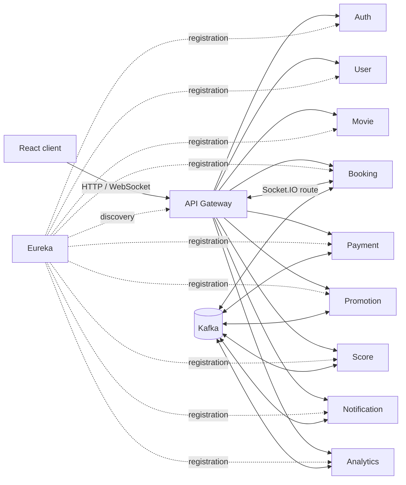

# Kiến trúc hệ thống LoraFilm

Tài liệu này mô tả topology và ranh giới service hiện tại. Chi tiết endpoint,
event, schema và business rule nằm trong các thư mục tương ứng được lập chỉ mục
tại [`docs/README.md`](../README.md).

## Tổng quan

LoraFilm là hệ thống microservices gồm React client, API Gateway, Eureka và
9 Spring Boot service. Gateway là HTTP entry point của client. Mỗi service sở hữu
database riêng; giao tiếp liên service dùng API đã xác thực hoặc Kafka event.

Mũi tên Kafka thể hiện integration event theo contract, không có nghĩa mọi cặp
service trao đổi trực tiếp trên cùng topic.

## Service ownership

| Service | Trách nhiệm chính | Cổng |
|---|---|---:|
| Auth | Tài khoản, đăng nhập, token/session, role, permission, OAuth và audit xác thực | 8081 |
| Movie | Phim, rạp, phòng, ghế, suất chiếu, pricing và auto scheduling | 8082 |
| Booking | Giữ ghế, booking, ticket/QR, bán tại quầy và concession order | 8083 |
| Payment | Payment attempt, callback, đối soát và refund lifecycle | 8084 |
| Notification | Email, in-app, SMS/Web Push provider boundary và template registry | 8085 |
| User | Hồ sơ khách hàng, nhân viên, tổ chức, ca làm và payroll | 8086 |
| Promotion | Campaign, promotion/voucher, claim và reservation | 8087 |
| Score | Loyalty ledger, tier, earn/redeem và reconciliation | 8088 |
| Analytics | Fact ingestion, KPI, forecast, insight, alert và dashboard | 8089 |

Service không sở hữu dữ liệu master của service khác. Khi cần tham chiếu, service
lưu public/business identifier và snapshot tối thiểu theo contract.

## Request và security boundary

1. Client gọi `/api/**` qua Gateway tại cổng 8080.
2. Public route được allowlist. Protected route yêu cầu JWT; Gateway kiểm tra
   token trước khi định tuyến và service tiếp tục enforce role/permission cho
   nghiệp vụ của mình.
3. Endpoint `/internal/**` dành cho service-to-service, dùng token nội bộ riêng
   và không được biến thành public route một cách ngầm định.
4. Frontend dùng route guard cho UX, nhưng backend authorization vẫn là lớp quyết
   định cuối cùng.

API Gateway không chứa business logic và không truy cập database nghiệp vụ.

## Data boundary

- Mỗi service có một MySQL database riêng: `auth_db`, `movie_db`, `booking_db`,
  `payment_db`, `notification_db`, `user_db`, `promotion_db`, `score_db` và
  `analytics_db`.
- Không tạo foreign key hoặc query chéo database.
- Canonical schema được quản lý thủ công trong `docs/database/mysql/`; Hibernate
  chạy `ddl-auto=validate`.
- Database đang có dữ liệu được nâng cấp bằng migration đã review, backup và áp
  dụng theo thứ tự. Docker Compose không tự chạy các migration trong `docs/`.

## Đồng bộ và bất đồng bộ

HTTP/internal API được dùng khi caller cần kết quả ngay trong request. Kafka được
dùng cho lifecycle event, projection, notification và analytics không cần khóa
chặt transaction giữa nhiều service.

Các luồng quan trọng áp dụng những cơ chế phù hợp với domain:

- transactional outbox để không mất event sau khi commit business data;
- idempotency key hoặc processed-event record để chịu được at-least-once delivery;
- retry có giới hạn và dead-letter/reconciliation cho lỗi không xử lý ngay được;
- snapshot dữ liệu cần audit thay vì đọc chéo database ở thời điểm sau.

Tên topic và payload chính xác được định nghĩa trong `docs/events/` và API/event
contract của owning service.

## Realtime booking

Booking Service cung cấp Socket.IO trên cổng local riêng và Gateway route
`/socket.io/**` tới endpoint đó. Realtime update giúp client hiển thị seat state
mới, nhưng database constraint và transaction của Booking Service vẫn là nguồn
quyết định chống double booking. Kết nối WebSocket không thay thế validation khi
tạo hoặc xác nhận booking.

## Hạ tầng local

Root `docker-compose.yml` chỉ chạy:

- MySQL 8 tại host port 3307;
- Redis 7 tại 6379;
- Zookeeper tại 2181;
- Kafka tại 9092.

Eureka, Gateway và các Java service chạy trực tiếp bằng Maven. Frontend chạy bằng
Vite tại 5173. Trình tự và lệnh đầy đủ nằm trong [`README.md`](../../README.md).

## Nguyên tắc thay đổi kiến trúc

- Thay đổi ownership cần nêu rõ migration dữ liệu và compatibility window.
- Thay đổi endpoint/event/schema phải cập nhật contract và test trong cùng Merge
  Request.
- Không thêm synchronous dependency chỉ để đọc dữ liệu có thể truyền bằng event
  snapshot hoặc projection.
- Secret chỉ đến từ biến môi trường/config local bị ignore; không ghi vào tài
  liệu, source hoặc log.
- Observability và health endpoint được triển khai theo từng service; không giả
  định mọi module có cùng một endpoint. Xem bảng trong `server/README.md`.
