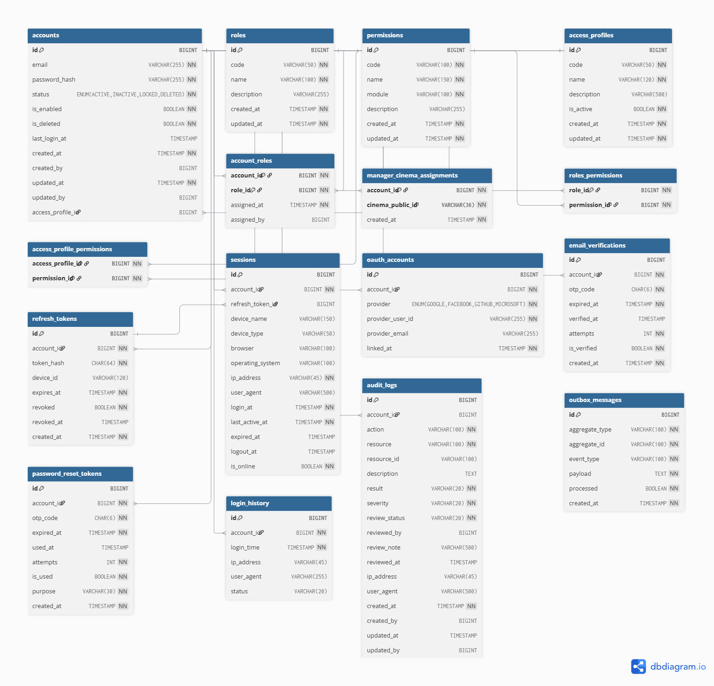
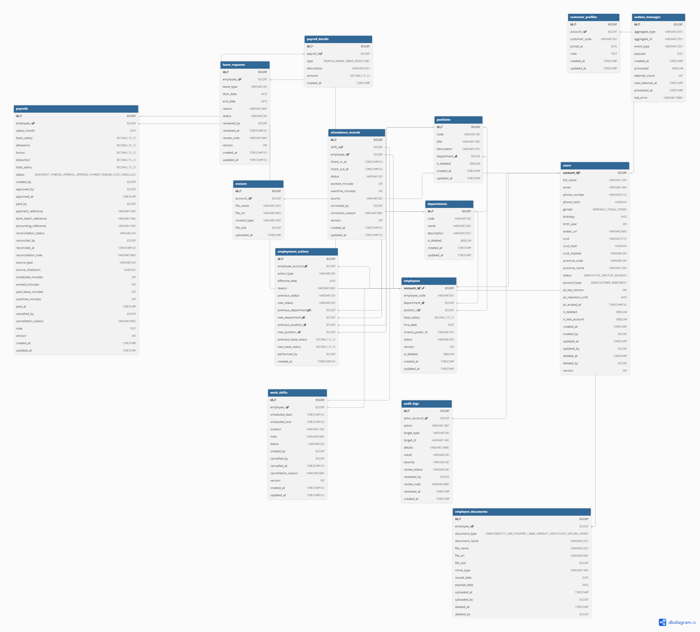
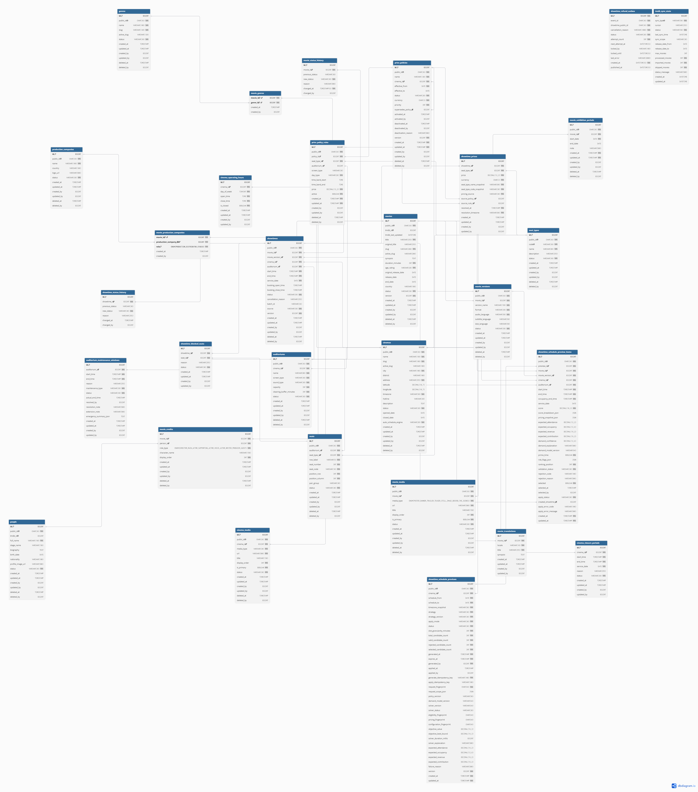
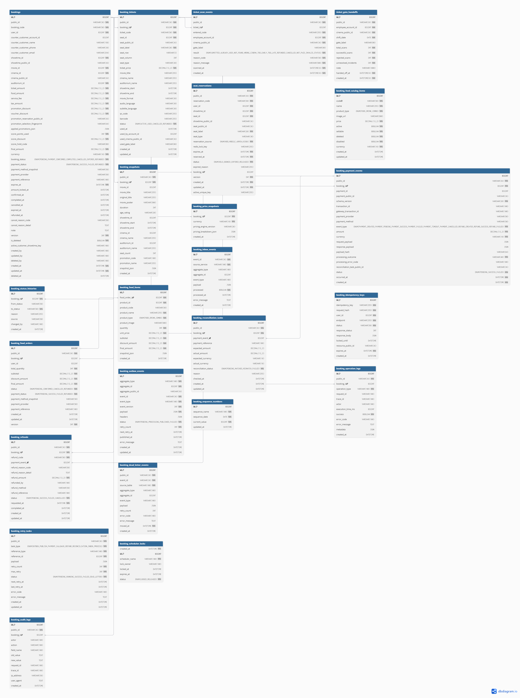
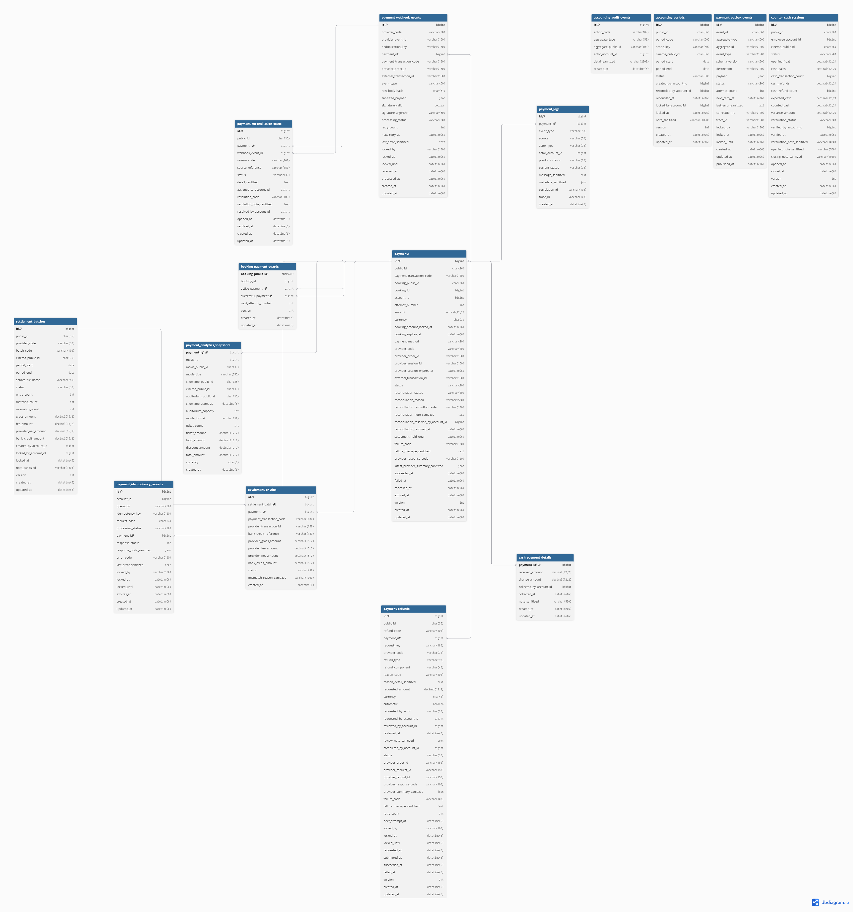
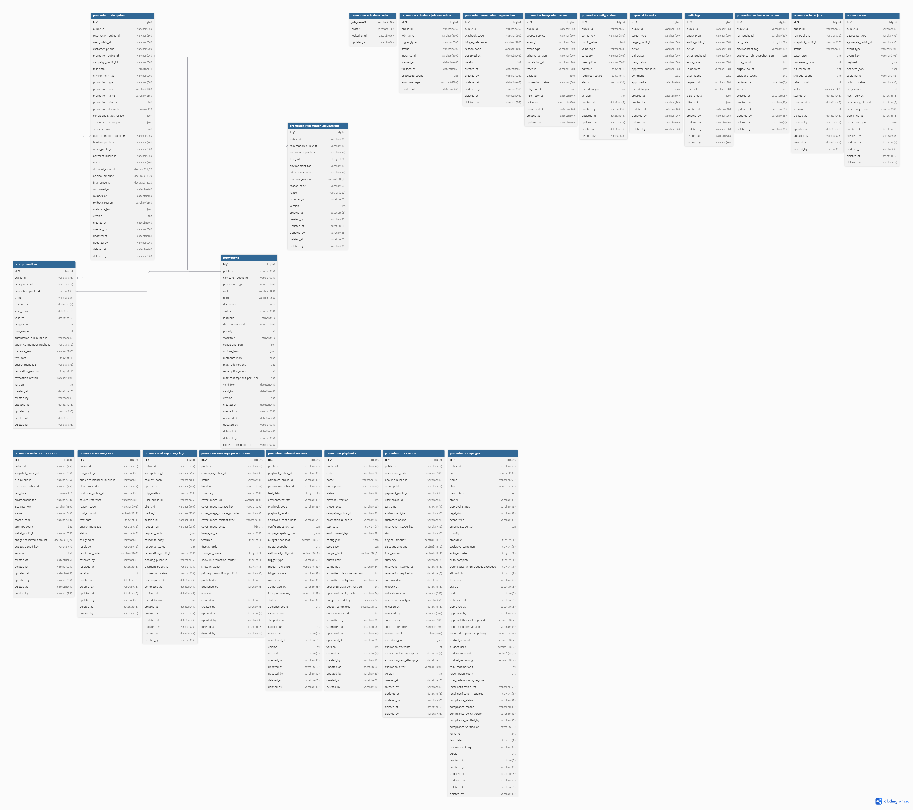
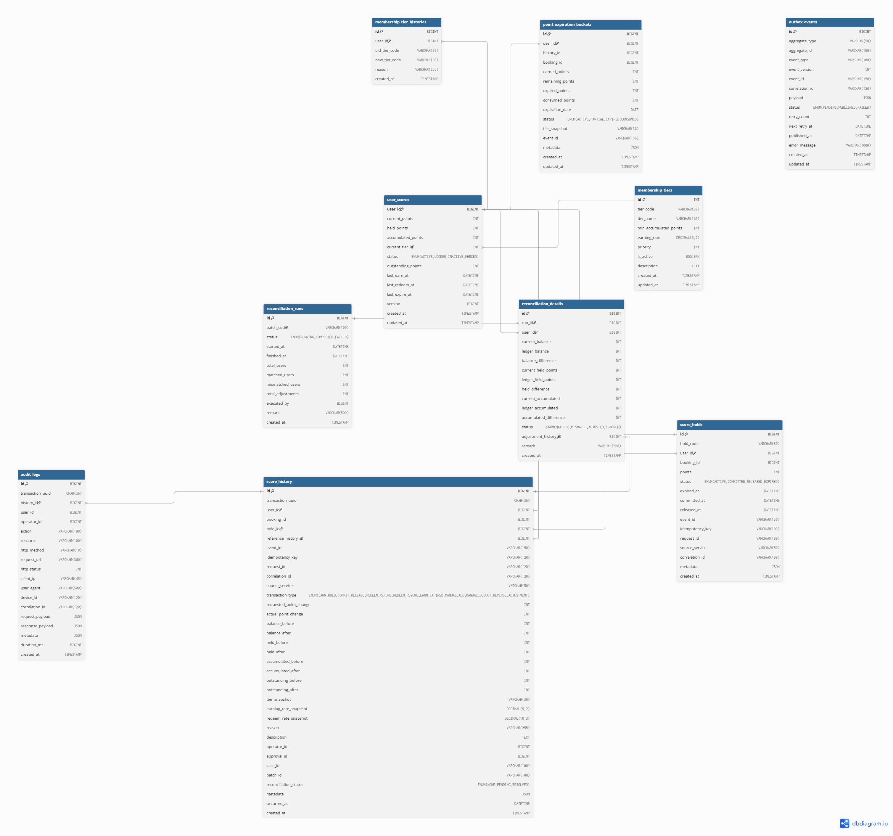
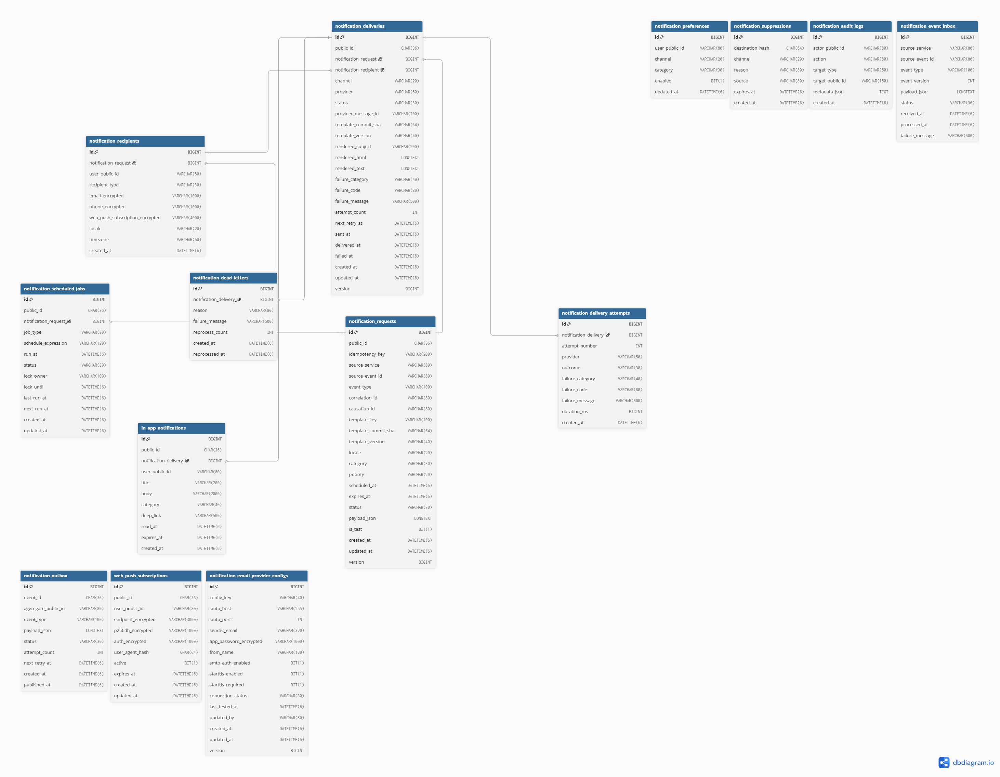
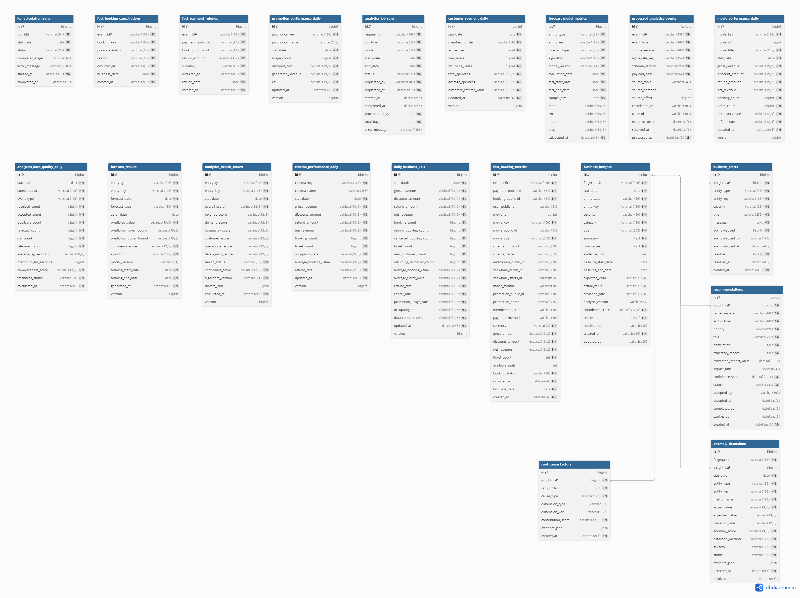

# Tài liệu ERD vật lý theo từng dịch vụ

Tài liệu này cung cấp sơ đồ thiết kế thực thể quan hệ mức vật lý (Physical Entity-Relationship Diagram) chi tiết cho từng dịch vụ riêng biệt trong hệ sinh thái LoraFilm.

## Mục đích

Tài liệu này đóng vai trò như bản thiết kế chi tiết giúp trực quan hóa luồng dữ liệu, phân định ranh giới lưu trữ giữa các microservice, đồng thời hỗ trợ đội ngũ phát triển và Mentor trong các buổi rà soát, đánh giá kiến trúc hệ thống.

## Cấu trúc thư mục

Dưới đây là sơ đồ cây cấu trúc lưu trữ của phân khu thiết kế ERD trong dự án:

```plaintext
docs/
└── database/
    └── erd/
        ├── README.md
        └── physical/
            ├── analytics-service-physical-erd.png
            ├── auth-service-physical-erd.png
            ├── booking-service-physical-erd.png
            ├── movie-service-physical-erd.png
            ├── notification-service-physical-erd.png
            ├── payment-service-physical-erd.png
            ├── promotion-service-physical-erd.png
            ├── score-service-physical-erd.png
            └── user-service-physical-erd.png
```

## Nguyên tắc mỗi dịch vụ một database

Dự án LoraFilm được xây dựng dựa trên kiến trúc microservices phân tán. Để đảm bảo tính độc lập và khả năng mở rộng tối đa, hệ thống áp dụng nguyên tắc Database-per-Service:

1. Mỗi dịch vụ microservice hoàn toàn sở hữu và quản lý một cơ sở dữ liệu tách biệt của riêng mình.
2. Tuyệt đối không thiết lập liên kết khóa ngoại vật lý (Foreign Key) chéo giữa các cơ sở dữ liệu của các dịch vụ khác nhau.
3. Liên kết dữ liệu liên dịch vụ được duy trì thông qua khái niệm Tham chiếu logic (Logical References). Các trường định danh như user_id, movie_id, booking_id, showtime_id, seat_id, promotion_id chỉ lưu trữ dưới dạng kiểu dữ liệu số nguyên thuần túy (bigint). Việc kiểm tra tính toàn vẹn dữ liệu được xử lý ở tầng mã nguồn ứng dụng Spring Boot hoặc thông qua cơ chế đồng bộ luồng sự kiện bất đồng bộ của Apache Kafka.

## Danh sách sơ đồ

Bảng danh mục quản lý sơ đồ ERD vật lý tương ứng với từng dịch vụ:

| Tên dịch vụ | Tệp sơ đồ trong `docs/database/erd/physical/` | Công cụ thiết kế | Trạng thái |
| :--- | :--- | :--- | :--- |
| 1. Auth Service | auth-service-physical-erd.png | dbdiagram.io | Hoàn thành |
| 2. User Service | user-service-physical-erd.png | dbdiagram.io | Hoàn thành |
| 3. Movie Service | movie-service-physical-erd.png | dbdiagram.io | Hoàn thành |
| 4. Booking Service | booking-service-physical-erd.png | dbdiagram.io | Hoàn thành |
| 5. Payment Service | payment-service-physical-erd.png | dbdiagram.io | Hoàn thành |
| 6. Promotion Service | promotion-service-physical-erd.png | dbdiagram.io | Hoàn thành |
| 7. Score Service | score-service-physical-erd.png | dbdiagram.io | Hoàn thành |
| 8. Notification Service | notification-service-physical-erd.png | dbdiagram.io | Hoàn thành |
| 9. Analytics Service | analytics-service-physical-erd.png | dbdiagram.io | Hoàn thành |

## Sơ đồ ERD vật lý chi tiết

### Dịch vụ xác thực

Quản lý đăng ký, đăng nhập, phân quyền (ADMIN, EMPLOYEE, CUSTOMER), mã hóa bảo mật mật khẩu, cấp phát token JWT và hỗ trợ liên kết tài khoản định danh mạng xã hội (Social Login).

*Lưu ý: Bảng `email_verification_tokens` đã được loại bỏ, việc quản lý token tạm thời được chuyển sang Redis. Đồng thời, schema bổ sung bảng `account_providers` để sẵn sàng mở rộng tính năng Social Login.*



### Dịch vụ người dùng

Quản lý thông tin hồ sơ cá nhân cốt lõi của khách hàng và hồ sơ nhân sự nội bộ của nhân viên rạp.



### Dịch vụ phim

Quản lý danh mục phim, thể loại, cấu trúc phòng chiếu, cấu hình ghế ngồi vật lý và lịch trình suất chiếu chi tiết.



### Dịch vụ đặt vé

Xử lý nghiệp vụ trung tâm về đặt vé, chi tiết vé lẻ trong hóa đơn và cơ chế khóa giữ ghế thời gian thực.



### Dịch vụ thanh toán

Tích hợp cổng thanh toán bên thứ ba, theo dõi trạng thái giao dịch tài chính và lưu vết nhật ký phục vụ đối soát dòng tiền.



### Dịch vụ khuyến mãi

Quản lý chiến dịch ưu đãi, mã giảm giá voucher, giới hạn lượt dùng và lịch sử áp dụng khuyến mãi trên từng đơn hàng.



### Dịch vụ điểm thành viên

Quản lý ví điểm thưởng tích lũy của khách hàng, lịch sử biến động điểm và cấu hình các mốc thăng hạng thành viên.



### Dịch vụ thông báo

Quản lý cấu trúc biểu mẫu tin nhắn và nhật ký trạng thái gửi thông báo vé điện tử, mã QR qua các kênh Email, SMS, Push.



### Dịch vụ phân tích

Kho dữ liệu đệm tổng hợp thông tin doanh thu theo ngày và theo phim phục vụ kết xuất báo cáo lên Dashboard quản trị.



## Ghi chú về ERD tổng ban đầu

Mặc dù sơ đồ ERD tập trung ban đầu rất hữu ích cho các cuộc thảo luận ở cấp độ khái niệm tổng quan hệ thống, việc hiện thực hóa ở mức vật lý đòi hỏi cấu trúc cơ sở dữ liệu phân tán và độc lập cho từng microservice để tránh sự ràng buộc chặt chẽ (tight coupling) giữa các bảng dữ liệu, đồng thời nâng cao độ tin cậy và tính mô-đun hóa của hệ thống.

## Quy trình cập nhật ERD

Khi phát sinh các thay đổi về nghiệp vụ liên quan đến cấu trúc cơ sở dữ liệu, các thành viên thực hiện theo quy trình sau:

Bước 1: Thành viên phụ trách truy cập dbdiagram.io để điều chỉnh cấu trúc mã DBML.

Bước 2: Xuất tệp ảnh PNG mới thông qua chức năng Export và ghi đè vào thư mục physical/.

Bước 3: Cập nhật tệp SQL tương ứng trong `docs/database/mysql/schema/`.

Bước 4: Tạo Merge Request hướng về nhánh develop để Lead Thành tiến hành rà soát.

## Lưu ý khi thiết kế ERD

Khi thiết kế hoặc cập nhật sơ đồ ERD vật lý, cần chú ý các quy tắc sau:
1. Đảm bảo khai báo chỉ mục (Index) trên các cột thường xuyên dùng làm điều kiện tìm kiếm hoặc truy vấn lọc để tối ưu hiệu năng.
2. Dữ liệu đồng bộ liên dịch vụ cần được truyền tải một cách bất đồng bộ qua Kafka sự kiện nhằm giảm thiểu độ trễ phản hồi của API.
3. Thiết kế bảng phải đảm bảo khả năng mở rộng cấu trúc linh hoạt mà không gây ảnh hưởng đến tính tương thích ngược của dữ liệu cũ khi tiến hành phân mảnh hoặc nâng cấp phiên bản hệ thống.
