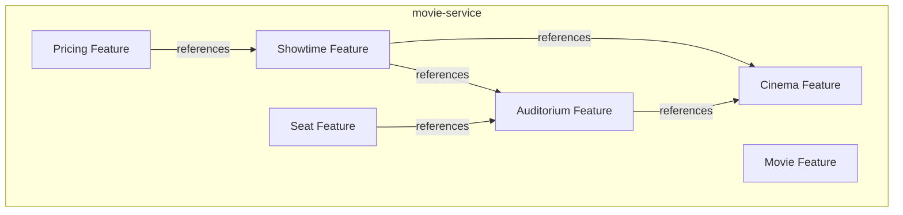

# Technical Specification: Cinema Management, Media, Operating Hours, and Closure Periods

## 1. Executive Summary
This document provides the production-grade architectural design and technical specification for implementing **Cinema Management, Media, Operating Hours, and Closure Periods** inside the `movie-service` microservice.
The module handles all administrative operations required to register cinemas, update their status lifecycles, configure weekly opening hours, upload media assets, and schedule temporary closures. It also exposes read-only endpoints for end-customers to browse active cinemas. All implementation details conform to DDD Lite (Package by Feature) architecture, clean coding practices, database constraint patterns, and the strict ban on Lombok.

---

## 2. Current Project Analysis

Before designing any new component, we analyzed the existing layout and infrastructure of the `movie-service`.

### 2.1. Current Package Structure (DDD Lite)
The project is structured by feature inside the base package `com.lorafilm.movie`:
* **`movie`**: Handles metadata, version mappings, and movie assets.
* **`auditorium`**: Manages cinema rooms, screen characteristics, and maintenance schedules.
* **`seat`**: Represents physical seat coordinates and types.
* **`showtime`**: Directs show schedule lifecycles.
* **`pricing`**: Tracks ticket pricing models.
* **`cinema`**: Contains the target feature classes.

### 2.2. Existing Cinema Feature Components
The cinema package (`com.lorafilm.movie.cinema`) already contains:
1. **Entities**:
   * `Cinema`: Partially implemented entity mapping general fields. Extends `BaseAuditableEntity`.
   * `CinemaMedia`: Entity mapping cinema media files. Extends `BaseAuditableEntity`.
   * `CinemaOperatingHour`: Entity mapping weekly hours. Tracks timestamps manually via `@PrePersist` and `@PreUpdate`.
   * `CinemaClosurePeriod`: Entity mapping temporary closure blocks.
2. **Repositories**:
   * `CinemaRepository`: Interface executing basic operations.
   * `CinemaMediaRepository`: Interface fetching active media items.
   * `CinemaOperatingHourRepository`: Interface fetching schedule data.
   * `CinemaClosurePeriodRepository`: Interface mapping closure blocks. Contains custom query `findOverlappingClosures`.
   * `CinemaSpecification`: Custom specifications mapping queries for `city`, `district`, `keyword`, and `status`.
3. **Services**:
   * `CinemaService`: Defines customer interfaces `getCinemas` and `getCinemaBySlug`.
   * `CinemaServiceImpl`: Standard implementations for customer queries. Resolves dependent details (media, operating hours, auditoriums) for the detail DTO.
4. **Controllers**:
   * `CinemaController`: Public endpoint class mapping `GET /api/cinemas` and `GET /api/cinemas/{cinemaSlug}`.
5. **DTOs and Mappers**:
   * `CinemaDto`: Basic data transfer model.
   * `CinemaDetailDto`: Extended payload including lists for media, operating hours, and active auditoriums.
   * `CinemaMapper`: Component converting `Cinema` entities to DTO representations.

### 2.3. Common Package Analysis
The shared package `com.lorafilm.movie.common` contains components that must be reused:
* **API Wrappers**:
  * `ApiResponse`: Unified JSON wrapper record structure.
  * `PageResponse`: Pagination envelope.
* **Exceptions**:
  * `BusinessException`: Runtime exception wrapping an `ErrorCode`.
  * `ErrorCode`: Predefined Enum mapping messages to HTTP statuses. Key values for this feature:
    * `CINEMA_NOT_FOUND("Cinema not found", 404)`
    * `CINEMA_NOT_CONFIGURABLE("Cinema is not in a configurable state", 400)`
    * `CINEMA_NOT_ACTIVE("Cinema is not active", 400)`
    * `INVALID_CINEMA_TIMEZONE("Invalid cinema timezone", 400)`
    * `CINEMA_CLOSURE_CONFLICT("Action conflicts with cinema closure schedule", 409)`
  * `GlobalExceptionHandler`: Centralized ControllerAdvice handling exceptions and returning mapped `ApiResponse` payloads.
* **Auditing**:
  * `BaseAuditableEntity`: Superclass providing `createdAt`, `updatedAt`, `createdBy`, `updatedBy`, `deletedAt`, `deletedBy` fields.
  * `AuditConfig` & `AuditorAwareImpl`: Resolves the active user ID string from Spring Security contexts.
* **Security**:
  * `CurrentUserProvider`: Interface and implementation to extract user details inside service components.

---

## 3. Current Database Analysis

The database schema represents the system's strict boundary. The tables are configured inside `movie-service-schema.sql`:

```sql
-- Cinemas main catalog
CREATE TABLE cinemas (
    id BIGINT PRIMARY KEY AUTO_INCREMENT,
    public_id CHAR(36) NOT NULL UNIQUE,
    name VARCHAR(150) NOT NULL,
    slug VARCHAR(180) NOT NULL,
    active_slug VARCHAR(180) GENERATED ALWAYS AS (CASE WHEN deleted_at IS NULL THEN slug ELSE NULL END) STORED,
    city VARCHAR(100) NOT NULL,
    district VARCHAR(100),
    address VARCHAR(255) NOT NULL,
    latitude DECIMAL(10, 7) NULL,
    longitude DECIMAL(10, 7) NULL,
    timezone VARCHAR(50) NOT NULL DEFAULT 'Asia/Ho_Chi_Minh',
    hotline VARCHAR(30),
    description TEXT,
    status VARCHAR(30) NOT NULL DEFAULT 'DRAFT',
    opened_date DATE NULL,
    closed_date DATE NULL,
    created_at TIMESTAMP DEFAULT CURRENT_TIMESTAMP,
    updated_at TIMESTAMP DEFAULT CURRENT_TIMESTAMP ON UPDATE CURRENT_TIMESTAMP,
    created_by BIGINT NULL,
    updated_by BIGINT NULL,
    deleted_at TIMESTAMP NULL,
    deleted_by BIGINT NULL,
    CONSTRAINT chk_cinemas_closed_date CHECK (closed_date IS NULL OR opened_date IS NULL OR closed_date >= opened_date),
    UNIQUE KEY uk_cinemas_active_slug (active_slug)
);

-- Media resources for cinema
CREATE TABLE cinema_media (
    id BIGINT PRIMARY KEY AUTO_INCREMENT,
    public_id CHAR(36) NOT NULL UNIQUE,
    cinema_id BIGINT NOT NULL,
    media_type VARCHAR(30) NOT NULL,
    url VARCHAR(500) NOT NULL,
    title VARCHAR(150),
    display_order INT NOT NULL DEFAULT 0,
    is_primary BOOLEAN NOT NULL DEFAULT FALSE,
    status VARCHAR(30) NOT NULL DEFAULT 'ACTIVE',
    created_at TIMESTAMP DEFAULT CURRENT_TIMESTAMP,
    updated_at TIMESTAMP DEFAULT CURRENT_TIMESTAMP ON UPDATE CURRENT_TIMESTAMP,
    created_by BIGINT NULL,
    updated_by BIGINT NULL,
    deleted_at TIMESTAMP NULL,
    deleted_by BIGINT NULL,
    CONSTRAINT fk_cinema_media_cinema FOREIGN KEY (cinema_id) REFERENCES cinemas (id) ON DELETE CASCADE
);

-- Weekly operating configurations
CREATE TABLE cinema_operating_hours (
    id BIGINT PRIMARY KEY AUTO_INCREMENT,
    cinema_id BIGINT NOT NULL,
    day_of_week TINYINT NOT NULL,
    open_time TIME NOT NULL,
    close_time TIME NOT NULL,
    is_closed BOOLEAN NOT NULL DEFAULT FALSE,
    created_at TIMESTAMP DEFAULT CURRENT_TIMESTAMP,
    updated_at TIMESTAMP DEFAULT CURRENT_TIMESTAMP ON UPDATE CURRENT_TIMESTAMP,
    created_by BIGINT NULL,
    updated_by BIGINT NULL,
    CONSTRAINT fk_operating_hours_cinema FOREIGN KEY (cinema_id) REFERENCES cinemas (id) ON DELETE CASCADE,
    CONSTRAINT uk_cinema_operating_day UNIQUE (cinema_id, day_of_week),
    CONSTRAINT chk_day_of_week CHECK (day_of_week BETWEEN 1 AND 7)
);

-- Closure periods schedule
CREATE TABLE cinema_closure_periods (
    id BIGINT PRIMARY KEY AUTO_INCREMENT,
    cinema_id BIGINT NOT NULL,
    start_time TIMESTAMP NOT NULL,
    end_time TIMESTAMP NOT NULL,
    reason VARCHAR(255),
    status VARCHAR(30) NOT NULL DEFAULT 'ACTIVE',
    created_at TIMESTAMP DEFAULT CURRENT_TIMESTAMP,
    updated_at TIMESTAMP DEFAULT CURRENT_TIMESTAMP ON UPDATE CURRENT_TIMESTAMP,
    created_by BIGINT NULL,
    updated_by BIGINT NULL,
    CONSTRAINT fk_closure_cinema FOREIGN KEY (cinema_id) REFERENCES cinemas (id) ON DELETE CASCADE,
    CONSTRAINT chk_closure_time CHECK (end_time > start_time)
);
```

### 3.1. DB Indexes Justification
* `idx_cinemas_city_district_status`: Multi-column index optimizing search operations on location filters. Prevents full-table scans for public queries.
* `idx_cinemas_status` & `idx_cinemas_public_id` & `idx_cinemas_deleted_at`: Speed up lookups for service-level status checks and ID mappings.
* `idx_cinema_media_cinema_type_status`: Speeds up fetching of media listings filtered by active statuses and media categories.
* `idx_operating_hours_cinema`: Speeds up loading weekly operating hours lists.
* `idx_closure_cinema_status_time` on `(cinema_id, status, start_time, end_time)`: Optimizes range overlap scans inside `findOverlappingClosures` during scheduling checks.

### 3.2. Referential Integrity & Constraints
* **Soft Delete**: `cinemas.deleted_at` maps inactive/deleted entries. Virtual column `active_slug` handles unique constraints dynamically to allow duplicate slugs for logically deleted records.
* **Foreign Keys**: Cascading deletion is applied on media, operating hours, and closure periods (`ON DELETE CASCADE`) to automatically purge dependent items when a parent cinema record is deleted.
* **Database Check Constraints**:
  * `chk_cinemas_closed_date` restricts closed date configurations.
  * `chk_day_of_week` restricts input values to the 1-7 weekly day range.
  * `chk_closure_time` restricts closure start times to be before end times.

---

## 4. Gap Analysis

The following gap analysis highlights the delta between the current implementation and requirements:

```
+------------------------------------+--------------------------------------+----------------------------------------+
| Current Component State            | Required Target State (Issue)        | Identified Gap / Work Needed           |
+------------------------------------+--------------------------------------+----------------------------------------+
| Customer-only endpoint controller  | Full Admin + Customer endpoints      | Implement Admin API endpoints with     |
| and service methods. No writing.   | for Cinema Management.               | role validation checks.                |
+------------------------------------+--------------------------------------+----------------------------------------+
| Basic entities defined.            | Full media config, operating hours   | Write DTOs mapping fields, validations,|
| No requests/responses DTOs mapped.  | updates, and closure period sets.   | and converters for payload mappings.   |
+------------------------------------+--------------------------------------+----------------------------------------+
| Simple slug mapping.               | Enforce unique slug lifecycle rules  | Implement slug normalization routines, |
|                                    | and status machine validations.     | checking existing active conflicts.    |
+------------------------------------+--------------------------------------+----------------------------------------+
| Query checking interfaces.         | Validate temporary closures overlaps | Integrate service-level checks invoking|
|                                    | on scheduling updates.               | overlap query methods.                 |
+------------------------------------+--------------------------------------+----------------------------------------+
```

---

## 5. Dependency Analysis

The cinema feature coordinates with neighboring features within `movie-service`:



### 5.1. Feature Interactions
* **Auditorium**: Audits cinema status lifecycles. A cinema set to `PERMANENTLY_CLOSED` must reject active rooms. Soft deleting a cinema verifies that related room listings are empty.
* **Showtime**: Check that new showtime intervals fall completely within operating hours and outside scheduled closure blocks.
* **Seat & Movie & Pricing**: Unaffected by cinema configuration updates. These domains **will not be modified** during implementation.

---

## 6. Architecture Decision Records (ADRs)

### 6.1. ADR-01: Expose `public_id` (UUID) in APIs
* **Decision**: We use `publicId` (UUID string) as the primary identifier across REST API boundaries for `Cinema` and `CinemaMedia`.
* **Reason**: Prevents primary key enumeration attacks and decouples the internal database index structure from public consumption.
* **Source**: Database Schema (`public_id` column).
* **Impact**: All controllers and services must parse and resolve entities using `publicId`.

### 6.2. ADR-02: Expose Database `id` (Long) for Closure Periods
* **Decision**: Expose database primary key `id` (Long) in APIs for managing `CinemaClosurePeriod` updates.
* **Reason**: The database schema does not define a `public_id` column for `cinema_closure_periods`. To maintain alignment with `auditorium_maintenance_windows`, we use the internal `id` rather than altering physical database schemas.
* **Source**: Database Schema (`cinema_closure_periods` table fields).
* **Impact**: Admin cancel endpoints map variables using the resource ID parameter type.

### 6.3. ADR-03: Separate `AdminCinemaController` from `CinemaController`
* **Decision**: Write administrative operations inside a dedicated `AdminCinemaController`, keeping read actions inside `CinemaController`.
* **Reason**: Aligns with the existing `AdminAuditoriumController` coding style. Simplifies Spring Security routing controls by isolating operations under the `/api/admin` path.
* **Source**: Codebase structure review.
* **Impact**: Clearer controller division and simplified authorization filters.

### 6.4. ADR-04: Expose Cinema timezone configuration defaults
* **Decision**: The timezone property defaults to `"Asia/Ho_Chi_Minh"` and restricts updates to values registered in Java's `ZoneId` mapping registry.
* **Reason**: Prevents parse discrepancies across client systems.
* **Source**: Database Schema (`timezone` column constraint).
* **Impact**: Throws validation exceptions if timezone formats are unrecognized.

---

## 7. Business Rules

### 7.1. Explicit Rules (From Issue)
* **Customer Visibility**: Customers can search and view only active cinemas (`status = 'ACTIVE'` and `deleted_at IS NULL`).
* **Attributes Constraint**: A cinema must define `city`, `district`, and `address` attributes.
* **Media Assets**: Media gallery entries map to categories: `LOGO`, `BANNER`, `GALLERY`, `MAP`.
* **Timetables**: Defines weekly schedules using day indices (1 to 7).
* **Closure Periods**: Cinema can declare unexpected or planned temporary closures.
* **Showtime Restriction**: (Out of Scope for this branch) Showtime creation validation is deferred until showtime modules integrate.
* **Delete Restriction**: Deleting a cinema is blocked if it references active room configurations or historic showtime logs.
* **Slug Uniqueness**: Cinema slugs must remain unique across active entries.

### 7.2. Implicit Rules (Derived from Design)
* **Time Alignment**: Opened date must precede closed date (`closed_date >= opened_date`).
* **State Constraints**: Changes to cinema statuses must follow the state machine lifecycle rules.
* **Unique Operating Day**: A cinema can map at most one record per weekday index (1 to 7).

### 7.3. Production Rules (High-Load Guard)
* **Primary Media De-escalation**: If a cinema media item is set to `isPrimary = true`, any existing primary media items of the same type must be set to `isPrimary = false` within the transaction to maintain a single primary entry.
* **Closure Time Frame Checks**: Scheduled closure intervals must begin in the future (`startTime >= Instant.now()`).

### 7.4. Edge Cases
* **Concurrent Closure Settings**: Multiple administrators registering closures concurrently could bypass overlap checks. This is handled using database range queries executed in transactional blocks.
* **Reactivating Deleted Slugs**: Soft-deleted entries free up their slugs, allowing active records to reuse identical slugs.

---

## 8. Validation Strategy

We apply validation checks across four distinct layers:

### 8.1. DTO Validation (API Boundary)
Enforce base rules using `jakarta.validation` annotations:
* `@NotBlank` checks on string parameters (name, city, address, district).
* `@Size` restrictions on title text and hotline lengths.
* `@NotNull` checks on timezone strings and status values.

### 8.2. Business Validation (Service Layer)
* **Timezone checks**: The timezone string must match a value in `ZoneId.getAvailableZoneIds()`.
* **Temporal validation**: Verify time order parameters (`openedDate` <= `closedDate`, `openTime` < `closeTime`, `startTime` < `endTime`).
* **Duplicate day checks**: Bulk updates must contain exactly seven entries mapping weekdays 1 through 7 without duplicates.
* **Conflict validation**: Check for overlapping closure intervals using repository queries.
* **Lifecycle check**: Status updates must follow the state machine transition rules.

### 8.3. Database Validation (Physical Constraints)
* Column nullable definitions and unique constraints (`uk_cinemas_active_slug`, `uk_cinema_operating_day`).
* Check constraints (`chk_cinemas_closed_date`, `chk_day_of_week`, `chk_closure_time`).
* Foreign Key references (`ON DELETE RESTRICT` on dependent entity tables).

### 8.4. Security Validation (Access Control)
* Admin endpoints (under `/api/admin/**`) are restricted to requests containing verified `ADMIN` roles.
* Public paths are open to read-only customer traffic.

---

## 9. Entity Design

```
 com.lorafilm.movie.cinema.domain.entity
 
 +---------------------------------------------------------+
 | Cinema (extends BaseAuditableEntity)                   |
 | - id: Long (PK)                                         |
 | - publicId: String (UK, UUID)                           |
 | - name, slug, activeSlug, city, district, address      |
 | - latitude, longitude, timezone, hotline, description   |
 | - status: CinemaStatus                                  |
 | - openedDate, closedDate: LocalDate                     |
 +---------------------------------------------------------+
                              |
                              +---> OneToMany ---> CinemaMedia (extends BaseAuditableEntity)
                              |
                              +---> OneToMany ---> CinemaOperatingHour
                              |
                              +---> OneToMany ---> CinemaClosurePeriod
```

Entities map to the MySQL tables without using Lombok. Manual getters, setters, and constructors are implemented.

### 9.1. `Cinema`
* **Table**: `cinemas`
* **Annotations**: `@Entity`, `@Table(name = "cinemas")`
* **Properties**: Standard attributes with publicId mapped to a CHAR(36) UUID representation.

### 9.2. `CinemaMedia`
* **Table**: `cinema_media`
* **Annotations**: `@Entity`, `@Table(name = "cinema_media")`
* **Properties**: Reference mapping to the parent cinema using lazy fetching and cascading options.

### 9.3. `CinemaOperatingHour`
* **Table**: `cinema_operating_hours`
* **Annotations**: `@Entity`, `@Table(name = "cinema_operating_hours")`
* **Audit Hooks**:
  ```java
  @PrePersist
  protected void onCreate() {
      createdAt = Instant.now();
      updatedAt = Instant.now();
  }
  @PreUpdate
  protected void onUpdate() {
      updatedAt = Instant.now();
  }
  ```

### 9.4. `CinemaClosurePeriod`
* **Table**: `cinema_closure_periods`
* **Annotations**: `@Entity`, `@Table(name = "cinema_closure_periods")`
* **Audit Hooks**: Maps standard timestamps and auditor attributes.

---

## 10. DTO Design

We declare DTO classes without Lombok to handle input validation and response mapping.

### 10.1. Request DTOs
* **`CreateCinemaRequest`**: Includes name, city, district, address, latitude, longitude, timezone, hotline, description, openedDate, closedDate.
* **`UpdateCinemaRequest`**: Aligns with `CreateCinemaRequest` fields to update existing properties.
* **`UpdateCinemaStatusRequest`**: Contains the target `CinemaStatus` to run status lifecycle validation checks.
* **`CreateCinemaMediaRequest`**: Wraps fields: `mediaType`, `url`, `title`, `displayOrder`, `isPrimary`.
* **`UpdateCinemaMediaRequest`**: Allows editing URLs, titles, order sequence, primary flags, or setting active statuses.
* **`OperatingHourUpdateRequest`**: Combines `dayOfWeek` (1-7), `openTime`, `closeTime`, and `isClosed`.
* **`CreateCinemaClosurePeriodRequest`**: Holds the start timestamp, end timestamp, and a description reason.

### 10.2. Response DTOs
* **`CinemaResponse`**: Simple wrapper enclosing main properties and publicId for admin operations.
* **`CinemaMediaResponse`**: Returns media attributes including `publicId` and `status`.
* **`CinemaClosurePeriodResponse`**: Returns the scheduled closure block properties along with its database record `id`.

---

## 11. Repository Design

We define 4 repositories under `com.lorafilm.movie.cinema.repository`:

### 11.1. `CinemaRepository`
* `Optional<Cinema> findByPublicIdAndDeletedAtIsNull(String publicId);`
* `Optional<Cinema> findBySlugAndDeletedAtIsNull(String slug);`
* `boolean existsBySlugAndDeletedAtIsNull(String slug);`
* `boolean existsBySlugAndPublicIdNotAndDeletedAtIsNull(String slug, String publicId);`

### 11.2. `CinemaMediaRepository`
* `List<CinemaMedia> findByCinemaIdAndStatusAndDeletedAtIsNullOrderByDisplayOrderAsc(Long cinemaId, ActiveStatus status);`
* `Optional<CinemaMedia> findByPublicIdAndDeletedAtIsNull(String publicId);`

### 11.3. `CinemaOperatingHourRepository`
* `List<CinemaOperatingHour> findByCinemaId(Long cinemaId);`
* `List<CinemaOperatingHour> findByCinemaIdOrderByDayOfWeekAsc(Long cinemaId);`

### 11.4. `CinemaClosurePeriodRepository`
* `List<CinemaClosurePeriod> findByCinemaId(Long cinemaId);`
* JPQL Query:
  ```java
  @Query("SELECT c FROM CinemaClosurePeriod c WHERE c.cinema.id = :cinemaId " +
         "AND c.status = 'ACTIVE' " +
         "AND (c.startTime < :endTime AND c.endTime > :startTime)")
  List<CinemaClosurePeriod> findOverlappingClosures(
          @Param("cinemaId") Long cinemaId,
          @Param("startTime") Instant startTime,
          @Param("endTime") Instant endTime);
  ```

---

## 12. Service Design

The service interfaces separate controllers from entity-specific business logic:

* **`CinemaService`**
  ```java
  public interface CinemaService {
      // Customer Queries
      PageResponse<CinemaDto> getCinemas(String city, String district, String keyword, int page, int size);
      CinemaDetailDto getCinemaByIdentifier(String identifier);
      List<CinemaDetailDto.CinemaMediaDto> getCinemaMedia(String cinemaPublicId);
      List<CinemaDetailDto.OperatingHourDto> getCinemaOperatingHours(String cinemaPublicId);

      // Admin CRUD Commands
      CinemaResponse createCinema(CreateCinemaRequest request);
      CinemaResponse updateCinema(String publicId, UpdateCinemaRequest request);
      CinemaResponse updateCinemaStatus(String publicId, CinemaStatus targetStatus);
      
      CinemaMediaResponse addCinemaMedia(String cinemaPublicId, CreateCinemaMediaRequest request);
      CinemaMediaResponse updateCinemaMedia(String mediaPublicId, UpdateCinemaMediaRequest request);
      
      List<OperatingHourResponse> updateOperatingHours(String cinemaPublicId, List<OperatingHourUpdateRequest> requests);
      CinemaClosurePeriodResponse createClosurePeriod(String cinemaPublicId, CreateCinemaClosurePeriodRequest request);
      CinemaClosurePeriodResponse cancelClosurePeriod(Long closurePeriodId);
  }
  ```

* **`CinemaServiceImpl`**: Orchestrates service lookups, performs status checks, manages validation logic, updates audit fields, and handles data transactions.

---

## 13. Controller Design

We separate administrative functions and public views into distinct controllers:

### 13.1. `CinemaController` (Customer)
* **Base Route**: `/api/cinemas`
* Exposes public search, details, media, and operating hour details without authorization checks.

### 13.2. `AdminCinemaController` (Admin)
* **Base Route**: `/api/admin`
* Enforces role checks (`ADMIN`) on operations including updates, media management, operating hours setup, and scheduling closures.

---

## 14. Exception Strategy

All exceptions map to unified JSON payloads through the `GlobalExceptionHandler`:
* Spring validation constraints map to `400 Bad Request` responses containing validation details.
* Domain exceptions throw a `BusinessException` wrapping a specific `ErrorCode`:
  * `CINEMA_NOT_FOUND` $\rightarrow$ `404 Not Found`
  * `INVALID_CINEMA_TIMEZONE` $\rightarrow$ `400 Bad Request`
  * `INVALID_AUDITORIUM_STATUS_TRANSITION` $\rightarrow$ `400 Bad Request`
  * `CINEMA_CLOSURE_CONFLICT` $\rightarrow$ `409 Conflict`

---

## 15. Transaction Strategy

We apply transaction configurations across service paths:
* `@Transactional(readOnly = true)` is declared on query paths to optimize read performance.
* Default `@Transactional` configurations are set on write paths (creation, edits, cancellations) to guarantee that all updates execute atomically and rollback on failures.

---

## 16. Performance Strategy

To support high concurrent traffic in production:
* **Lazy Loading**: `FetchType.LAZY` configurations on entity associations prevent unwanted database operations.
* **Pagination Constraints**: Enforce page limits on search queries to prevent heavy database queries.
* **Query Indexing**: The database uses composite indexes on search query target fields: `(city, district, status)` and `(cinema_id, status, start_time, end_time)`.

---

## 17. Security Considerations

* **Role Validation**: Filters intercept requests to `/api/admin/**` to verify that the request contains the `ADMIN` role.
* **ID Obfuscation**: External payloads reference unique `publicId` (UUID) strings instead of database primary keys. For closure periods, the internal auto-increment ID is exposed because the database schema does not define a `public_id` column.

---

## 18. Production Considerations

* **Timezone Standardization**: Timestamps are saved as UTC `Instant` representations in the database. The system localizes time offsets using the cinema's configured timezone property (e.g. `"Asia/Ho_Chi_Minh"`).

---

## 19. Merge Conflict Minimization Strategy

To minimize conflicts when merging code changes:
* All classes are added inside the `com.lorafilm.movie.cinema` package.
* Refrain from modifying common codebase configurations unless appending keys to `ErrorCode.java`.

### Risk Assessment on File Modifications
* **`ErrorCode.java` (Low Risk)**: Shared enum. Appending keys at the end avoids line conflicts.
* **`CinemaMapper.java` (Medium Risk)**: Requires mapping additional DTO parameters. Check current field conversions to avoid conflicts.
* **`CinemaRepository.java` (Low Risk)**: Add new query methods. No risk of breaking existing calls.
* **`CinemaServiceImpl.java` (Medium Risk)**: Service implementation requires updating several method implementations. Keep code chunks structured to prevent conflicts.
* **`CinemaController.java` (Low Risk)**: The file is small and only requires appending public GET endpoints.

---

## 20. Two-Phase Development Plan

### Phase 1: Core CRUD & Base Mappings
* **Scope**: Implement basic CRUD operations and the core infrastructure for Cinemas.
* **Files Created**: `CreateCinemaRequest`, `UpdateCinemaRequest`, `UpdateCinemaStatusRequest`, `CinemaResponse`, `SlugUtils`.
* **Files Modified**: `CinemaRepository`, `CinemaMapper`, `CinemaService`, `CinemaServiceImpl`, `AdminCinemaController`.
* **Testing**: Unit tests covering CRUD validations and status lifecycles.

### Phase 2: Media, Operating Hours, and Closure Periods
* **Scope**: Implement operating hours configurations, media attachments, and closure period checks.
* **Files Created**: `CreateCinemaMediaRequest`, `UpdateCinemaMediaRequest`, `OperatingHourUpdateRequest`, `CreateCinemaClosurePeriodRequest`, `CinemaMediaResponse`, `CinemaClosurePeriodResponse`, `AdminCinemaControllerIntegrationTest`.
* **Files Modified**: `CinemaMediaRepository`, `CinemaClosurePeriodRepository`, `CinemaServiceImpl`, `CinemaController`.
* **Testing**: Integration tests validating overlapping closures and validation constraints.

---

## 21. File Creation Plan

We will create the following files during the implementation phase:
1. `com/lorafilm/movie/cinema/util/SlugUtils.java` - Slug utility.
2. `com/lorafilm/movie/cinema/dto/CreateCinemaRequest.java` - Creation payload DTO.
3. `com/lorafilm/movie/cinema/dto/UpdateCinemaRequest.java` - Update payload DTO.
4. `com/lorafilm/movie/cinema/dto/UpdateCinemaStatusRequest.java` - Status transition DTO.
5. `com/lorafilm/movie/cinema/dto/CreateCinemaMediaRequest.java` - Media creation payload.
6. `com/lorafilm/movie/cinema/dto/UpdateCinemaMediaRequest.java` - Media update payload.
7. `com/lorafilm/movie/cinema/dto/OperatingHourUpdateRequest.java` - Operating hour payload.
8. `com/lorafilm/movie/cinema/dto/CreateCinemaClosurePeriodRequest.java` - Closure period payload.
9. `com/lorafilm/movie/cinema/dto/CinemaResponse.java` - Cinema response payload DTO.
10. `com/lorafilm/movie/cinema/dto/CinemaMediaResponse.java` - Media response payload DTO.
11. `com/lorafilm/movie/cinema/dto/CinemaClosurePeriodResponse.java` - Closure period response DTO.
12. `com/lorafilm/movie/cinema/controller/AdminCinemaController.java` - Admin REST controller endpoints.
13. `test/java/com/lorafilm/movie/cinema/service/CinemaServiceImplTest.java` - Unit tests verifying CRUD operations and status lifecycles.
14. `test/java/com/lorafilm/movie/cinema/controller/AdminCinemaControllerIntegrationTest.java` - Integration tests verifying REST endpoints.

---

## 22. File Modification Plan

We will modify the following files during the implementation phase:
1. `com/lorafilm/movie/common/exception/ErrorCode.java` - Append new validation error codes if needed.
2. `com/lorafilm/movie/cinema/dto/CinemaMapper.java` - Add conversions for the newly created responses.
3. `com/lorafilm/movie/cinema/repository/CinemaRepository.java` - Add unique check query signatures.
4. `com/lorafilm/movie/cinema/repository/CinemaMediaRepository.java` - Add public identifier lookup method.
5. `com/lorafilm/movie/cinema/repository/CinemaClosurePeriodRepository.java` - Add lookup methods.
6. `com/lorafilm/movie/cinema/service/CinemaService.java` - Append service signatures.
7. `com/lorafilm/movie/cinema/service/CinemaServiceImpl.java` - Implement service logic.
8. `com/lorafilm/movie/cinema/controller/CinemaController.java` - Add public media and operating hour search endpoints.

---

## 23. Testing Strategy

* **Unit Testing**: Test the slug utility, status validations, and DTO mappings with JUnit 5.
* **Integration Testing**: Test database constraints, overlap checks, and REST endpoints using `@SpringBootTest` and MockMvc.

---

## 24. Risks and Edge Cases

* **Timezone Shifts**: Storing timestamps in UTC and referencing local times can lead to offsets. We mitigate this by validating timezone values.
* **Overlapping Closures**: Ensure transactions block double-booking checks.

---

## 25. Future Recommendations

* Implement cache strategies using Redis to retrieve cinema layouts and operating hours.
* Add email notifications to alert customers if scheduled closures affect their bookings.
