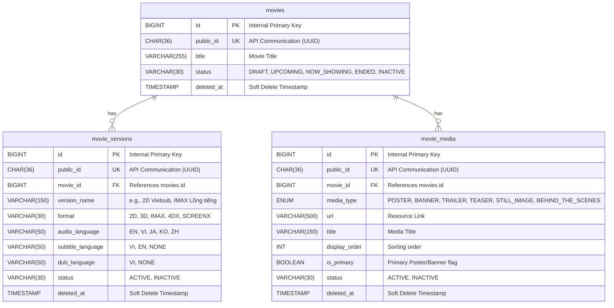

# Tài liệu Thiết kế & Kế hoạch Triển khai Module Movie Versions & Movie Media (Issue #179)

Tài liệu này đặc tả thiết kế kỹ thuật chi tiết, các ràng buộc cơ sở dữ liệu, quy luật nghiệp vụ và đặc tả API cho module **Movie Versions & Movie Media** trong Movie Service. Tài liệu được tinh chỉnh bám sát yêu cầu nghiệp vụ của Issue #179 và tuân thủ các nguyên tắc thiết kế thực tế của dự án để đảm bảo tính sẵn sàng cao và giảm thiểu tối đa xung đột mã nguồn.

---

## Mục lục
1. [Phân tích Database Schema](#1-phân-tích-database-schema)
2. [Quy luật Nghiệp vụ & Ràng buộc (Business Rules)](#2-quy-luật-nghiệp-vụ--ràng-buộc-business-rules)
3. [Đặc tả REST API](#3-đặc-tả-rest-api)
4. [Nguyên tắc Giảm thiểu Xung đột & Rủi ro](#4-nguyên-tắc-giảm-thiểu-xung-đột--rủi-ro)
5. [Lộ trình Triển khai 2 Giai đoạn](#5-lộ-trình-triển-khai-2-giai-đoạn)
6. [Kịch bản Kiểm thử Nghiệm thu (Acceptance Test Cases)](#6-kịch-bản-kiểm-thử-nghiệm-thu-acceptance-test-cases)

---

## 1. Phân tích Database Schema

Dựa trên file cơ sở dữ liệu chung [movie-service-schema.sql](file:///h:/Code%20Java/OJT_saleTicket/hcm26_cpl_java_05_group3/docs/database/mysql/movie-service-schema.sql), các bảng liên quan trực tiếp đến module này bao gồm: `movies`, `movie_versions` và `movie_media`.



### Chi tiết các bảng & Á nghĩa thiết kế kỹ thuật:

1. **Bảng `movies`**:
   - Quản lý trạng thái xuất bản chung của bộ phim (`status`). Cần được kiểm tra điều kiện xuất bản (Publish Validation) trước khi cập nhật sang các trạng thái kích hoạt.

2. **Bảng `movie_versions`**:
   - Đại diện cho các phiên bản phát hành/chiếu khác nhau của phim (Ví dụ: Bản IMAX phụ đề Việt, bản 2D lồng tiếng).
   - Ràng buộc duy nhất cơ sở dữ liệu (`uk_movie_version_unique`):
     ```sql
     UNIQUE KEY uk_movie_version_unique (movie_id, format, audio_language, subtitle_language, dub_language)
     ```
     Đảm bảo không tạo trùng lặp cấu hình phiên bản của cùng một bộ phim.
   - Để đồng bộ với CSDL, thực thể `MovieVersion.java` cần được cấu hình bổ sung annotation `@UniqueConstraint` tại `@Table`:
     ```java
     @Table(name = "movie_versions", uniqueConstraints = {
         @UniqueConstraint(name = "uk_movie_version_unique", columnNames = {"movie_id", "format", "audio_language", "subtitle_language", "dub_language"})
     })
     ```

3. **Bảng `movie_media`**:
   - Quản lý các tài nguyên hình ảnh/video đi kèm của phim.
   - Trường `display_order` dùng để kiểm soát thứ tự hiển thị của các hình ảnh tĩnh hoặc trailer phụ trợ của phim.
   - Cờ `is_primary` chỉ định đây là poster chính hoặc banner chính.

---

## 2. Quy luật Nghiệp vụ & Ràng buộc (Business Rules)

### A. Ràng buộc về Movie Version:
* **Tính duy nhất**: Không cho phép tạo hai phiên bản có cùng tổ hợp (`format`, `audio_language`, `subtitle_language`, `dub_language`) trên cùng một bộ phim. Nếu phát hiện trùng lặp, hệ thống phải ném lỗi `BusinessException` với mã lỗi tương ứng khai báo trong `ErrorCode` (ví dụ: lỗi trùng lặp phiên bản - HTTP 400).
* **Vòng đời & Trạng thái**:
  * Trạng thái hoạt động gồm `ACTIVE` và `INACTIVE`.
  * Khách hàng (Customer) chỉ được phép xem các phiên bản ở trạng thái `ACTIVE` và chưa bị xóa mềm (`deleted_at IS NULL`).

### B. Ràng buộc về Movie Media:
* **Kiểm soát Media chính (Primary Media Logic)**:
  * Chỉ cho phép thiết lập `is_primary = true` khi loại phương tiện (`media_type`) là **`POSTER`** hoặc **`BANNER`**. Với các loại media khác (như `TRAILER`, `STILL_IMAGE`), trường `is_primary` bắt buộc phải là `false`.
  * Trong cùng một bộ phim, tại một thời điểm chỉ được phép có tối đa một Poster chính hoạt động (`media_type = POSTER`, `is_primary = true`, `status = ACTIVE`, `deleted_at IS NULL`) và tối đa một Banner chính hoạt động (`media_type = BANNER`, `is_primary = true`, `status = ACTIVE`, `deleted_at IS NULL`).
  * **Hành vi hệ thống**: Khi Admin thêm mới hoặc cập nhật một media thành `is_primary = true` (và status = ACTIVE), hệ thống phải thực hiện tự động cập nhật toàn bộ các media khác có cùng `media_type` của phim đó về trạng thái `is_primary = false` trong cùng một Transaction `@Transactional`.
* **Thứ tự hiển thị (Display Order)**:
  * Các API trả về danh sách media cho khách hàng hoặc quản trị viên phải sắp xếp theo thứ tự `display_order` tăng dần (số nhỏ xếp trước).
  * **Cơ chế giải quyết trùng lặp thứ tự**: Nếu hai media có cùng giá trị `display_order`, hệ thống sẽ sắp xếp phụ theo `created_at` giảm dần (mới nhất xếp trước) và theo `id` tăng dần để đảm bảo kết quả trả về luôn nhất quán.
* **Xóa mềm (Soft Delete)**:
  * Khi Admin thực hiện xóa media, hệ thống thực thi xóa mềm bằng cách cập nhật trường `deleted_at = Instant.now()` và `deleted_by = {current_user_id}` qua phương thức `performSoftDelete()`. Khách hàng sẽ không thể truy cập các media đã bị xóa mềm này.

### C. Quy luật Publish Phim (Publish Validation Rule):
* Hệ thống tuyệt đối không cho phép đổi trạng thái bộ phim sang trạng thái đã xuất bản (ví dụ: chuyển từ trạng thái nháp sang các trạng thái hoạt động) nếu phim đó thiếu một trong hai điều kiện sau:
  1. Có ít nhất một Movie Version ở trạng thái `ACTIVE` (và chưa bị xóa mềm).
  2. Có ít nhất một Movie Media là Poster chính hoạt động (`media_type = POSTER`, `is_primary = true`, `status = ACTIVE`, và chưa bị xóa mềm).
* Nếu không thỏa mãn, hệ thống phải chặn lại và ném lỗi `BusinessException` với lỗi tương ứng tại `ErrorCode` (trả về HTTP Status `400 Bad Request`).

---

## 3. Đặc tả REST API

Tất cả các API Response phải được bọc trong lớp định dạng chuẩn của dự án: `com.lorafilm.movie.common.api.ApiResponse`. Nhằm đồng bộ với source code thực tế tại [ApiResponse.java](file:///h:/Code%20Java/OJT_saleTicket/hcm26_cpl_java_05_group3/server/movie-service/src/main/java/com/lorafilm/movie/common/api/ApiResponse.java), các API trả về lỗi sẽ sử dụng phương thức `ApiResponse.fail(errorMessage)` thay vì `ApiResponse.error()`.

### A. API dành cho Khách hàng (Customer)

#### 1. Lấy chi tiết thông tin phim
* **Method**: `GET`
* **URL**: `/api/movies/{movieId}`
* **Path Variable**: `{movieId}` là mã định danh phim (slug hoặc public_id theo quy ước của API contract).
* **Logic nghiệp vụ**:
  * Trả về thông tin chi tiết phim đi kèm danh sách các phiên bản phim đang hoạt động (`status = ACTIVE` và chưa bị xóa mềm) và các media đang hoạt động (`status = ACTIVE` và chưa bị xóa mềm, sắp xếp theo `display_order`).
* **Response Body**:
  ```json
  {
    "success": true,
    "message": "Success",
    "data": {
      "publicId": "e305e9bd-1971-4682-bbab-fb6047214777",
      "title": "Lật Mặt 7: Một Điều Ước",
      "slug": "lat-mat-7-mot-dieu-uoc",
      "durationMinutes": 138,
      "ageRating": "T16",
      "releaseDate": "2026-04-26",
      "status": "NOW_SHOWING",
      "versions": [
        {
          "publicId": "c590b14c-1d0b-4869-906d-cd0752ad7501",
          "versionName": "2D Vietsub",
          "format": "TWO_D",
          "audioLanguage": "VI",
          "subtitleLanguage": "EN",
          "dubLanguage": "NONE"
        }
      ],
      "media": [
        {
          "publicId": "f908b61c-5d0b-4369-906d-cd0752ad7900",
          "mediaType": "POSTER",
          "url": "https://cdn.lorafilm.com/posters/lat-mat-7.jpg",
          "title": "Poster chính thức",
          "isPrimary": true,
          "displayOrder": 0
        }
      ]
    }
  }
  ```

#### 2. Lấy danh sách các phiên bản của phim
* **Method**: `GET`
* **URL**: `/api/movies/{movieId}/versions`
* **Path Variable**: `{movieId}` là mã định danh của bộ phim.
* **Logic nghiệp vụ**: Chỉ hiển thị các phiên bản có `status = ACTIVE` và chưa bị xóa mềm.
* **Response Body**: Trả về `ApiResponse` bọc danh sách `MovieVersionResponse`.

#### 3. Lấy danh sách tài nguyên đa phương tiện (Media) của phim
* **Method**: `GET`
* **URL**: `/api/movies/{movieId}/media`
* **Path Variable**: `{movieId}` là mã định danh của bộ phim.
* **Logic nghiệp vụ**: Chỉ hiển thị media có `status = ACTIVE` và chưa bị xóa mềm, sắp xếp theo thứ tự `display_order`.
* **Response Body**: Trả về `ApiResponse` bọc danh sách `MovieMediaResponse`.

---

### B. API dành cho Quản trị viên (Admin)

#### 1. Tạo mới một phiên bản phim (Movie Version)
* **Method**: `POST`
* **URL**: `/api/admin/movies/{movieId}/versions`
* **Path Variable**: `{movieId}` là mã định danh của phim.
* **Request Body**:
  ```json
  {
    "versionName": "IMAX Lồng Tiếng Việt",
    "format": "IMAX",
    "audioLanguage": "VI",
    "subtitleLanguage": "NONE",
    "dubLanguage": "VI",
    "status": "ACTIVE"
  }
  ```
* **Logic nghiệp vụ**:
  * Kiểm tra trùng lặp tổ hợp định danh phiên bản.
  * Tự động sinh `publicId` dạng UUIDv4 và ghi nhận thông tin audit.

#### 2. Cập nhật thông tin phiên bản phim
* **Method**: `PUT`
* **URL**: `/api/admin/movie-versions/{versionId}`
* **Path Variable**: `{versionId}` là `public_id` (UUID) của phiên bản cần cập nhật.
* **Request Body** tương tự API tạo mới.
* **Logic nghiệp vụ**: Tìm phiên bản chưa bị xóa mềm, thực hiện validate trùng lặp nếu thay đổi định danh và cập nhật dữ liệu.

#### 3. Thêm mới tài nguyên đa phương tiện (Movie Media)
* **Method**: `POST`
* **URL**: `/api/admin/movies/{movieId}/media`
* **Request Body**:
  ```json
  {
    "mediaType": "POSTER",
    "url": "https://cdn.lorafilm.com/posters/lat-mat-7-alt.jpg",
    "title": "Poster phụ bản đặc biệt",
    "displayOrder": 1,
    "isPrimary": true,
    "status": "ACTIVE"
  }
  ```
* **Logic nghiệp vụ**:
  * Kiểm tra tính hợp lệ của `is_primary` theo loại media (chỉ cho phép với POSTER/BANNER).
  * Áp dụng Transaction để reset cờ `is_primary` của các media cùng loại nếu media mới được gán làm primary.

#### 4. Cập nhật thông tin tài nguyên đa phương tiện
* **Method**: `PUT`
* **URL**: `/api/admin/movie-media/{mediaId}`
* **Request Body** tương tự API thêm mới.

#### 5. Xóa tài nguyên đa phương tiện (Soft Delete)
* **Method**: `DELETE`
* **URL**: `/api/admin/movie-media/{mediaId}`
* **Logic nghiệp vụ**: Tìm media và thực thi xóa mềm (`performSoftDelete()`).

---

## 4. Nguyên tắc Giảm thiểu Xung đột & Rủi ro

Để dự án được triển khai trơn tru, hạn chế tối đa xung đột mã nguồn khi nhiều thành viên cùng đóng góp code, chúng ta tuân thủ các nguyên tắc sau:

1. **Phân chia thư mục mã nguồn theo DDD Lite**:
   - Mọi class mới thuộc về thực thể `MovieVersion` và `MovieMedia` phải nằm trong các package tương ứng bên trong `movie/`:
     * Repository: `movie/repository/MovieVersionRepository.java`, `movie/repository/MovieMediaRepository.java`.
     * Service: `movie/service/MovieVersionService.java` (Interface + Impl), `movie/service/MovieMediaService.java` (Interface + Impl).
     * Controller: `movie/controller/MovieVersionController.java`, `movie/controller/MovieMediaController.java`.
     * DTO: các class request/response nằm trong `movie/dto/`.

2. **Cách ly API Endpoints**:
   - Tạo các controller riêng biệt cho từng nghiệp vụ (`MovieVersionController` và `MovieMediaController`) thay vì gộp chung tất cả vào một controller tổng.

3. **Ngăn chặn xung đột trên thực thể dùng chung (`Movie.java`)**:
   - **Quy tắc cốt lõi**: **Không định nghĩa quan hệ `@OneToMany`** (bidirectional mapping) bên trong thực thể [Movie.java](file:///h:/Code%20Java/OJT_saleTicket/hcm26_cpl_java_05_group3/server/movie-service/src/main/java/com/lorafilm/movie/movie/domain/entity/Movie.java).
   - Để lấy danh sách con (versions, media) phục vụ cho API Chi tiết phim, trong `MovieServiceImpl` hãy gọi trực tiếp qua `MovieVersionRepository` và `MovieMediaRepository` bằng `movie_id`. Điều này giúp tránh sửa đổi trực tiếp vào file Entity dùng chung, triệt tiêu nguy cơ xung đột mã nguồn khi tích hợp.

4. **Sử dụng Manual Mapping (Ánh xạ thủ công)**:
   - Dự án hiện không tích hợp MapStruct hay ModelMapper trong `pom.xml`. Lập trình viên sẽ sử dụng mapper class thủ công hoặc hàm khởi tạo/static builder trong DTO để chuyển đổi dữ liệu, tránh tự ý thêm các thư viện ánh xạ ngoài tầm kiểm soát.

5. **Khai báo Error Code mới**:
   - Lập trình viên cần bổ sung các mã lỗi nghiệp vụ tương ứng (như lỗi trùng phiên bản, lỗi thiếu poster chính khi xuất bản) vào enum dùng chung [ErrorCode.java](file:///h:/Code%20Java/OJT_saleTicket/hcm26_cpl_java_05_group3/server/movie-service/src/main/java/com/lorafilm/movie/common/exception/ErrorCode.java).

---

## 5. Lộ trình Triển khai 2 Giai đoạn

### Giai đoạn 1: Triển khai Core & Quản lý Movie Versions
* **Mục tiêu**: Hoàn thành phần lõi và tính năng quản lý phiên bản phim (Movie Versions).
* **Nhiệm vụ cụ thể**:
  1. Thêm annotation `@UniqueConstraint` tại `@Table` của thực thể `MovieVersion.java`.
  2. Tạo `MovieVersionRepository`: Hỗ trợ tìm kiếm theo `publicId`, tìm theo `movieId` hoạt động, kiểm tra trùng lặp tổ hợp.
  3. Khai báo bổ sung mã lỗi nghiệp vụ tương ứng cho trùng lặp phiên bản trong `ErrorCode.java`.
  4. Tạo các lớp DTO: `CreateMovieVersionRequest`, `UpdateMovieVersionRequest`, `MovieVersionResponse` sử dụng manual mapping.
  5. Triển khai `MovieVersionService` và `MovieVersionController` xử lý CRUD và validate trùng lặp phiên bản.
  6. Viết Unit/Integration Tests kiểm thử các trường hợp trùng lặp phiên bản và lọc dữ liệu khách hàng.

### Giai đoạn 2: Triển khai Movie Media & Publish Validation
* **Mục tiêu**: Hoàn thành tính năng quản lý tài nguyên phim (Movie Media), nâng cấp API lấy chi tiết phim và tích hợp logic kiểm duyệt xuất bản phim (Publish Validation).
* **Nhiệm vụ cụ thể**:
  1. Tạo `MovieMediaRepository`: Hỗ trợ tìm kiếm theo `publicId`, tìm danh sách chưa bị xóa mềm của phim, tìm media chính của phim.
  2. Tạo các lớp DTO cho Media sử dụng manual mapping.
  3. Triển khai `MovieMediaService` và `MovieMediaController` xử lý CRUD tài nguyên, cập nhật cờ `is_primary` trong `@Transactional` và soft delete.
  4. Nâng cấp API `GET /api/movies/{movieId}`: Truy vấn từ các repository con để gộp danh sách versions và media đang hoạt động vào DTO response.
  5. Tích hợp logic Publish Validation: Khi thực hiện cập nhật trạng thái phim để xuất bản, kiểm tra sự tồn tại của active version và active primary poster.
  6. Viết Unit/Integration Tests kiểm thử logic primary media, thứ tự sắp xếp và từ chối publish phim khi không đủ điều kiện.

---

## 6. Kịch bản Kiểm thử Nghiệm thu (Acceptance Test Cases)

### Kịch bản 1: Kiểm duyệt từ chối trùng lặp phiên bản (Duplicate Version Check)
* **Các bước thực hiện**:
  1. Gọi API tạo mới phiên bản với: format: `IMAX`, audioLanguage: `EN`, subtitleLanguage: `VI`, dubLanguage: `NONE`.
  2. Gọi lại API này lần thứ 2 với cùng các tham số trên cho cùng một phim.
* **Kết quả kỳ vọng**: Lần gọi thứ nhất thành công; lần gọi thứ hai bị chặn và trả về HTTP status `400 Bad Request` cùng mã lỗi tương ứng.

### Kịch bản 2: Khách hàng không thể xem phiên bản/tài nguyên không hoạt động hoặc bị xóa mềm
* **Các bước thực hiện**:
  1. Tạo 1 phiên bản phim/media có trạng thái `ACTIVE` và 1 phiên bản phim/media có trạng thái `INACTIVE` (hoặc bị soft delete).
  2. Gọi API khách hàng `GET /api/movies/{movieId}`.
* **Kết quả kỳ vọng**: Dữ liệu trả về chỉ chứa các phiên bản và media hoạt động (`ACTIVE` và `deleted_at IS NULL`).

### Kịch bản 3: Tự động cập nhật thuộc tính Primary Media
* **Các bước thực hiện**:
  1. Tạo poster A với `isPrimary = true` cho bộ phim X.
  2. Tạo poster B với `isPrimary = true` cho bộ phim X.
  3. Lấy danh sách media của bộ phim X.
* **Kết quả kỳ vọng**: Poster B lưu trữ thành công với trạng thái `isPrimary = true`. Poster A tự động bị cập nhật thành `isPrimary = false` trong cơ sở dữ liệu.

### Kịch bản 4: Kiểm duyệt điều kiện Publish Phim (Publish Validation)
* **Các bước thực hiện**:
  * **Trường hợp A (Thiếu điều kiện)**: Phim ở trạng thái nháp không có phiên bản/poster hoạt động. Gọi API yêu cầu xuất bản phim.
  * **Trường hợp B (Đầy đủ điều kiện)**: Phim có 1 version `ACTIVE` và 1 poster hoạt động có `isPrimary = true`. Gọi API yêu cầu xuất bản phim.
* **Kết quả kỳ vọng**: Trường hợp A bị chặn và báo lỗi 400; Trường hợp B thành công.
