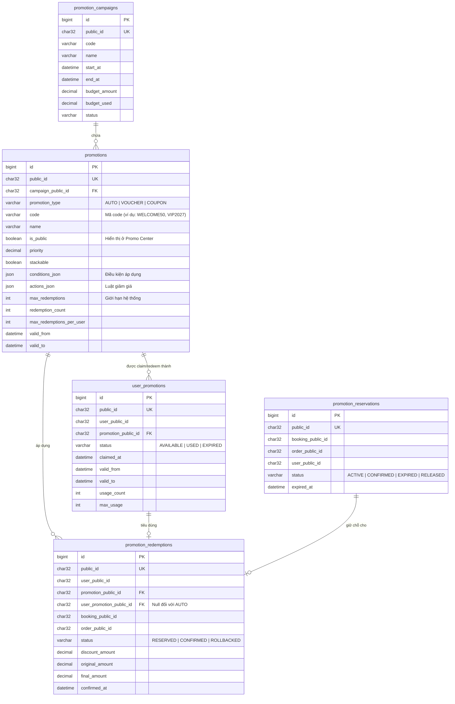

# Đánh giá & Thiết kế lại Kiến trúc Promotion Service

Bản đánh giá này phân tích tính phù hợp của kiến trúc khuyến mãi mới (gồm Campaign, Promotion [AUTO, VOUCHER, COUPON], Wallet và Engine) so với hiện tại, đánh giá khối lượng công việc và đề xuất chi tiết sự thay đổi của cơ sở dữ liệu (Database Schema). Đồng thời, tài liệu này bổ sung kế hoạch loại bỏ hoàn toàn tính năng **Voucher bồi thường (Compensation Voucher)** để tối giản hóa thiết kế hệ thống.

---

## 1. Đánh giá tính phù hợp của kiến trúc đề xuất

Ý tưởng triển khai theo luồng mới là **RẤT PHÙ HỢP** và cực kỳ chuẩn hóa theo mô hình của các hệ thống E-Commerce lớn (như Grab, Shopee, Lazada).

### Ưu điểm vượt trội so với kiến trúc cũ:

1. **Campaign chỉ là chiến dịch (Marketing Container)**:
   * *Hiện tại*: `PromotionCampaign` đang bị gắn cứng với `campaignType` (Coupon, Voucher, Automatic Discount). Một chiến dịch "Black Friday" bắt buộc phải tạo 3 campaigns khác nhau cho 3 loại ưu đãi.
   * *Đề xuất mới*: Campaign đóng vai trò là "Folder" quản lý. Một Campaign có thể chứa đồng thời cả AUTO, VOUCHER và COUPON, giúp việc quản lý ngân sách tổng thể của chiến dịch, thời gian chạy và báo cáo marketing tập trung, hiệu quả hơn.
2. **Tách biệt rõ ràng giữa Template và Wallet Instance**:
   * *Hiện tại*: Bảng `vouchers` chứa cả thông tin ưu đãi và `owner_public_id` (người sở hữu). Điều này khiến hệ thống không thể tạo một "Mẫu Voucher" công khai cho tất cả mọi người nhìn thấy và tự ấn "Nhận" (Claim) vào ví, mà bắt buộc admin phải chủ động phát hành (Issue) trực tiếp tới từng User trước.
   * *Đề xuất mới*: Phân tách thành **Voucher/Coupon Template** (Định nghĩa ưu đãi, nằm trong Promotion Center) và **User Voucher/Wallet Item** (Voucher của riêng từng User sau khi Claim/Redeem). Luồng này giúp hệ thống hỗ trợ hàng triệu khách hàng tự động nhận voucher mà không bị phình to dữ liệu cấu hình.
3. **Phân phối ưu đãi tối ưu**:
   * Phân biệt rõ **AUTO** (tự động áp dụng, không mã, không ví), **VOUCHER** (công khai, phải claim) và **COUPON** (riêng tư, nhập mã redeem). Giúp tối ưu hóa trải nghiệm khách hàng ở trang Checkout và trang Khuyến mãi (Promotion Center).

---

## 2. Đánh giá mức độ thay đổi (Có cần sửa nhiều không?)

Mức độ sửa đổi là **LỚN (Structural Refactoring)**, do đây là thay đổi cốt lõi về mặt mô hình dữ liệu (Data Model) và logic tính toán (Promotion Engine). Tuy nhiên, việc sửa đổi này là xứng đáng để nâng cấp hệ thống lên quy mô lớn hơn.

Các phần chính cần sửa đổi bao gồm:
1. **Database Schema**: Cần viết SQL Migration mới để thay đổi cấu trúc bảng, xóa các cột cũ và liên kết lại các mối quan hệ (1 Campaign -> nhiều Promotions).
2. **Entities & DTOs**: Cập nhật lại các JPA Entity, Mapper và các Class Request/Response ở Controller.
3. **Promotion Engine (Logic Checkout)**: Sửa lại hàm Validate và Calculate Discount để quét theo đúng thứ tự:
   $$\text{AUTO} \rightarrow \text{Ví Voucher} \rightarrow \text{Nhập Coupon} \rightarrow \text{Tính Discount tốt nhất (Best Discount)}$$
4. **Bổ sung API mới**:
   * API **Claim Voucher**: Người dùng ấn nhận voucher công khai từ Promotion Center đưa vào Wallet.
   * API **Redeem Coupon**: Người dùng nhập mã coupon private để lưu vào Wallet hoặc áp dụng thẳng.
5. **Loại bỏ tính năng Voucher bồi thường (Compensation Voucher)**:
   * Xóa bỏ hoàn toàn các Entity, Service, Repository, DTO và Controller liên quan đến `CompensationVoucher`. Thay thế bằng việc phát hành các Voucher (`Voucher`) thông thường thuộc chiến dịch Chăm sóc khách hàng hệ thống, giúp gom gọn về một luồng quản lý và giảm thiểu bảng trung gian.

---

## 3. Thiết kế lại Cơ sở dữ liệu (Database Schema)

Để hiện thực hóa kiến trúc mới, chúng ta sẽ cấu trúc lại database. Thay vì chia làm các bảng rời rạc (`coupons`, `vouchers`, `promotion_rules`), chúng ta sẽ gom nhóm thành:
* **Campaign**: Chiến dịch cha.
* **Promotion (Template)**: Định nghĩa luật giảm giá (AUTO, VOUCHER, COUPON).
* **User Wallet (User Promotion)**: Ví lưu các voucher/coupon mà người dùng đã claim/redeem.
* **Redemption / Reservation**: Lịch sử sử dụng và phiên giữ khuyến mãi khi checkout.
* **Loại bỏ bảng**: `compensation_vouchers`.

### Sơ đồ Quan hệ Thực thể (ERD) mới



### Chi tiết thay đổi các bảng Database

#### 1. Bảng `promotion_campaigns` (Thay đổi)
* **Hành động**: Loại bỏ cột `campaign_type`. Campaign giờ chỉ là một container quản lý thời gian và ngân sách.

| Tên Cột | Kiểu Dữ Liệu | Ràng buộc | Mô tả |
| :--- | :--- | :--- | :--- |
| `id` | BIGINT | PRIMARY KEY | Khóa chính nội bộ |
| `public_id` | CHAR(36) | UNIQUE | UUID public |
| `code` | VARCHAR(100) | UNIQUE | Mã chiến dịch (ví dụ: `BACK_TO_SCHOOL_2027`) |
| `name` | VARCHAR(255) | NOT NULL | Tên chiến dịch |
| `start_at` | DATETIME | NOT NULL | Thời gian bắt đầu chiến dịch |
| `end_at` | DATETIME | NOT NULL | Thời gian kết thúc chiến dịch |
| `budget_amount` | DECIMAL(18,2)| NOT NULL | Ngân sách tổng cho chiến dịch |
| `budget_used` | DECIMAL(18,2)| NOT NULL | Ngân sách đã tiêu |
| `status` | VARCHAR(30) | NOT NULL | Trạng thái (DRAFT, ACTIVE, PAUSED, COMPLETED) |

#### 2. Bảng `promotions` (Tạo mới - Hợp nhất từ `coupons`, `promotion_rules`, cấu hình voucher)
* **Hành động**: Lưu cấu hình template của cả 3 loại khuyến mãi: **AUTO**, **VOUCHER** và **COUPON**.

| Tên Cột | Kiểu Dữ Liệu | Ràng buộc | Mô tả |
| :--- | :--- | :--- | :--- |
| `id` | BIGINT | PRIMARY KEY | Khóa chính nội bộ |
| `public_id` | CHAR(36) | UNIQUE | UUID public |
| `campaign_public_id`| CHAR(36) | FK | Link tới `promotion_campaigns` |
| `promotion_type` | VARCHAR(50) | NOT NULL | Loại phân phối: `AUTO`, `VOUCHER`, `COUPON` |
| `code` | VARCHAR(100) | NULL | Mã code áp dụng (ví dụ: `WELCOME50` hoặc `VIP2027`). Null đối với AUTO. |
| `name` | VARCHAR(255) | NOT NULL | Tên chương trình khuyến mãi |
| `description` | TEXT | NULL | Mô tả ưu đãi |
| `is_public` | BOOLEAN | NOT NULL | `true` đối với Voucher công khai (hiển thị ở Promo Center), `false` đối với Coupon/Auto |
| `priority` | INT | NOT NULL | Độ ưu tiên áp dụng (Engine dùng để xếp thứ tự tính toán) |
| `stackable` | BOOLEAN | DEFAULT FALSE| Cho phép cộng dồn với khuyến mãi khác |
| `conditions_json` | JSON | NOT NULL | Điều kiện áp dụng (Ví dụ: `min_ticket = 2`, `movie_type = 3D`) |
| `actions_json` | JSON | NOT NULL | Hành động giảm giá (Ví dụ: `discount_percentage = 20%`, `max_discount = 50k`) |
| `max_redemptions` | INT | NULL | Giới hạn số lượt dùng tối đa trên toàn hệ thống |
| `redemption_count` | INT | DEFAULT 0 | Số lượt đã được sử dụng thực tế |
| `max_redemptions_per_user`| INT | DEFAULT 1 | Số lượt tối đa một user được nhận/dùng |
| `valid_from` | DATETIME | NOT NULL | Bắt đầu hiệu lực của template |
| `valid_to` | DATETIME | NOT NULL | Kết thúc hiệu lực của template |

#### 3. Bảng `user_promotions` (Tạo mới - Đóng vai trò là Wallet)
* **Hành động**: Khi User **Claim** Voucher công khai hoặc **Redeem** Coupon code, hệ thống sẽ chèn một dòng vào đây để chuyển quyền sở hữu cho User đó.

| Tên Cột | Kiểu Dữ Liệu | Ràng buộc | Mô tả |
| :--- | :--- | :--- | :--- |
| `id` | BIGINT | PRIMARY KEY | Khóa chính nội bộ |
| `public_id` | CHAR(36) | UNIQUE | UUID public |
| `user_public_id` | CHAR(36) | INDEX | Người sở hữu ưu đãi |
| `promotion_public_id`| CHAR(36) | FK | Link tới cấu hình `promotions` gốc |
| `status` | VARCHAR(30) | NOT NULL | Trạng thái ví: `AVAILABLE`, `USED`, `EXPIRED` |
| `claimed_at` | DATETIME | NOT NULL | Thời điểm nhận voucher/coupon |
| `valid_from` | DATETIME | NOT NULL | Bắt đầu sử dụng được |
| `valid_to` | DATETIME | NOT NULL | Ngày hết hạn trong ví |
| `usage_count` | INT | DEFAULT 0 | Số lần đã dùng |
| `max_usage` | INT | DEFAULT 1 | Số lần tối đa được dùng (Thường là 1) |

#### 4. Bảng `promotion_redemptions` (Hợp nhất từ `voucher_redemptions` và `coupon_redemptions`)
* **Hành động**: Ghi nhận lịch sử giao dịch khi ưu đãi được sử dụng thành công cho đơn hàng.

| Tên Cột | Kiểu Dữ Liệu | Ràng buộc | Mô tả |
| :--- | :--- | :--- | :--- |
| `id` | BIGINT | PRIMARY KEY | Khóa chính |
| `public_id` | CHAR(36) | UNIQUE | UUID |
| `user_public_id` | CHAR(36) | NOT NULL | Người sử dụng |
| `promotion_public_id`| CHAR(36) | FK | Khuyến mãi nào |
| `user_promotion_public_id`| CHAR(36)| FK, NULL | Bản ghi Wallet nào (Null nếu là AUTO promotion) |
| `booking_public_id`| CHAR(36) | INDEX | Mã booking liên kết |
| `order_public_id` | CHAR(36) | INDEX | Mã đơn hàng liên kết |
| `status` | VARCHAR(30) | NOT NULL | Trạng thái: `RESERVED`, `CONFIRMED`, `ROLLBACKED` |
| `discount_amount` | DECIMAL(18,2)| NOT NULL | Số tiền được giảm thực tế |
| `original_amount` | DECIMAL(18,2)| NOT NULL | Số tiền gốc |
| `final_amount` | DECIMAL(18,2)| NOT NULL | Số tiền phải trả sau giảm |
| `confirmed_at` | DATETIME | NULL | Thời điểm xác nhận đơn hàng thành công |

---

## 4. Luồng xử lý chi tiết tại Checkout (Promotion Engine)

Khi người dùng tiến hành thanh toán (Checkout Request), Promotion Engine sẽ xử lý theo các bước sau để tìm ra phương án giảm giá tối ưu nhất:

```text
[Bắt đầu Checkout]
       │
       ▼
1. Quét & Áp dụng AUTO Promotion
   (Hệ thống tự động tìm các khuyến mãi AUTO đang active và thỏa điều kiện của Giỏ hàng)
       │
       ▼
2. Lọc các Voucher từ Wallet của User (user_promotions.status = 'AVAILABLE')
   (Kiểm tra xem User có chọn áp dụng Voucher nào trong ví không)
       │
       ▼
3. Kiểm tra Mã Coupon nhập thêm (nếu có)
   (Kiểm tra tính hợp lệ của mã Coupon riêng tư)
       │
       ▼
4. Chạy Engine đánh giá & tính toán
   ├─ Kiểm tra điều kiện ràng buộc (Min Order, Loại vé, Suất chiếu...)
   ├─ Kiểm tra tính cộng dồn (Stackable)
   └─ Tính toán số tiền giảm tối đa (Best Discount)
       │
       ▼
5. Tạo phiên giữ chỗ (Promotion Reservation)
   (Giữ quota/budget tạm thời trong thời gian thực hiện thanh toán)
```

---

## 5. Kế hoạch di chuyển dữ liệu (Data Migration Path)

Vì hệ thống đang chạy cấu trúc cũ, khi chuyển sang cấu trúc mới cần viết script migration:
1. **Di chuyển Campaign**: Giữ nguyên thông tin bảng `promotion_campaigns`, cập nhật bỏ cột `campaign_type`.
2. **Di chuyển Coupons thành Promotions**:
   * Chuyển các dòng từ `coupons` sang `promotions` với `promotion_type = 'COUPON'`.
3. **Di chuyển Rules thành Promotions**:
   * Chuyển các luật giảm giá tự động từ `promotion_rules` sang `promotions` with `promotion_type = 'AUTO'`.
4. **Di chuyển Vouchers thành Wallet**:
   * Các dòng trong `vouchers` cũ (vì đã được gán trực tiếp cho người dùng qua `owner_public_id`) sẽ được chuyển thành `user_promotions` (Wallet) trong db mới.
   * Tạo một bản ghi tương ứng trong `promotions` đại diện cho Voucher Template để làm gốc liên kết.
5. **Di chuyển Redemptions**: Gộp dữ liệu từ `voucher_redemptions` và `coupon_redemptions` sang bảng `promotion_redemptions` duy nhất.
6. **Dọn dẹp tính năng bồi thường**: Chạy migration SQL xóa bảng `compensation_vouchers` và các lịch sử phê duyệt có `target_type = 'COMPENSATION'`.

---

## 6. Kế hoạch loại bỏ tính năng Voucher bồi thường (Compensation Voucher)

Tính năng **Compensation Voucher** cũ được thiết kế thành một thực thể riêng biệt (`CompensationVoucher`) và có luồng phê duyệt bồi thường riêng. Tuy nhiên, theo kiến trúc mới:
* Mọi hình thức ưu đãi thuộc sở hữu của User đều quy về Wallet (`user_promotions`).
* Khi có nhu cầu bồi thường cho khách hàng (ví dụ: do lỗi hệ thống, hủy suất chiếu), Admin chỉ cần tạo và phát hành một **Voucher** hoặc **Coupon** thuộc Chiến dịch chăm sóc khách hàng (ví dụ Campaign `CUSTOMER_CARE`). Bản chất Voucher/Coupon này sẽ trực tiếp xuất hiện trong Wallet của người dùng.
* Việc này giúp loại bỏ hoàn toàn mã nguồn thừa, bảng thừa và thống nhất luồng Checkout của Engine.

### Danh sách các file cần xóa bỏ (Deleted Files):
* `com/project/promotionservice/benefit/entity/CompensationVoucher.java`
* `com/project/promotionservice/benefit/entity/CompensationApprovalHistory.java` (Logic phê duyệt bồi thường)
* `com/project/promotionservice/benefit/repository/CompensationVoucherRepository.java`
* `com/project/promotionservice/benefit/repository/CompensationApprovalHistoryRepository.java`
* `com/project/promotionservice/benefit/service/CompensationService.java`
* `com/project/promotionservice/benefit/service/impl/CompensationServiceImpl.java`
* `com/project/promotionservice/benefit/controller/AdminCompensationController.java`
* `com/project/promotionservice/benefit/dto/request/CompensationRequests.java`

### Danh sách các file cần chỉnh sửa (Modified Files):
1. **`com/project/promotionservice/benefit/enums/BenefitEnums.java`**:
   * Xóa giá trị `COMPENSATION` khỏi enum `CouponType` và `VoucherType`.
   * Xóa giá trị `COMPENSATION` khỏi enum `VoucherSource` (hoặc giữ lại nếu muốn đánh dấu nguồn gốc nhưng khuyên dùng một nguồn generic hơn).
   * Xóa hoàn toàn 2 enums con: `CompensationType` và `CompensationStatus`.
2. **`com/project/promotionservice/benefit/dto/response/BenefitResponses.java`**:
   * Xóa static class `CompensationResponse`.
3. **`com/project/promotionservice/benefit/specification/BenefitSpecifications.java`**:
   * Xóa method `Specification<CompensationVoucher> compensations(...)`.
4. **`com/project/promotionservice/reservation/service/impl/PromotionReservationServiceImpl.java`**:
   * Sửa các thông báo lỗi liên quan đến bồi thường ở hàm release/cancel (ví dụ lines 332 và 381, loại bỏ phần gợi ý `"use refund or compensation"`).
5. **`com/project/promotionservice/benefit/BenefitDomainIntegrationTest.java`**:
   * Xóa test case `compensationIssuesLinkedVoucherAndApprovalHistory`.

### Kịch bản SQL Migration (Flyway `V6__remove_compensation_voucher_feature.sql`):
```sql
-- Xóa bảng bồi thường
DROP TABLE IF EXISTS compensation_vouchers;

-- Dọn dẹp dữ liệu lịch sử phê duyệt của phần bồi thường trong bảng dùng chung
DELETE FROM approval_histories WHERE target_type = 'COMPENSATION';
```
