# Tài Liệu Tích Hợp Luồng Đăng Nhập & Hồ Sơ LoraFilm

Tài liệu này mô tả chi tiết kiến trúc, cơ chế lưu trữ phiên làm việc, cơ chế tự động làm mới Access Token (Token Refresh) và luồng hoạt động chi tiết qua từng màn hình (Register, Verify OTP, Login, Profile) của ứng dụng React + Vite Frontend LoraFilm sau khi tích hợp với Auth/User Services thông qua API Gateway.

---

## 1. Kiến Trúc Luồng Xác Thực (Authentication Architecture)

### 1.1 Cơ Chế Quản Lý Trạng Thế & Lưu Trữ Phiên (Session Storage)
Ứng dụng sử dụng kết hợp giữa **localStorage**, **sessionStorage** và **React Context API** (`AuthContext`) để quản lý trạng thái xác thực đồng bộ và bảo mật:
- **localStorage**: Dùng để lưu trữ thông tin phiên đăng nhập lâu dài:
  - `authToken`: JWT Access Token dùng cho các API yêu cầu xác thực.
  - `refreshToken`: UUID Refresh Token dùng để lấy Access Token mới.
  - `userAccountId`: ID tài khoản người dùng đăng nhập.
  - `userEmail`: Email của người dùng đăng nhập.
  - `userRole`: Quyền của tài khoản (`CUSTOMER`, `EMPLOYEE`, `ADMIN`).
- **sessionStorage**: Dùng làm kho lưu trữ tạm thời, bền bỉ cho luồng đăng ký (giữa màn hình Register, Verify OTP, Login):
  - `pending_otp_email`: Email đang chờ xác thực OTP.
- **React Context (`AuthContext`)**: Đóng vai trò là trung tâm dữ liệu xác thực (Single Source of Truth) cho toàn bộ ứng dụng, đồng bộ trạng thái đăng nhập tức thì giữa các component (ví dụ: `Header`, `AppRoutes` và `CustomerProfilePage`).

---

### 1.2 Cơ Chế Tự Động Làm Mới Token (Access Token Refresh)
Khi Access Token hết hạn (nhận mã lỗi HTTP `401 Unauthorized` từ API Gateway), Axios Interceptor tự động kích hoạt luồng làm mới token bằng Refresh Token để đảm bảo người dùng không bị gián đoạn trải nghiệm.

#### Sơ đồ hoạt động làm mới Token:

```mermaid
sequenceDiagram
    autonumber
    actor User as Người dùng
    participant App as React Frontend (apiClient)
    participant GW as API Gateway (Port 8080)
    participant AuthSrv as Auth Service

    User->>App: Yêu cầu thao tác (e.g. Xem Profile)
    App->>GW: GET /api/users/{id} (Kèm Token cũ)
    GW-->>App: HTTP 401 Unauthorized (Token hết hạn)
    
    rect rgb(30, 30, 45)
        Note over App: Đánh dấu yêu cầu là đang chờ làm mới token
        Note over App: Đưa các request 401 tiếp theo vào hàng đợi (failedQueue)
        App->>GW: POST /api/auth/refresh-token (Kèm refreshToken)
        GW->>AuthSrv: Xác thực Refresh Token
        AuthSrv-->>GW: Trả về cặp token mới
        GW-->>App: HTTP 200 OK (Cặp token mới)
        Note over App: Lưu cặp token mới vào localStorage
        Note over App: Giải phóng hàng đợi và cập nhật token mới vào header
    end

    App->>GW: Gửi lại request cũ (Kèm Token mới)
    GW-->>App: HTTP 200 OK (Dữ liệu Profile)
    App-->>User: Hiển thị thông tin Profile thành công
```

#### Các quy tắc kiểm soát luồng refresh:
1. **Kiểm soát đồng thời (Concurrency Control)**: Nếu nhiều yêu cầu API song song nhận lỗi 401 cùng lúc, ứng dụng chỉ kích hoạt duy nhất một yêu cầu làm mới token. Các yêu cầu khác sẽ được xếp vào hàng đợi chờ và tự động thực thi lại sau khi có token mới.
2. **Quy tắc bỏ qua (Exclusion Rules)**: Luồng tự động refresh tuyệt đối không áp dụng cho các API xác thực cơ bản như Đăng nhập, Đăng ký, Xác thực OTP và Gửi lại OTP để tránh lặp vô hạn.
3. **Xử lý thất bại (Fallback Action)**: Nếu Refresh Token cũng hết hạn hoặc không hợp lệ (lỗi refresh), ứng dụng tự động xoá toàn bộ dữ liệu phiên ở client, chuyển hướng người dùng về trang Đăng nhập (`/login`).
4. **Không rò rỉ PII**: Không gửi token Bearer đến các API bên thứ ba (như API kiểm tra CCCD).

---

## 2. Chi Tiết Luồng Hoạt Động Từng Màn Hình (Screen-by-Screen Flow)

### 2.1 Màn Hình Đăng Ký (Register Screen - `/register`)
* **Chức năng**: Cho phép người dùng điền thông tin đăng ký thành viên.
* **Xác thực trước (Local & CCCD check)**:
  - Kiểm tra định dạng dữ liệu nhập (Email, Số điện thoại, Độ dài mật khẩu).
  - Tự động kiểm tra tính hợp lệ của số CCCD (12 chữ số) thông qua CCCD API cục bộ trước khi cho phép submit.
* **Xử lý cuộc gọi API và Phản hồi**:
  - Gửi yêu cầu đăng ký (`POST /api/auth/register`).
  - **Khi đăng ký thành công**:
    - Không cấp token đăng nhập ngay tại bước này.
    - Lưu email đăng ký vào `sessionStorage`.
    - Chuyển hướng sang màn hình Xác thực OTP (`/verify-otp`) kèm theo dữ liệu email qua `location.state` để tự điền.
  - **Khi xảy ra lỗi (Error Mapping)**:
    - `AUTH_EMAIL_ALREADY_EXISTS` $\rightarrow$ Hiển thị lỗi ngay bên dưới ô nhập Email.
    - `VALIDATION_ERROR` (Kèm mảng `errors`) $\rightarrow$ Bóc tách từng đối tượng lỗi trong mảng (như `phoneNumber`, `cccd`, `email`, v.v.) để hiển thị cảnh báo đỏ bên dưới **nhiều ô nhập liệu cùng lúc**. (Áp dụng khi hệ thống phát hiện trùng cả SĐT và CCCD, bị khóa trong Redis, hoặc khi bị lỗi định dạng dữ liệu).
    - `PHONE_NUMBER_ALREADY_EXISTS` $\rightarrow$ Hiển thị lỗi bên dưới ô nhập Số điện thoại.
    - `CCCD_ALREADY_EXISTS` $\rightarrow$ Hiển thị lỗi bên dưới ô nhập CCCD.
    - `REGISTRATION_ALREADY_PENDING` $\rightarrow$ Lưu thông tin email vào `sessionStorage` và tự động chuyển hướng người dùng sang trang `/verify-otp`.
    - `PHONE_NUMBER_RESERVED` / `CCCD_RESERVED` $\rightarrow$ Hiển thị thông báo lỗi hệ thống kèm thời gian chờ thực hiện lại (ví dụ: `Số điện thoại này thuộc một đăng ký đang chờ xử lý. Vui lòng thử lại sau 60 giây.`).

---

### 2.2 Màn Hình Xác Thực OTP (Verify OTP Screen - `/verify-otp`)
* **Chức năng**: Xác thực tài khoản bằng mã OTP 6 chữ số được gửi qua Email.
* **Xử lý giải quyết Email (Email Resolution Flow)**:
  1. Lấy thông tin từ `location.state?.email` (khi chuyển tiếp trực tiếp từ trang Đăng ký/Đăng nhập).
  2. Nếu không có, lấy thông tin từ `sessionStorage.getItem("pending_otp_email")`.
  3. Nếu cả hai đều không có, ứng dụng sẽ cung cấp ô nhập liệu Email thủ công để người dùng tự điền.
* **Thao tác xác thực**:
  - Khi người dùng điền đủ 6 chữ số và nhấn nút xác thực, ứng dụng gọi API `POST /api/auth/verify` với payload: `{ email, otp }`.
  - **Xác thực thành công**: Xoá kho lưu trữ tạm trong `sessionStorage`, chuyển hướng người dùng về trang Đăng nhập (`/login`) kèm theo thông báo kích hoạt tài khoản thành công và tự động điền sẵn Email của họ.
* **Cơ chế gửi lại OTP & Tránh Rate Limit**:
  - Có đồng hồ đếm ngược chờ gửi lại OTP (mặc định là 60 giây).
  - Khi đếm ngược kết thúc, nút "Gửi lại mã" được mở khoá.
  - Nhấp nút gửi lại gọi API `POST /api/auth/send-otp`.
  - Nếu gặp lỗi `OTP_RATE_LIMIT`, ứng dụng cập nhật đồng hồ đếm ngược theo thời gian chờ do API Backend phản hồi (`retryAfter`).

---

### 2.3 Màn Hình Đăng Nhập (Login Screen - `/login`)
* **Chức năng**: Người dùng đăng nhập bằng tài khoản và mật khẩu đã tạo.
* **Xác thực tự động điền**:
  - Tự động điền email từ trang xác thực OTP hoặc trang đăng ký nếu có truyền qua router state.
* **Xử lý cuộc gọi API và Điều hướng**:
  - Gọi API `POST /api/auth/login`.
  - **Đăng nhập thành công**:
    - Ghi nhận thông tin đăng nhập tập trung tại `AuthContext`.
    - Điều hướng dựa trên role và permission trong access token:
      - Tài khoản có quyền `ADMIN` $\rightarrow$ Chuyển sang Trang Quản Trị Viên `/admin`.
      - Tài khoản có role `EMPLOYEE` $\rightarrow$ Chuyển sang Trang Nhân Viên `/employee`; màn đích được chọn theo permission.
      - Khách hàng (`CUSTOMER`) $\rightarrow$ Chuyển về Trang Chủ `/`.
  - **Đăng nhập thất bại do chưa xác thực (Unverified)**:
    - Nếu API trả lỗi `AUTH_ACCOUNT_NOT_VERIFIED`:
      1. Tuyệt đối không lưu trữ bất kỳ token nào.
      2. Lưu email nhập vào `sessionStorage` và tự động điều hướng người dùng sang trang `/verify-otp` với mục đích `REGISTRATION`.

---

### 2.4 Màn Hình Hồ Sơ Thành Viên (Profile Screen - `/profile`)
* **Chức năng**: Hiển thị thông tin cá nhân và lịch sử đặt vé của khách hàng.
* **Bảo vệ quyền riêng tư thông tin nhạy cảm (CCCD Protection)**:
  - Tuyệt đối không lưu trữ CCCD đầy đủ chưa mã hóa trong `localStorage` hay in ra log client.
  - Số CCCD hiển thị trên giao diện được làm mờ (Masked - Ví dụ: `092******749`) và đặt ở trạng thái Read-Only.
  - Các trường Họ Tên, Ngày Sinh, Giới Tính là dữ liệu định danh pháp lý nên bị vô hiệu hóa chỉnh sửa (Read-Only) để chống gian lận thông tin.
* **Xử lý tạo hồ sơ bất đồng bộ (Eventual Consistency & Retry Strategy)**:
  - Do hệ thống backend sử dụng kiến trúc Event-Driven, hồ sơ thành viên có thể chưa được tạo ngay lập tức khi đăng nhập lần đầu.
  - Khi frontend gọi API lấy hồ sơ (`GET /api/users/{id}`) mà nhận mã lỗi 404 hoặc mã lỗi `USER_NOT_FOUND`:
    - **Không đăng xuất người dùng ngay lập tức**.
    - Frontend thực hiện cơ chế tự động tải lại (retry) tối đa **3 lần**, mỗi lần cách nhau **1000 miligiây**.
    - Nếu sau 3 lần vẫn chưa tải được, trạng thái hồ sơ được chuyển sang trạng thái "Đang khởi tạo" (`profilePending`).
    - Giao diện hiển thị thông báo thân thiện: `Hồ sơ của bạn đang được khởi tạo. Vui lòng thử lại sau.` kèm theo nút **"Tải lại hồ sơ"** để người dùng có thể nhấp tải lại thủ công mà không mất phiên đăng nhập.

---

## 3. Quản Lý Định Tuyến & Rào Cản Bảo Vệ (Route Guards)

Để bảo vệ các tài nguyên và API trên client khỏi các truy cập trái phép, hai thành phần Route Guard chính được thiết lập trong `AppRoutes.jsx`:

1. **`ProtectedRoute`**:
   - Chặn bất kỳ người dùng chưa đăng nhập nào cố tình truy cập vào trang cá nhân (`/profile`) hoặc các trang luồng đặt vé riêng tư.
   - Nếu ứng dụng đang trong quá trình tải lại phiên làm việc khi load trang (`isInitializing` là true), Guard sẽ hiển thị màn hình chờ (PageLoader) thay vì đẩy người dùng về trang đăng nhập.
2. **`RoleRoute`**:
   - Bảo vệ các đường dẫn quản trị và vận hành rạp chiếu.
   - Đối với Admin (`/admin/*`): Yêu cầu role là `ADMIN`.
   - Đối với Nhân viên (`/employee/*`): Yêu cầu role `EMPLOYEE`; mỗi route con tiếp tục yêu cầu permission chức năng tương ứng.
   - Khớp nối chính xác kể cả khi quyền được trả về dưới dạng có tiền tố `ROLE_` (ví dụ: `ROLE_ADMIN` được chuẩn hóa thành `ADMIN` trước khi so khớp).
