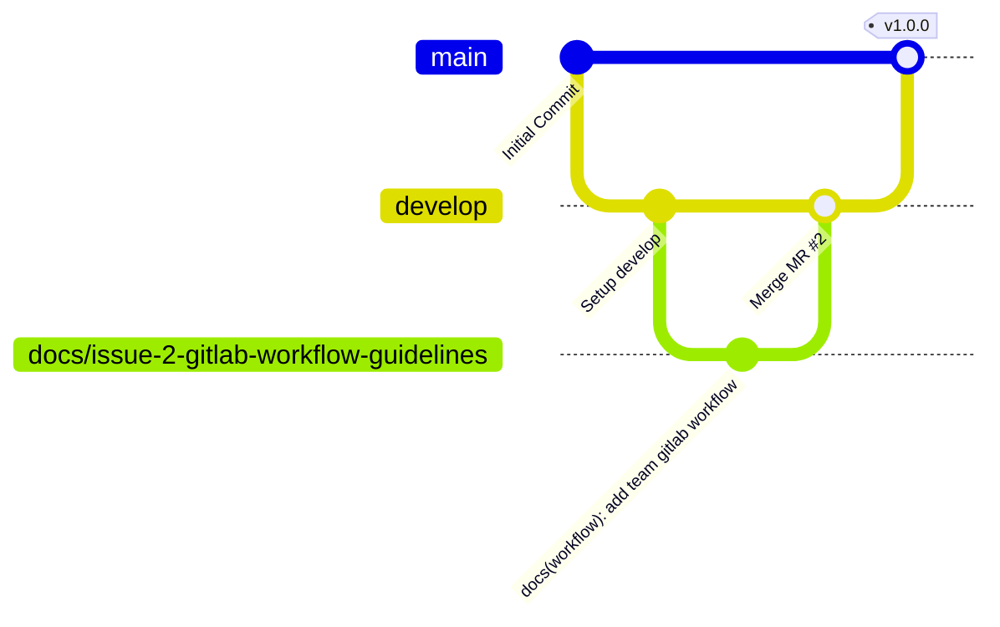

# Hướng dẫn Quy trình Làm việc GitLab & Quản lý Nhánh (GitLab Workflow & Branching Guidelines)

Tài liệu này đóng vai trò là nguồn thông tin chính thức (single source of truth) về các quy tắc làm việc trên Git và GitLab dành cho nhóm thực tập sinh (OJT) gồm 5 thành viên. Việc tuân thủ các tiêu chuẩn này giúp đảm bảo chất lượng mã nguồn, khả năng truy vết và tích hợp mượt mà trên kiến trúc microservices (`client`, `server`, `api-gateway`).

---

## 1. Giới thiệu (Introduction)

Trong môi trường phát triển microservices cộng tác, tính kỷ luật trong quy trình làm việc là vô cùng quan trọng. Với việc nhiều lập trình viên cùng thay đổi mã nguồn của các thành phần frontend, backend và API gateway, việc tự ý tạo nhánh hoặc push trực tiếp sẽ dẫn đến xung đột mã nguồn (merge conflicts), mất code và làm gián đoạn quá trình tích hợp.

Bằng cách áp dụng quy trình quản lý nhánh chặt chẽ, commit có cấu trúc, cập nhật trạng thái bảng issue một cách hệ thống và kiểm duyệt mã nguồn thông qua Merge Request, chúng ta sẽ:
*   Đảm bảo mọi thay đổi đều được gắn liền với một **GitLab Issue** đã được phê duyệt.
*   Duy trì lịch sử commit sạch sẽ, dễ đọc và dễ tìm kiếm.
*   Ngăn chặn các lỗi nghiêm trọng (regression bugs) lọt vào nhánh tích hợp (`develop`) và nhánh sản phẩm (`main`).
*   Thúc đẩy văn hóa đánh giá chéo mã nguồn (peer review) và học hỏi dưới sự hướng dẫn của Team Leader.

---

## 2. Chiến lược Quản lý Nhánh (Branching Strategy)

Kho lưu trữ mã nguồn của chúng ta áp dụng chiến lược quản lý nhánh lấy cảm hứng từ Git Flow nhằm tách biệt mã nguồn chạy ổn định ở môi trường sản xuất khỏi mã nguồn đang trong quá trình phát triển.



### Các Nhánh Chính (Core Branches)

| Nhánh (Branch) | Trạng thái Bảo vệ | Mục đích | Quy tắc |
| :--- | :--- | :--- | :--- |
| `main` | **Bảo vệ Nghiêm ngặt** | Trạng thái sẵn sàng chạy trên môi trường sản xuất (production). Đại diện cho phiên bản triển khai ổn định mới nhất. | Nghiêm cấm push trực tiếp. Mã nguồn chỉ được cập nhật thông qua Merge Request (MR) được merge từ nhánh `develop` bởi Team Leader. |
| `develop` | **Bảo vệ Nghiêm ngặt** | Nhánh tích hợp chính. Mọi tính năng, sửa lỗi và tài liệu đều phải được merge vào đây trước tiên. | Nghiêm cấm push trực tiếp. Mọi thay đổi phải được thực hiện trên các nhánh công việc (task branches) cục bộ và merge thông qua MR. |

### Tiền tố Đặc trưng cho Nhánh (Feature-Specific Prefixes)

Tất cả các task phát triển phải được thực hiện trên một nhánh riêng biệt được cắt ra từ nhánh `develop` mới nhất. Các nhánh phải sử dụng một trong các tiền tố sau đây tùy thuộc vào bản chất của công việc:

| Tiền tố (Prefix) | Phân loại | Mô tả Cách dùng |
| :--- | :--- | :--- |
| `feature/` | Tính năng (Features) | Phát triển một tính năng mới hoặc một thành phần chức năng của hệ thống. |
| `fix/` | Sửa lỗi (Bug Fixes) | Sửa lỗi, khắc phục lỗi runtime hoặc chỉnh sửa lại logic bị lỗi. |
| `docs/` | Tài liệu (Documentation) | Tạo mới, sửa đổi hoặc cập nhật các file Markdown, tài liệu đặc tả API hoặc các tài liệu hướng dẫn. |
| `setup/` | Cài đặt & Môi trường | Cấu hình cài đặt dự án, CI/CD pipelines, cấu hình Docker hoặc cấu trúc thư mục. |
| `test/` | Kiểm thử (Testing) | Thêm mới hoặc cập nhật unit tests, integration tests hoặc cấu hình kiểm thử đầu cuối (E2E). |

> [!IMPORTANT]
> **Quy tắc Quy trình Nghiêm ngặt:** Mọi task phát triển đều phải ánh xạ tới một GitLab Issue. Việc push trực tiếp lên nhánh `main` hoặc `develop` bị nghiêm cấm hoàn toàn. Luôn cắt nhánh của bạn từ nhánh `develop` mới nhất.

### Quy ước Đặt tên Nhánh (Branch Naming Conventions)

Để duy trì tính đồng nhất và khả năng truy vết mã nguồn theo từng task của dự án, tất cả các tên nhánh phải tuân theo đúng định dạng sau:

$$\text{<prefix>/issue-<id>-<short-description>}$$

*   `<prefix>`: Một trong các tiền tố được liệt kê trong bảng trên (ví dụ: `feature`, `fix`, `docs`).
*   `<id>`: Số ID của GitLab Issue.
*   `<short-description>`: Mô tả ngắn gọn, viết thường, các từ cách nhau bằng dấu gạch ngang (kebab-case) về công việc cần thực hiện.

#### Ví dụ:
*   `docs/issue-2-gitlab-workflow-guidelines`
*   `feature/issue-14-client-login-ui`
*   `fix/issue-29-server-jwt-expiration`
*   `setup/issue-5-docker-compose-environment`
*   `test/issue-42-api-gateway-routing-tests`

---

## 3. Quy ước Lịch sử Commit (Commit Message Guidelines)

Chúng ta áp dụng quy chuẩn **Conventional Commits** để giữ cho lịch sử commit luôn rõ ràng, có tổ chức và có thể đọc hiểu tự động.

### Định dạng Commit

$$\text{<type>(<scope>): <description>}$$

*   **`<type>`**: Mô tả mục đích của commit (ví dụ: `feat`, `fix`, `docs`).
*   **`<scope>`** (Không bắt buộc nhưng khuyến khích sử dụng): Module hoặc gói phần mềm cụ thể bị ảnh hưởng bởi commit, được đặt trong dấu ngoặc đơn. Các scope phổ biến trong dự án của chúng ta bao gồm: `client`, `server`, `api-gateway`, `docker`, `workflow`, `deps`, `config`.
*   **`<description>`**: Tóm tắt ngắn gọn các thay đổi ở thì hiện tại, thể hiện dưới dạng câu mệnh lệnh (ví dụ: "add login form", KHÔNG dùng "added login form" hay "adds login form"). Mô tả nên bắt đầu bằng chữ cái viết thường và không kết thúc bằng dấu chấm.

### Các loại Commit (Commit Types)

| Loại (Type) | Mô tả |
| :--- | :--- |
| `feat` | Một tính năng mới hoặc một bổ sung lớn cho codebase. |
| `fix` | Sửa lỗi hoặc khắc phục sự cố trong code hiện tại. |
| `docs` | Những thay đổi chỉ liên quan đến tài liệu. |
| `style` | Những thay đổi không làm ảnh hưởng đến ngữ nghĩa của code (khoảng trắng, định dạng code, thiếu dấu chấm phẩy, v.v.). |
| `refactor` | Thay đổi cấu trúc code nhưng không sửa lỗi cũng như không thêm tính năng mới (ví dụ: tối ưu hiệu năng hoặc làm sạch code). |
| `test` | Thêm các test case bị thiếu hoặc sửa lại các test case hiện có. |
| `chore` | Các thay đổi đối với quy trình build, công cụ hỗ trợ, thư viện hoặc dependencies (ví dụ: cập nhật phiên bản của thư viện). |

### Ví dụ Thực tế

Dưới đây là các commit message mẫu được định dạng chính xác theo quy tắc của chúng ta:

```bash
# Thêm tính năng ở client
feat(client): implement interactive navigation sidebar

# Sửa lỗi ở server
fix(server): resolve null pointer exception in auth interceptor

# Cập nhật tài liệu
docs(workflow): add team gitlab workflow and branching guidelines

# Cập nhật dependency/thư viện ở client
chore(deps): upgrade axios to version 1.6.0 in client

# Thêm kiểm thử cho API Gateway
test(api-gateway): add request rate limiting tests
```

---

## 4. Quy trình Quản lý Bảng Issue trên GitLab (GitLab Issue Board Workflow)

Bảng Issue trên GitLab là trung tâm quản lý tiến độ sprint của chúng ta. Trạng thái của từng công việc được theo dõi thông qua các scoped labels tùy chỉnh tạo nên một pipeline rõ ràng từ khi lập kế hoạch đến khi hoàn thành.

```mermaid
stateDiagram-v2
    [*] --> status::ready : Tạo Issue
    status::ready --> status::in-progress : Người được giao bắt đầu làm / Cắt nhánh
    status::in-progress --> status::review : Push lên GitLab & Tạo Merge Request
    status::in-progress --> status::blocked : Bị nghẽn bởi task/issue khác
    status::blocked --> status::in-progress : Hết nghẽn (Blocker được giải quyết)
    status::review --> status::done : MR được duyệt & Merge bởi Leader
    status::done --> [*]
```

### Scoped Labels & Trạng thái

1.  **`status::ready`**
    *   **Ý nghĩa:** Issue đã được thảo luận, đánh giá độ khó và sẵn sàng để phát triển. Nó được đưa vào cột backlog của sprint hiện tại.
    *   **Hành động:** Khi lập trình viên sẵn sàng bắt đầu một task mới, họ chọn issue từ cột này, tự gán (assign) cho bản thân và chuyển sang cột tiếp theo.
2.  **`status::in-progress`**
    *   **Ý nghĩa:** Lập trình viên đang tích cực thực hiện task. Nhánh code cục bộ tương ứng đã được tạo.
    *   **Hành động:** Lập trình viên viết code, commit cục bộ tuân theo Conventional Commits và push nhánh lên GitLab.
3.  **`status::review`**
    *   **Ý nghĩa:** Việc viết code đã hoàn thành, các bài test đã chạy thành công và một Merge Request (MR) đã được mở để merge vào nhánh `develop`.
    *   **Hành động:** Lập trình viên thiết lập các reviewer cho MR, liên kết với issue và chuyển trạng thái của issue sang cột này trên bảng.
4.  **`status::blocked`**
    *   **Ý nghĩa:** Việc phát triển bị tạm dừng do phụ thuộc vào các task khác chưa xong, chưa có quyết định về mặt kiến trúc hoặc phát hiện lỗi ở module liên quan.
    *   **Hành động:** Lập trình viên chuyển issue sang trạng thái này, để lại comment giải thích rõ lý do bị chặn và tag Team Leader hoặc các thành viên liên quan. Khi vấn đề được giải quyết, chuyển issue quay lại `status::in-progress`.
5.  **`status::done`**
    *   **Ý nghĩa:** MR đã được phê duyệt, giải quyết xong các xung đột dòng code, pipeline chạy thành công và nhánh đã được merge vào `develop`.
    *   **Hành động:** Issue sẽ tự động hoặc thủ công được đóng lại và đánh dấu là Done.

> [!WARNING]
> **Quy tắc di chuyển trạng thái Issue:** Không tự ý nhảy giai đoạn. Tuyệt đối không tự chuyển issue sang trạng thái `status::done`. Trạng thái `status::done` chỉ được cập nhật đồng thời với việc merge MR hoặc có sự xác nhận của Team Leader.

---

## 5. Quy trình Tạo Merge Request (MR Process)

Sau khi hoàn thành phát triển và kiểm tra kỹ lưỡng các thay đổi ở máy cục bộ, bạn phải gửi mã nguồn để đánh giá. Quy trình MR đóng vai trò kiểm soát chất lượng mã nguồn của toàn đội.

### Các Bước Thực hiện Quy trình MR

1.  **Chuẩn bị Nhánh của bạn:**
    Đảm bảo nhánh cục bộ đã cập nhật mã nguồn mới nhất từ nhánh `develop` trên GitLab.
    ```bash
    git checkout develop
    git pull origin develop
    git checkout docs/issue-2-gitlab-workflow-guidelines
    git merge develop
    ```
2.  **Push và Tạo MR:**
    Push nhánh của bạn lên kho lưu trữ GitLab, sau đó nhấn vào đường link hiển thị ở terminal hoặc truy cập vào trang GitLab để mở một Merge Request mới.
3.  **Điền Thông tin Chi tiết cho MR:**
    *   **Tiêu đề (Title):** Tuân theo quy chuẩn commit (ví dụ: `docs(workflow): add team gitlab workflow and branching guidelines`).
    *   **Nhánh nguồn (Source Branch):** `<your-prefix>/issue-<id>-<short-description>`
    *   **Nhánh đích (Target Branch):** `develop` (Tuyệt đối không chọn `main` cho các task phát triển thông thường).
    *   **Mô tả (Description):** Sử dụng Template mô tả MR chuẩn dưới đây để trình bày về thay đổi của bạn.
    *   **Chỉ định Người duyệt (Reviewer Assignment):** Bắt buộc gán **Thành (Team Leader)** làm Reviewer chính. Bạn cũng có thể tag các thành viên khác để cùng đánh giá (peer review).
4.  **Xem xét và Giải quyết Thảo luận:**
    *   Reviewer Thành sẽ kiểm tra mã nguồn, để lại nhận xét/phản hồi và duyệt (approve) hoặc yêu cầu sửa đổi (request changes).
    *   Lập trình viên phản hồi ý kiến bằng cách sửa đổi và push các commit bổ sung lên cùng nhánh đó.
    *   Khi tất cả thảo luận được đánh dấu là đã giải quyết (resolved) và Team Leader phê duyệt, MR đã sẵn sàng để merge.

### Template mô tả MR Chuẩn

Copy và paste phần nội dung bên dưới vào khung mô tả MR trên GitLab:

```markdown
## Summary
This MR introduces the definitive GitLab Workflow Guideline for the OJT team. It details the rules for branching, commit formats, issue board transitions, and the merge request review cycle to maintain repository health and team alignment.

## Related Issue
Closes #2

## Changes
* Created `docs/gitlab-workflow.md` containing full development lifecycle documentation.
* Added branch naming rules and examples (`feature/*`, `fix/*`, `docs/*`, etc.).
* Standardized commit messages based on Conventional Commits.
* Outlined the `status::` label pipeline for the issue board.

## How to Test
1. Checkout to this branch: `git checkout docs/issue-2-gitlab-workflow-guidelines`
2. Open and review `docs/gitlab-workflow.md` using a Markdown viewer or IDE preview.
3. Verify that all rules match Sprint 0 requirements exactly.

## Checklist
- [x] Documentation follows the repository structure rules.
- [x] No direct pushes to main/develop are implied.
- [x] Scoped status labels match the board configuration.
- [x] Formatting and syntax are clean and readable.
```

---

## 6. Tiêu chí Hoàn thành (Definition of Done - DoD)

Một task không bao giờ được coi là xong chỉ vì dòng code đã được viết. Để đảm bảo codebase luôn ổn định và sẵn sàng deploy, mọi issue phải đáp ứng đủ các **Tiêu chí Hoàn thành (DoD)** sau:

*   [ ] **Chất lượng mã nguồn (Code Quality):** Code tuân thủ các nguyên lý clean code, không có thư viện import thừa, không có đoạn code comment bị bỏ hoang hoặc các câu lệnh debugger tạm thời.
*   [ ] **Build & Kiểm thử:** Ứng dụng chạy build thành công ở máy cục bộ và không xảy ra lỗi. Tất cả các bài unit và integration tests đều vượt qua (passed).
*   [ ] **Tính tuân thủ Git:** Tên nhánh và commit message tuân thủ đúng hướng dẫn trong tài liệu này.
*   [ ] **Đánh giá & Duyệt:** MR đã được kiểm duyệt và phê duyệt bởi Team Leader (**Thành**).
*   [ ] **Tích hợp:** MR được merge thành công vào nhánh `develop`.
*   [ ] **Đóng Issue:** GitLab Issue liên quan đã được đóng lại.

> [!CAUTION]
> **Quy tắc Quan trọng về Trạng thái Hoàn thành:** Một issue chỉ được coi là HOÀN THÀNH khi Merge Request tương ứng đã chính thức được merge vào nhánh `develop` hoặc được xác nhận/đóng bởi Team Leader. **Các thành viên không được phép đóng issue trước khi MR được merge.**
