# Audit Promotion Service: vòng đời Admin → Customer và khả năng vận hành

> Ngày audit: **2026-08-19**  
> Phạm vi code: nhánh `main`, commit `9de6badb`  
> Bản cập nhật: **v2 — đã walkthrough runtime Admin, Customer và kiểm tra route bằng role Manager**
> Mục tiêu: xác định Promotion Service đang được sử dụng như thế nào từ lúc admin tạo chương trình đến lúc khách hàng sử dụng/hoàn khuyến mãi; đánh giá mức bao phủ nghiệp vụ và độ dễ vận hành của UI.

## 1. Kết luận điều hành

**Kết luận ngắn: Promotion Service đã cover tốt phần “transaction core”, nhưng chưa cover đủ phần “business operations”.**

- Luồng kỹ thuật `preview → reserve → confirm/release/expire → reverse` khá chắc: có idempotency, pessimistic locking, quota/budget, snapshot, outbox, scheduler và reconciliation.
- Ba mô hình `AUTO`, `VOUCHER`, `COUPON` đã đi được từ catalog đến checkout; voucher có ví, coupon cấp riêng qua thông báo, AUTO do engine tự chọn.
- Customer journey ở checkout tương đối tốt: chỉ cho chọn tối đa một manual benefit, AUTO không bị đưa vào danh sách voucher để khách tự chọn, backend trả kết quả authoritative.
- Runtime UI đẹp, sạch và đồng bộ; promotion detail, customer wallet và các trạng thái cơ bản trình bày tốt. Điểm yếu không nằm ở theme hay spacing mà ở control plane và information architecture.
- UI admin hiện chỉ cho role `ADMIN` vào Promotion Center, trong khi backend kiểm tra các role Marketing, Finance Director, Legal Compliance và Operations Manager. Database demo hiện cũng chưa có các role này, chỉ có `ADMIN`, `MANAGER`, `EMPLOYEE`, `CUSTOMER`; tài khoản Manager truy cập trực tiếp `/admin/promotions` nhận `403`.
- Nhiều thao tác backend quan trọng chưa có UI: reject, legal fail, kill switch, cancel campaign, approval history và reservation history.
- Rule builder của admin chỉ cấu hình được một phần nhỏ điều kiện mà engine hỗ trợ. Các chương trình theo payment method, channel, format, seat type, showtime, ngày loại trừ… chưa thể vận hành trọn vẹn bằng UI.
- Tài liệu, UI copy và runtime đang mâu thuẫn về “best-price protection”: tài liệu nói AUTO tốt hơn thì không consume voucher khách chọn; code/test hiện coi voucher/coupon khách chọn là authoritative.

### Phán quyết theo mục đích sử dụng

| Bối cảnh | Đánh giá |
|---|---|
| Demo nội bộ với một tài khoản admin và ít chương trình | **Dùng được** |
| Vận hành thật với phân quyền Marketing/Finance/Legal/Ops | **Chưa đạt** |
| Checkout và bảo toàn số liệu tài chính/quota | **Khá tốt, cần implement target policy best-price/release reason/counting** |
| Tạo chiến dịch phức tạp hoàn toàn qua UI | **Chưa đủ coverage** |
| Điều tra sự cố và audit lịch sử từ UI | **Chưa đủ** |

**Khuyến nghị release:** giữ transaction core, không viết lại engine. Trước production cần ưu tiên control plane: dừng sự cố, state-aware actions, maker–checker/capability và drill-down vận hành. Phản biện sau audit đã đề xuất ba target policy cụ thể: **Best price wins nhưng phải thông báo**, **giữ `RELEASED` và thêm `releaseReasonType`**, **campaign quota đếm theo order/reservation**.

## 2. Phạm vi và phương pháp

Đã audit các lớp sau:

1. Frontend admin Promotion Center, campaign/promotion wizard, issue modal và operations dashboard.
2. Frontend customer Promotion Center, wallet, public voucher, system promotion, promotion chooser và checkout.
3. Promotion API, campaign approval/legal lifecycle, promotion engine, wallet, reservation/redemption và schedulers.
4. Tích hợp Booking/Payment với preview, reserve, confirm, release, refresh và reverse.
5. Business-rule document, API document, automated tests và snapshot dữ liệu demo hiện tại.

### Mức độ bằng chứng

- **Code/static flow:** đã đọc trực tiếp implementation hiện tại.
- **Automated test:** backend Promotion Service chạy **165/165 test pass**, `0 failure`, `0 error`; nhóm frontend được chọn chạy **50/50 test pass**.
- **Dữ liệu demo:** đã đọc snapshot không chứa PII để kiểm tra happy path và rollback.
- **Runtime UI:** đã đăng nhập bằng tài khoản được cấp và walkthrough trực tiếp:
  - Admin: AUTO, voucher trong ví, coupon empty state, promotion detail, promotion wizard, campaign list và operations dashboard.
  - Customer: public voucher, wallet/detail, AUTO tab và copy hiển thị.
  - Manager: truy cập trực tiếp Promotion Center và xác nhận nhận `403`.
- **Giới hạn còn lại:** chưa thực hiện moderated usability test với admin non-tech; chưa mutate dữ liệu production-like để đi qua mọi state campaign; database demo chưa có persona Marketing/Finance/Legal/Ops để test từng capability end-to-end.

## 3. Kiến trúc tổng quan

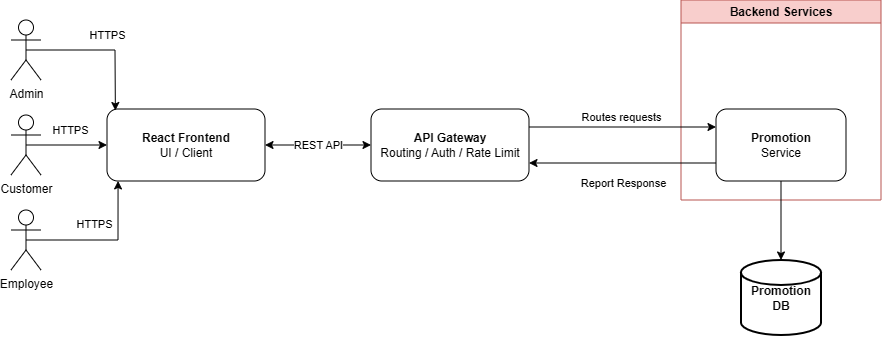

> Hình trên là sơ đồ thành phần có sẵn trong repository. Luồng vòng đời chi tiết dưới đây được dựng lại từ implementation hiện tại.

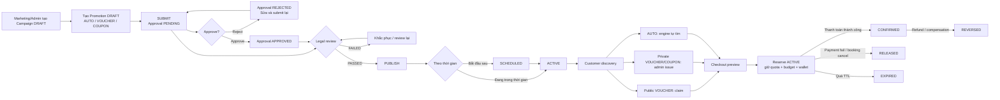

### Điểm cần đọc đúng trong sơ đồ

- Campaign điều khiển lifecycle của promotion. Endpoint activate/pause trực tiếp promotion đã bị vô hiệu hóa; publish/activate campaign sẽ kích hoạt promotion phù hợp.
- `cancel` reservation hiện gọi cùng service với `release`, nên trạng thái lưu là `RELEASED`, không có `CANCELLED` trong enum runtime.
- `REVERSED` có tồn tại ở backend và phục vụ refund/compensation sau confirm, nhưng chưa có trong danh sách trạng thái reservation của frontend promotion.

### 3.1 Bằng chứng walkthrough runtime

#### Admin — danh sách AUTO

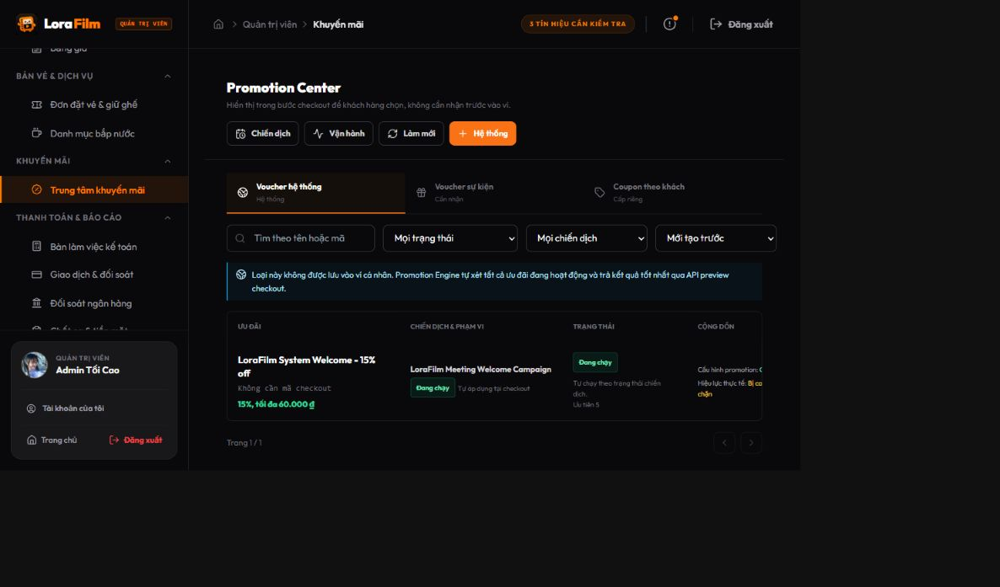

Màn hình nhất quán với toàn hệ thống, filter rõ và giải thích đúng việc Engine tự xét AUTO. Tuy nhiên header lại nói “hiển thị trong checkout để khách hàng chọn”, trái với runtime.

#### Admin — voucher và effective availability

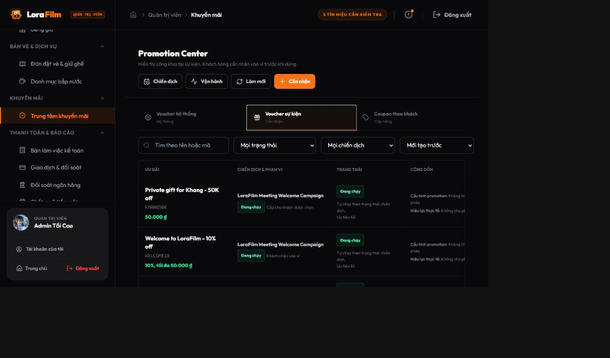

Promotion `Private gift for Khang` hiển thị lifecycle “Đang chạy” dù quota là `1 / 1`. UI chưa tách **vòng đời** khỏi **khả dụng thực tế** như `EXHAUSTED`.

#### Admin — coupon empty state

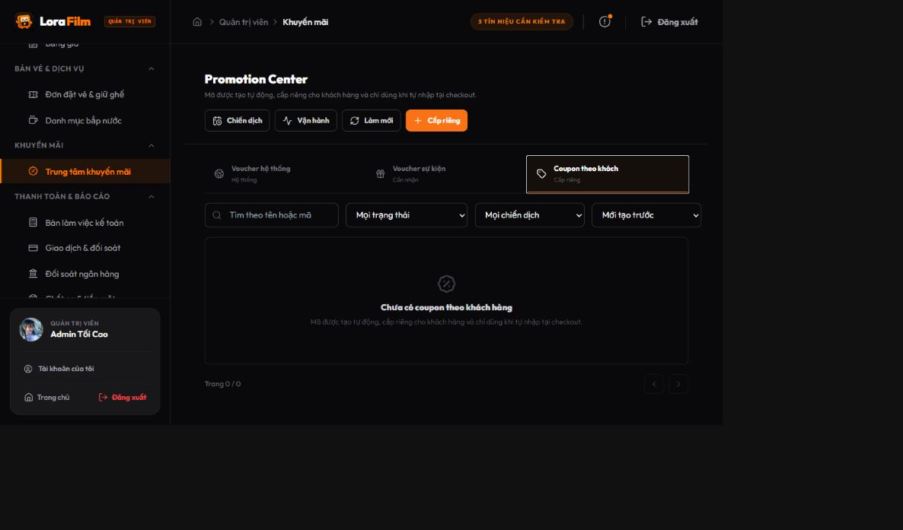

Empty state đẹp nhưng không có CTA/hướng dẫn tạo template rồi cấp cho customer.

#### Admin — campaign và operations

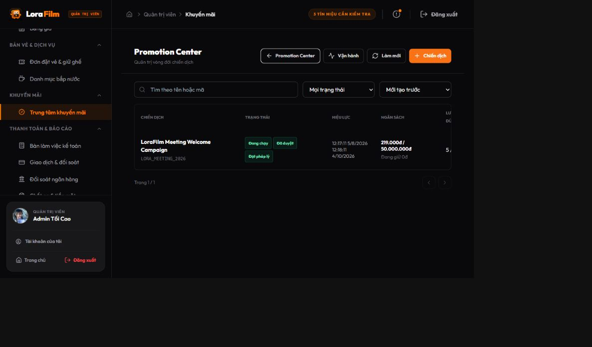

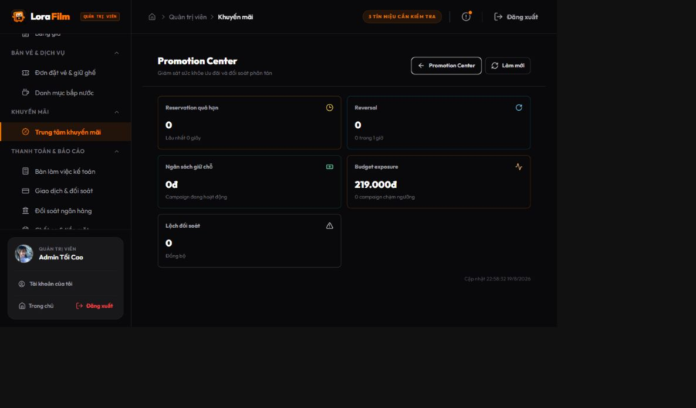

Campaign đang chạy chỉ có action pause trên happy path, không có detail workspace/timeline/kill switch. Operations hiển thị năm metric tốt nhưng các card không drill-down tới reservation, redemption hoặc adjustment.

#### Customer — wallet và AUTO

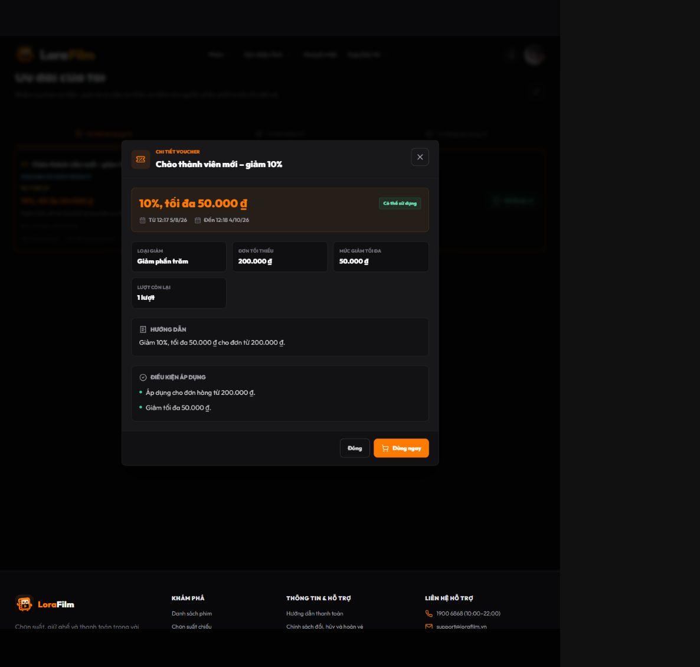

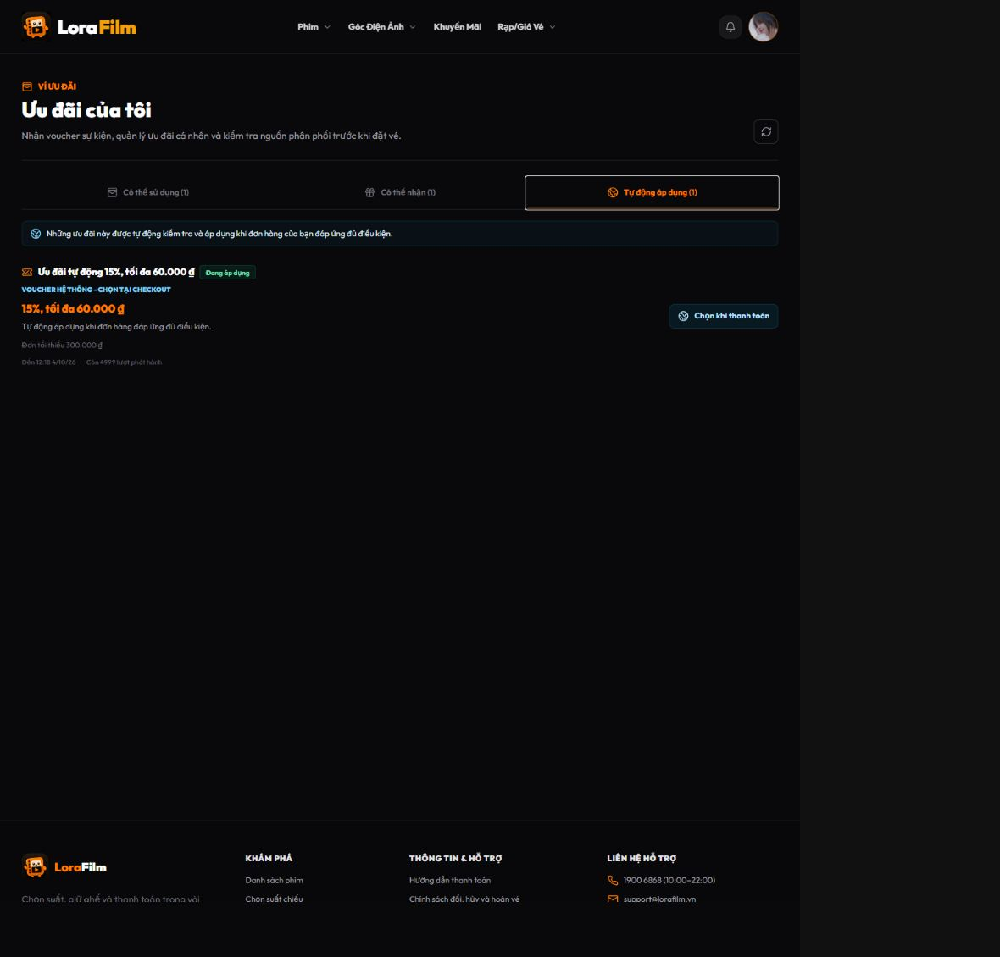

Wallet detail dễ hiểu, có điều kiện và CTA “Dùng ngay”. AUTO tab lại vừa nói tự động áp dụng vừa ghi “chọn tại checkout/Chọn khi thanh toán”, gây mâu thuẫn kỳ vọng.

#### Role Manager — kiểm tra route

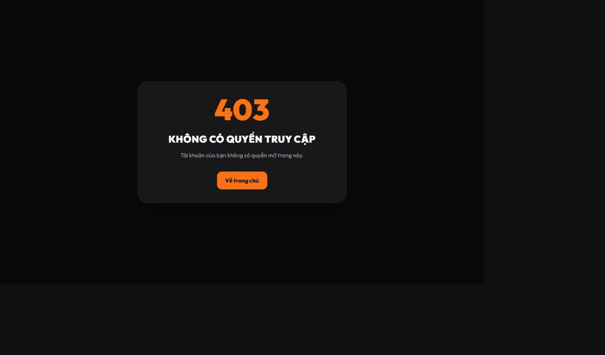

Runtime xác nhận route Promotion Center chỉ cho `ADMIN`. Đây là bằng chứng về access gap hiện tại; không có nghĩa bắt buộc phải xây năm UI riêng, mà cần capability/permission đúng với mô hình vận hành được chọn.

## 4. Vòng đời hiện tại theo từng actor

### 4.1 Admin/Marketing tạo và cấu hình

1. Tạo campaign với code, tên, thời gian, budget, quota, priority, stackable/exclusive và các cờ auto lifecycle.
2. Tạo ít nhất một promotion thuộc campaign. Promotion có loại `AUTO`, `VOUCHER` hoặc `COUPON`, action phần trăm/tiền cố định/miễn phí và conditions JSON.
3. Promotion wizard có bốn bước, preview, validate, clone draft và code generation. Đây là phần UX tốt nhất của admin UI.
4. Campaign chỉ được sửa khi status là `DRAFT` và approval là `DRAFT` hoặc `REJECTED`. Mỗi thay đổi cấu hình reset approval/legal để buộc duyệt lại.

### 4.2 Approval, legal và xuất bản

1. Campaign phải có promotion hợp lệ mới submit được.
2. Budget trên 50.000.000 VNĐ cần Finance Director; thấp hơn cho phép Marketing Manager hoặc Finance Director.
3. Legal review nhận `PASSED` hoặc `FAILED` sau khi campaign đã submit.
4. Chỉ campaign `APPROVED + PASSED` mới publish; kết quả là `SCHEDULED` hoặc `ACTIVE` tùy thời gian.
5. Runtime hỗ trợ pause, activate, kill switch và cancel campaign.

**Khoảng trống vận hành:** UI chỉ có submit, approve, legal pass, publish, activate và pause. Các nhánh reject, legal fail, kill switch, cancel và approval history không có giao diện hoàn chỉnh.

### 4.3 Phân phối tới customer

| Loại | Cách customer nhận/biết | Cách sử dụng |
|---|---|---|
| `AUTO` | Tab “Tự động áp dụng”; không vào wallet | Engine tự đánh giá khi preview checkout |
| Public `VOUCHER` | Tab “Có thể nhận” | Customer claim → vào tab “Có thể sử dụng” → chọn tại checkout |
| Private `VOUCHER` | Admin issue vào wallet từng customer | Chọn tại checkout |
| `COUPON` | Admin issue riêng; mã gửi qua notification, không hiển thị trong wallet | Nhập mã tại checkout |

Customer page hiện chỉ giữ các wallet item còn dùng được. Điều này làm màn hình gọn, nhưng customer không có lịch sử rõ ràng về voucher đã dùng/hết hạn/bị thu hồi và lý do.

### 4.4 Checkout và payment

1. Booking gửi context authoritative: user, movie, cinema, showtime, seat, format, channel, payment method, amount…
2. Customer chỉ gửi tối đa một lựa chọn thủ công: wallet voucher, promotion ID hoặc coupon code.
3. Engine luôn tải AUTO candidates; nếu không có manual thì chọn một AUTO tốt nhất.
4. Nếu có manual, implementation hiện giữ manual làm authoritative; chỉ ghép thêm tối đa một AUTO khi cả promotion và campaign hai phía đều `stackable`, đồng thời không vi phạm `exclusiveCampaign`.
5. Preview chỉ tư vấn; reserve đánh giá lại trong transaction, lock và giữ budget/quota/wallet.
6. Payment success → `CONFIRMED`; payment fail/cancel trước confirm → `RELEASED`; timeout → `EXPIRED`; refund sau confirm → `REVERSED` và tạo adjustment ledger.

### 4.5 Operations

Backend/UI operations dashboard đã có các nhóm tín hiệu:

- reservation hết hạn tồn đọng;
- reversal;
- campaign budget exposure;
- reconciliation mismatch.

Backend cũng có API search reservation, nhưng Promotion Center hiện không tải/hiển thị bảng lịch sử reservation. Khi có incident, operator phải dựa vào API/DB/log thay vì tự điều tra từ UI.

## 5. Ma trận coverage nghiệp vụ

Ký hiệu: ✅ cover; ⚠️ cover một phần hoặc dễ vận hành sai; ❌ chưa có đường vận hành trên UI hiện tại.

| Nghiệp vụ | Backend | UI Admin | UI Customer/Checkout | Nhận xét |
|---|:---:|:---:|:---:|---|
| Tạo/sửa campaign draft | ✅ | ✅ | – | UI edit chưa kiểm tra approval lock trước khi bấm |
| Tạo/sửa/clone promotion | ✅ | ✅ | – | Wizard và clone flow tốt |
| Submit approval | ✅ | ✅ | – | Backend cho resubmit `REJECTED`; UI chỉ hiện submit ở `DRAFT` approval |
| Approve theo ngưỡng budget | ✅ | ⚠️ | – | UI chỉ role ADMIN; không vận hành đúng Finance/Marketing matrix |
| Reject campaign có lý do | ✅ | ❌ | – | Service frontend cũng chưa expose method reject |
| Legal `PASSED` | ✅ | ⚠️ | – | UI dùng comment cố định, nút hiện cả khi chưa submit |
| Legal `FAILED` | ✅ | ❌ | – | Không có lựa chọn/khu vực nhập lý do |
| Approval history | ✅ | ❌ | – | Có API, chưa có view |
| Publish/schedule/activate | ✅ | ✅ | – | Happy path cover |
| Pause campaign | ✅ | ⚠️ | – | Backend hỗ trợ `ACTIVE` và `SCHEDULED`; UI chỉ hiện cho `ACTIVE` |
| Kill switch khẩn cấp | ✅ | ❌ | – | Thiếu thao tác quan trọng nhất khi có revenue incident |
| Cancel campaign | ✅ | ❌ | – | Không có UI |
| Public voucher claim | ✅ | – | ✅ | Có chống claim sai/duplicate |
| Private voucher issue | ✅ | ⚠️ | ✅ | Chọn thủ công tối đa 20 customer hiển thị mỗi query; không segment/import |
| Coupon issue/notification | ✅ | ⚠️ | ✅ | Không có resend/recovery UX trong Promotion Center |
| AUTO discovery | ✅ | ✅ | ⚠️ | Chạy đúng nhưng copy nói “Chọn khi thanh toán” |
| Rule theo movie/cinema/min order | ✅ | ✅ | ✅ | Cover trực tiếp trong wizard |
| Rule theo showtime/payment/channel/format/order/seat | ✅ | ❌ | ✅ runtime | Chỉ tạo được qua API/raw JSON hoặc dữ liệu có sẵn |
| Exclude date/room, purchase/showtime day | ✅ | ❌/⚠️ | ✅ runtime | Wizard chỉ expose day-of-week chung, không đủ ngữ nghĩa |
| Tier/verification | ✅ | ✅ | ✅ | Có fail-closed verification ở engine |
| Best-price giữa manual và AUTO | ⚠️ | – | ⚠️ | Tài liệu và implementation mâu thuẫn |
| Manual + AUTO stacking | ✅ | ✅ config | ✅ | Tối đa 1 + 1, có exclusive campaign |
| Reserve/confirm/release/expire | ✅ | – | ✅ | Atomic/idempotent |
| Refund/reverse confirmed promotion | ✅ | ⚠️ monitoring | ✅ tích hợp | Frontend status list thiếu `REVERSED` |
| Phân biệt cancel với payment failure | ❌ | ❌ | ❌ | Cả hai cùng thành `RELEASED` |
| Reservation/ledger investigation | ✅ API | ❌ | – | Chưa có UI explorer |
| Customer xem lịch sử voucher | ✅ dữ liệu | – | ❌ | Trang chỉ giữ item đang usable |

## 6. Những phần đang làm tốt

### 6.1 Transaction integrity

- Reserve không tin hoàn toàn preview; service đánh giá lại và lock trước khi giữ tài nguyên.
- Quota được kiểm tra ở promotion, user wallet và campaign; budget có used/reserved/remaining.
- Idempotency áp dụng cho các transition nội bộ; checkout scope có unique constraint để tránh double reservation.
- Snapshot promotion/campaign/action/condition được giữ tại redemption, giúp lịch sử không bị thay đổi khi template đổi.
- Có expire scheduler, retry theo record, outbox và reconciliation.
- Refund/compensation không sửa lịch sử cũ mà chuyển `REVERSED` và tạo adjustment ledger.

### 6.2 Customer checkout

- `PromotionChooser` không expose AUTO như voucher cho customer tự chọn.
- Voucher không đủ điều kiện vẫn có thể hiện kèm lý do; item used/exhausted/terminal bị ẩn khỏi chooser.
- Claim-and-use được hỗ trợ trong cùng flow.
- Checkout kiểm tra selected voucher phải xuất hiện trong kết quả backend; khi stack thì hiển thị tổng authoritative từ engine.

### 6.3 Admin authoring cơ bản

- Promotion wizard chia bước rõ, có preview và confirm.
- Có clone draft, code generation, lookup movie/cinema bằng tên và cảnh báo advanced conditions được preserve.
- Campaign table hiển thị đồng thời business status, approval status, legal status, budget used/reserved và redemption count.
- Issue modal có bước kiểm tra danh sách trước khi gửi và thông báo rõ giới hạn hiện tại.

## 7. Findings ưu tiên

### Mức ưu tiên

- **P0:** chặn vận hành production vì rủi ro quyền hạn/tài chính hoặc không có đường xử lý incident.
- **P1:** thiếu nghiệp vụ chính, có thể làm sai giá hoặc gây thao tác thất bại.
- **P2:** ảnh hưởng hiệu suất, khả năng hiểu hệ thống, auditability hoặc chất lượng dài hạn.

### AUD-001 — P0 có điều kiện: maker–checker/capability chưa tồn tại end-to-end

**Bằng chứng**

- Tất cả route promotion admin đi qua `adminOnly`, chỉ cho `ADMIN`.
- Backend lại cấp quyền theo từng action cho `MARKETING_MANAGER`, `MARKETING_STAFF`, `FINANCE_DIRECTOR`, `LEGAL_COMPLIANCE`, `OPERATIONS_MANAGER`.
- Approval service bỏ kiểm tra four-eyes và budget authority khi actor là `ADMIN`.
- Database runtime chưa có các role promotion chuyên biệt; role catalog đang dùng chỉ có `ADMIN`, `MANAGER`, `EMPLOYEE`, `CUSTOMER`. Manager truy cập trực tiếp Promotion Center nhận `403`.

**Tác động**

- Nếu LoraFilm chỉ demo bằng một admin, giới hạn này chưa chặn demo.
- Nếu vận hành production có nhiều người và tiền thật, Marketing/Finance/Legal/Ops không có capability end-to-end để làm phần việc của mình.
- Một admin có thể tạo rồi tự approve bằng nút thông thường; maker–checker chưa được enforce cho actor duy nhất đang vào được UI.
- Nếu `ADMIN` là emergency override thì hiện chưa có UX riêng, reason bắt buộc hoặc dấu vết override rõ ràng.

**Khuyến nghị**

1. Chọn mô hình access profile/capability production; không cần hard-code năm giao diện theo năm role.
2. Thay `adminOnly` bằng permission/action capability tương ứng và cho actor thấy đúng queue/action.
3. Không bypass four-eyes cho thao tác thường. Nếu cần superadmin override, tạo action riêng, bắt buộc reason + step-up confirmation + audit event.

### AUD-002 — P0: thiếu control plane để xử lý lifecycle và incident

UI campaign hiện không có reject, legal fail, kill switch, cancel và history. Pause scheduled campaign cũng không có dù backend hỗ trợ.

**Tác động:** khi campaign sai giá/sai audience hoặc cần dừng khẩn cấp, operator phải gọi API thủ công. Đây là rủi ro revenue và kéo dài MTTR.

**Khuyến nghị:** dùng một action menu sinh từ server capabilities; mọi action nguy hiểm có modal nhập reason, hiển thị impact và yêu cầu confirm. Kill switch phải nằm nổi bật trong campaign detail và operations dashboard.

### AUD-003 — P1 theo scope release: rule builder không cover condition engine

UI hiện expose chủ yếu:

- minimum order;
- movie;
- cinema;
- membership tier/verification;
- một day-of-week chung.

Engine còn hỗ trợ showtime, payment method, channel, format, order type, seat type, allowed users, purchase day, showtime day, exclude room type và exclude dates.

**Tác động:** không thể cấu hình chính xác các chương trình kiểu “chỉ online”, “chỉ MoMo”, “Thứ Tư nhưng loại lễ”, “chỉ ghế thường”, “không áp dụng IMAX/VIP”, hoặc “chỉ một số suất chiếu” bằng UI. Đây chỉ là P1 cho các loại campaign mà release tuyên bố hỗ trợ; không cần expose mọi predicate chỉ vì backend đã có.

**Khuyến nghị:** chốt allowlist rule cho release, công bố rõ rule chưa hỗ trợ và không để UI làm mất advanced conditions. Sau đó mở rộng theo nhóm `Audience`, `Order`, `Showtime`, `Payment`, `Exclusions`; thêm human-readable preview và test-order simulator.

### AUD-004 — P1: business rule best-price mâu thuẫn với code/test

- Business rule `BR-VOU-05` nói engine phải so sánh manual với AUTO tốt nhất; AUTO tốt hơn thì không reserve/consume manual.
- Engine hiện ghi rõ manual choice là authoritative và test `selectedWalletVoucherIsKeptWhenBetterAutomaticCannotStack` xác nhận voucher 10.000 vẫn được giữ dù AUTO giảm 21.000.
- Checkout frontend cũng coi việc backend không trả selected voucher là kết quả invalid.

**Tác động:** tùy cách PO hiểu, customer có thể trả nhiều hơn kỳ vọng hoặc hệ thống có thể làm trái lựa chọn chủ động của customer.

**Target policy từ vòng phản biện: Best price wins, nhưng không được làm âm thầm.**

1. Manual voucher/coupon là preference, không phải mệnh lệnh bắt buộc.
2. Nếu AUTO tốt hơn và không stack được, chọn AUTO, không reserve/consume manual.
3. Checkout phải nói rõ voucher vẫn còn trong ví và customer tiết kiệm thêm bao nhiêu.
4. Nếu tổng giảm bằng nhau, ưu tiên phương án không tiêu hao voucher.
5. Benefit phi tiền tệ không được tự động thay thế chỉ bằng so sánh amount.

Cần đồng bộ business rule, engine, frontend validation, copy và regression test trước production.

### AUD-005 — P1: endpoint cancel không giữ được semantics cancel

`POST /internal/reservations/{id}/cancel` gọi `reservationService.release`; enum chỉ có `ACTIVE`, `CONFIRMED`, `REVERSED`, `RELEASED`, `EXPIRED`.

**Tác động:** không phân biệt customer/admin cancel với payment failure hoặc chủ động release. Dashboard, SLA, fraud analysis và customer support mất nguyên nhân nghiệp vụ ở cấp trạng thái; API document cũ vẫn mô tả `CANCELLED` nên gây drift.

**Target policy từ vòng phản biện:** giữ `RELEASED` vì promotion reservation là tài nguyên giữ tạm; `CANCELLED` thuộc Booking Service. Bắt buộc thêm `releaseReasonType` như `PAYMENT_FAILED`, `PAYMENT_TIMEOUT`, `CUSTOMER_CANCELLED_BOOKING`, `STAFF_CANCELLED_BOOKING`, `BOOKING_EXPIRED`, `CAMPAIGN_PAUSED`, `CAMPAIGN_KILL_SWITCH`, `SYSTEM_COMPENSATION`, cùng `releasedAt`, actor/source/reference và reason detail; expose trong search/dashboard.

### AUD-006 — P0/P1: action availability của frontend không khớp backend state machine

Ví dụ:

- Edit campaign chỉ check `status === DRAFT`, nên approval `PENDING/APPROVED` vẫn bấm được rồi backend trả 409.
- Nút legal xuất hiện khi `legalStatus !== PASSED`, kể cả campaign chưa submit; action luôn ghi `PASSED` với comment cố định.
- Delete promotion bị disable chủ yếu khi `ACTIVE`, trong khi backend chỉ cho xóa `DRAFT`.
- Delete campaign không kiểm tra promotion/active hold ở client.
- Frontend khai báo `REVERSED` thiếu trong reservation statuses.
- Update request nhận `legalNotificationRef` nhưng configuration policy reset field khi cấu hình thay đổi; contract dễ gây hiểu nhầm.

**Khuyến nghị:** backend trả `allowedActions`, `effectiveStatus`, `blockedReasons`, `requiredNextActor` cho mỗi row/detail; frontend render trực tiếp theo capability thay vì tự lặp state machine. Error 409 vẫn cần giữ làm defense-in-depth.

### AUD-007 — SHOULD sau release blocker: issue promotion chưa vận hành được ở quy mô lớn

- Mỗi query chỉ tải 20 active customer, chỉ có “Chọn trang này”.
- “Tất cả người dùng” bị disable; request tối đa 1.000 ID.
- Không có segment, CSV import, preview audience count, dry-run, scheduled issue, approval hoặc progress/retry job.

**Tác động:** thao tác chậm, dễ bỏ sót/chọn nhầm và không phù hợp campaign có hàng nghìn customer.

**Khuyến nghị:** với quy mô demo hiện tại, không ưu tiên hơn kill switch/state-aware actions/best-price. Sau khi đóng release blocker, chuyển từ gửi mảng ID đồng bộ sang `AudienceDefinition + IssueJob`; có preview count/sample, progress, retry và downloadable result.

### AUD-008 — P1 usability: copy về AUTO gây hiểu nhầm

- Tab customer ghi “Tự động áp dụng”, đúng với runtime.
- Card lại ghi “Chọn khi thanh toán”; admin model cũng mô tả khách chọn tại checkout.
- Test checkout khẳng định AUTO không được expose như voucher có thể chọn.

**Khuyến nghị copy:** “Hệ thống tự áp dụng ưu đãi tốt nhất khi đơn hàng đủ điều kiện. Bạn không cần chọn hoặc nhập mã.”

### AUD-009 — P0/P1: thiếu operations drill-down và history/explorer

- Approval history và reservation search có API nhưng không có UI.
- Operator không drill down từ monitoring metric tới reservation/redemption/adjustment cụ thể; đây là blocker production khi cần điều tra tiền/quota.
- Customer không xem được voucher đã dùng/hết hạn/revoked; phần này là SHOULD sau release blocker.

**Khuyến nghị:** campaign detail có timeline bất biến; operations có reservation/ledger explorer; customer wallet có tab history và lý do trạng thái.

### AUD-010 — P2: coverage test mạnh ở service, yếu ở page-level operations

- Backend 165 tests và nhóm chooser/checkout/service frontend đã pass.
- Không có component/page test cho `AdminPromotionCenterPage` hoặc `CustomerPromotionCenterPage`.
- Demo data chỉ chứng minh chủ yếu ACTIVE, public/private voucher, AUTO, confirm và release; chưa chứng minh trực quan coupon, scheduled, paused, expired, reversed, legal fail/reject và stacking.

**Khuyến nghị:** thêm role-matrix E2E và scenario fixture cho toàn lifecycle; ưu tiên test action visibility/state guard vì đây là nơi drift hiện tại xảy ra.

### AUD-011 — P2: documentation drift

API document vẫn có đoạn mô tả một benefit/không AUTO discovery, reservation `COMPLETED/CANCELLED` và endpoint validate cũ; implementation hiện dùng tối đa `1 manual + 1 AUTO`, `CONFIRMED/REVERSED` và reservation workflow mới.

**Khuyến nghị:** đánh dấu tài liệu cũ là archived hoặc generate API/state tables từ code; thêm “last verified commit” cho tài liệu nghiệp vụ.

### AUD-012 — target policy: campaign quota đếm theo order/reservation

Một reservation có thể chứa manual + AUTO. Logic consumption hiện gom theo campaign và dùng count theo reservation, trong khi promotion redemption có thể có hai record.

Vòng phản biện đã đề xuất định nghĩa `campaign.maxRedemptions` là **số order/reservation được hưởng ít nhất một benefit của campaign**. Khi một order stack hai promotion cùng campaign: campaign usage tăng 1, hai promotion redemption tăng tổng cộng 2, budget trừ tổng discount thực tế.

UI nên đổi nhãn để tránh ba nghĩa cùng dùng từ “lượt”:

- Campaign: `Số đơn đã áp dụng`.
- Promotion: `Số lượt ưu đãi`.
- User limit: `Tối đa mỗi khách`.

## 8. Đánh giá UX admin

Điểm dưới đây đã điều chỉnh sau walkthrough runtime; vẫn chưa phải moderated user testing.

| Khía cạnh | Điểm / 10 | Nhận xét |
|---|:---:|---|
| Mức độ đẹp và đồng bộ | 8 | Theme, spacing, tab, filter, table, modal và empty state nhất quán |
| Khả năng quét nhanh dữ liệu | 6.5 | Status và budget nhìn được; action icon dày, nhãn quota chưa rõ nghĩa |
| Dễ hiểu với admin non-tech | 6 | Wizard/detail tốt; thuật ngữ ba tab và copy AUTO còn gây học thuật ngữ nội bộ |
| Khả năng vận hành toàn vòng đời | 4.5 | Cover happy path, thiếu reject/legal fail/kill/cancel/history/detail campaign |
| Khả năng xử lý sự cố | 3.5 | Có KPI nhưng không drill-down và không có emergency control đầy đủ |

### Quan sát UI cụ thể

1. Ba tab trộn nguồn tạo, mục đích và cách phân phối. Nên đổi:
   - `Voucher hệ thống` → `Ưu đãi tự động`.
   - `Voucher sự kiện` → `Voucher trong ví`.
   - `Coupon theo khách` → `Mã ưu đãi cá nhân`.
2. CTA `+ Hệ thống`, `+ Cần nhận`, `+ Cấp riêng` chưa phải động từ rõ. Nên có primary `+ Tạo ưu đãi`; tách tạo template khỏi cấp cho customer.
3. Lifecycle và availability bị trộn. Promotion `ACTIVE` với quota `1 / 1` vẫn hiện “Đang chạy”; cần lớp effective state như `Có thể sử dụng`, `Chưa đến thời gian`, `Đã hết lượt`, `Hết ngân sách`, `Campaign tạm dừng`, `Đã hết hạn`.
4. Cột cộng dồn chứa thông tin tốt nhưng quá kỹ thuật. Nên dùng badge `Bị chiến dịch chặn` và tooltip “Ưu đãi cho phép cộng dồn, nhưng chiến dịch hiện không cho phép”.
5. `1 / 1000` chưa nói là used/issued/reserved. Nên hiển thị `Đã dùng 1 / 1.000 · Đang giữ 0 · Còn 999` và `Tối đa 1 lần mỗi khách`.
6. Mỗi promotion row có nhiều icon; giữ `Xem chi tiết` làm primary và gom edit/clone/issue/history/delete vào menu có chữ.
7. `Chiến dịch` và `Vận hành` là điều hướng nhưng trông như action. Nên chuyển thành navigation rõ: `Tổng quan | Chiến dịch | Cấp phát | Vận hành`.
8. Coupon empty state cần giải thích bước tiếp theo và CTA `Tạo ưu đãi`.
9. Chip “3 tín hiệu cần kiểm tra” là điểm tốt; nên click tới Operations, filter đúng vấn đề và hiển thị severity.

**Kết luận UX:** UI đẹp và đủ tốt để demo/happy path. Chưa đủ an toàn cho admin non-tech vận hành production vì thiếu context “đang ở bước nào, ai xử lý tiếp, vì sao bị chặn, dừng sẽ ảnh hưởng gì và điều tra ở đâu”.

## 9. Information architecture đề xuất

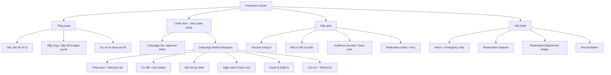

Campaign nên là aggregate admin nghĩ đến trước; Promotion là benefit nằm trong campaign. Có thể giữ một màn hình tra cứu promotion toàn hệ thống, nhưng không nên là đường vận hành chính ngang hàng với campaign.

### Campaign detail nên trả lời ngay năm câu hỏi

1. Campaign đang ở trạng thái nào, ai phải hành động tiếp?
2. Còn thiếu điều kiện nào để publish?
3. Customer nào/order nào sẽ đủ điều kiện?
4. Budget/quota đã used, reserved và projected bao nhiêu?
5. Nếu dừng bây giờ, active hold và customer đang checkout sẽ được xử lý thế nào?

### 9.1 Target state/action matrix

Các state dưới đây là **operational/effective state** được suy ra từ business status + approval + legal, không nhất thiết thay thế enum database hiện tại.

| Effective state | Action hợp lệ | Actor/capability chính |
|---|---|---|
| `DRAFT` | Cấu hình campaign/benefit/audience, validate, delete, submit | Marketing author |
| `REJECTED` | Xem lý do, sửa, submit lại | Creator/Marketing |
| `PENDING_APPROVAL` | Approve/reject có lý do | Approver đúng ngưỡng, không phải creator |
| `LEGAL_PENDING` | Pass/fail có reason/reference | Legal reviewer khi `legalRequired=true` |
| `READY_TO_PUBLISH` | Publish | Marketing publisher |
| `SCHEDULED` | Pause, cancel, kill switch | Operations |
| `ACTIVE` | Pause lượt mới, cancel theo policy, kill switch | Operations |
| `PAUSED` | Resume, cancel, kill switch | Operations |
| `ENDED/CANCELLED/KILLED` | Read-only, history, clone | Viewer có quyền |

| Persona/capability group | Được làm | Không được làm |
|---|---|---|
| Marketing Author | Create/edit draft, clone, test rule, submit | Tự approve, legal, publish, kill |
| Marketing Approver | Approve dưới ngưỡng nếu không phải creator, reject, publish | Legal review, emergency override |
| Finance Approver | Approve/reject vượt ngưỡng, xem budget exposure | Sửa nội dung marketing, legal |
| Legal Reviewer | Pass/fail legal, ghi reason/reference | Sửa discount, approve tài chính |
| Operations | Activate/pause/resume/kill/cancel, điều tra reservation | Sửa rule hoặc tự duyệt |
| Super Admin | Xem toàn bộ; emergency override riêng có audit | Không âm thầm bypass four-eyes bằng action thường |

Ngưỡng 50 triệu hiện là implementation value, chưa phải bằng chứng policy được PO phê duyệt; nên đưa vào cấu hình/versioned approval policy. Legal review cũng nên dựa trên `legalRequired`/template risk thay vì mặc định mọi campaign đều cần review thủ công.

## 10. Backlog refine đề xuất

### MUST trước production

1. Implement ba target policy: Best price wins có thông báo; `RELEASED + releaseReasonType`; campaign usage đếm theo order.
2. Backend trả `allowedActions`, `effectiveStatus`, `blockedReasons`, `requiredNextActor`.
3. Enforce creator không tự approve; tách emergency override có reason/step-up/audit.
4. Thêm reject, legal fail/pass, pause scheduled, cancel và kill switch.
5. Mọi transition nguy hiểm bắt buộc reason, impact summary và audit before/after.
6. Campaign detail có lifecycle rail, readiness checklist, benefits, budget/quota và timeline.
7. Operations drill-down tới reservation, redemption, adjustment, booking/payment reference và release reason.
8. Phân biệt lifecycle `ACTIVE` với effective availability `EXHAUSTED/BLOCKED/BUDGET_EXHAUSTED`.
9. Chuẩn hóa tên ba loại ưu đãi, CTA và copy AUTO.
10. Đồng bộ frontend, backend, business rule và regression test về best price.

### SHOULD sau khi đóng release blocker

1. Chốt allowlist production rồi mở rộng rule builder cho payment method, channel, showtime, seat type và exclude date.
2. Thêm test-order simulator giải thích từng rule pass/fail bằng kết quả backend.
3. Audience segment và issue job bất đồng bộ có preview/progress/retry.
4. Customer xem lịch sử voucher used/expired/revoked.
5. Role/capability matrix E2E và page-level test cho Admin/Customer Promotion Center.
6. Chuẩn hóa API document và state-machine document.
7. Legal review theo risk/template (`legalRequired`) thay vì bắt buộc thủ công cho mọi campaign.

### COULD

1. Forecast burn rate budget/quota.
2. Conversion, claim-to-use, breakage và incremental revenue.
3. Anomaly detection và audience recommendation.
4. Báo cáo tải xuống cho issue job.
5. So sánh hiệu quả giữa các campaign.

## 11. Bộ UAT tối thiểu sau khi refine

| # | Scenario | Kỳ vọng |
|---:|---|---|
| 1 | Marketing Staff tạo campaign + promotion | Tạo/sửa được nhưng không tự approve |
| 2 | Creator thử approve campaign của mình | Bị chặn; history ghi rõ |
| 3 | Campaign 49M và 51M | Áp đúng authority matrix |
| 4 | Legal chọn FAILED rồi PASSED | Cả hai action có reason/ref và timeline |
| 5 | Publish campaign tương lai | `SCHEDULED`, tự active đúng timezone |
| 6 | Kill switch campaign ACTIVE | Chặn reserve mới ngay; active hold theo policy đã công bố |
| 7 | Public voucher claim hai lần | Idempotent/đã sở hữu, không cấp trùng |
| 8 | Coupon issue và notification fail | Có retry/recovery và operator thấy trạng thái |
| 9 | Không chọn manual | Engine chọn đúng AUTO tốt nhất |
| 10 | Manual giảm 10.000, AUTO giảm 21.000, không stack | Chọn AUTO; manual không bị consume; UI nói tiết kiệm thêm 11.000 |
| 11 | Manual + AUTO stack | Chỉ tối đa 1+1, đủ cả four stackable flags và exclusive rule |
| 12 | Hai request reserve cạnh tranh quota cuối | Chỉ một request thắng, không âm budget/quota |
| 13 | Payment fail, customer cancel, TTL expire | `RELEASED + PAYMENT_FAILED`, `RELEASED + CUSTOMER_CANCELLED_BOOKING`, `EXPIRED`; hoàn tài nguyên đúng |
| 14 | Refund sau confirm | Reservation/redemption `REVERSED`, wallet/quota/budget và ledger đúng |
| 15 | Retry cùng idempotency key | Không tạo reservation/redemption trùng |
| 16 | Operator drill-down alert | Từ metric mở được reservation và adjustment liên quan |
| 17 | Customer xem voucher used/expired/revoked | Có history và lý do dễ hiểu |
| 18 | Issue cho segment > 1.000 customer | Job async có preview, progress, retry và kết quả tải xuống |
| 19 | Một order dùng manual + AUTO cùng campaign | Campaign usage +1; promotion redemptions +2; budget trừ tổng discount |
| 20 | Campaign `PENDING_APPROVAL` render trên UI | Edit/delete/publish không hiện nếu backend không trả capability |

## 12. Snapshot dữ liệu demo tại thời điểm audit

Snapshot này chỉ dùng để đánh giá độ đa dạng scenario, không chứa dữ liệu nhận diện customer.

| Dữ liệu | Quan sát |
|---|---|
| Campaign | 1 campaign ACTIVE, APPROVED, PASSED; budget 50.000.000, used 219.000, reserved 0 |
| Promotion | 1 AUTO active private, 4 VOUCHER active; chưa có COUPON seed |
| Wallet | 6 AVAILABLE, 4 USED |
| Reservation | 5 CONFIRMED tổng discount 219.000; 1 RELEASED discount 50.000 |
| Redemption | 5 CONFIRMED; 1 ROLLBACKED |
| Role catalog runtime | `ADMIN`, `MANAGER`, `EMPLOYEE`, `CUSTOMER`; chưa có role promotion chuyên biệt |

Demo hiện chứng minh happy path và release, nhưng chưa đủ để review trực quan toàn lifecycle.

## 13. Các file bằng chứng chính

| Nội dung | File |
|---|---|
| Route role admin | `client/src/routes/AppRoutes.jsx` |
| Admin Promotion Center | `client/src/features/promotion/admin/pages/AdminPromotionCenterPage.jsx` |
| Customer Promotion Center | `client/src/features/promotion/customer/pages/CustomerPromotionCenterPage.jsx` |
| Checkout chooser | `client/src/features/promotion/customer/components/PromotionChooser.jsx` |
| Engine selection/stacking | `server/promotion-service/src/main/java/com/project/promotionservice/promotion/service/PromotionEngineService.java` |
| Approval/four-eyes | `server/promotion-service/src/main/java/com/project/promotionservice/promotion/service/impl/ApprovalServiceImpl.java` |
| Campaign state machine | `server/promotion-service/src/main/java/com/project/promotionservice/promotion/service/impl/CampaignServiceImpl.java` |
| Condition engine | `server/promotion-service/src/main/java/com/project/promotionservice/promotion/service/PromotionConditionEvaluator.java` |
| Reservation lifecycle | `server/promotion-service/src/main/java/com/project/promotionservice/reservation/service/impl/PromotionReservationServiceImpl.java` |
| Cancel endpoint | `server/promotion-service/src/main/java/com/project/promotionservice/reservation/controller/InternalPromotionReservationController.java` |
| Business rules | `docs/design/promotion-service/promotion-service-questions-and-business-rules.md` |
| API document cần làm mới | `docs/api/promotion-service-api.md` |

### 13.1 Bộ ảnh runtime

| # | Ảnh | Nội dung |
|---:|---|---|
| 1 | `screenshots/01-admin-promotions-auto.png` | Danh sách AUTO và copy hiện tại |
| 2 | `screenshots/02-admin-vouchers-wallet.png` | Voucher, quota và action density |
| 3 | `screenshots/03-admin-coupons-empty.png` | Coupon empty state thiếu CTA |
| 4 | `screenshots/04-admin-campaigns.png` | Campaign list và happy-path action |
| 5 | `screenshots/05-admin-operations.png` | Operations metrics thiếu drill-down |
| 6 | `screenshots/06-admin-promotion-detail.png` | Promotion detail modal |
| 7 | `screenshots/07-customer-claimable.png` | Public voucher customer có thể nhận |
| 8 | `screenshots/08-customer-wallet-detail.png` | Wallet detail và CTA dùng ngay |
| 9 | `screenshots/09-customer-auto-copy.png` | Mâu thuẫn copy AUTO |
| 10 | `screenshots/10-manager-promotion-403.png` | Manager bị chặn ở Promotion Center |

## 14. Prompt gợi ý cho vòng review tiếp theo

```text
Bạn đóng vai Product Owner + Business Analyst + UX Lead cho hệ thống khuyến mãi rạp phim.

Audit v2 đã có bằng chứng runtime và đang dùng ba target policy:
- Best price wins nhưng phải thông báo; manual voucher không bị consume nếu AUTO tốt hơn.
- Promotion reservation giữ trạng thái RELEASED và lưu releaseReasonType.
- Campaign quota đếm theo order/reservation; promotion quota đếm theo benefit.

Hãy review bản refine/implementation tiếp theo và:
1. Kiểm tra ba policy đã được triển khai nhất quán giữa backend, frontend, docs và test chưa.
2. Kiểm tra UI có chỉ render action từ allowedActions/effectiveStatus/blockedReasons không.
3. Kiểm tra campaign detail có trả lời: đang ở bước nào, ai xử lý tiếp, vì sao bị chặn,
   budget/quota bao nhiêu và dừng sẽ ảnh hưởng gì.
4. Kiểm tra Operations có drill-down tới reservation/redemption/adjustment và release reason không.
5. Đối chiếu acceptance criteria MUST/SHOULD trong audit; liệt kê phần pass/fail và bằng chứng.

Không suy đoán từ screenshot nếu có thể kiểm tra runtime/API. Nếu thiếu dữ liệu, hãy nêu test cụ thể cần chạy.
```

## 15. Kết luận cuối

Promotion Service **không thiếu nền kỹ thuật và UI hiện tại không xấu**. Transaction core khá tốt; admin/customer screens đẹp, gọn và đủ cho demo. Khoảng trống production nằm ở lớp vận hành: capability/maker–checker, server-driven state actions, emergency stop, effective availability, campaign-centric workspace và điều tra lịch sử.

Hướng refine phù hợp là giữ transaction core, triển khai ba target policy đã nêu và chuyển Promotion Center từ danh sách promotion có nhiều icon thành workspace xoay quanh campaign. Admin phải luôn biết campaign đang ở bước nào, ai xử lý tiếp, vì sao chưa publish, ưu đãi còn thật sự dùng được không, đang giữ bao nhiêu budget/quota và dừng bây giờ ảnh hưởng checkout nào.
