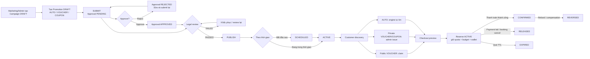
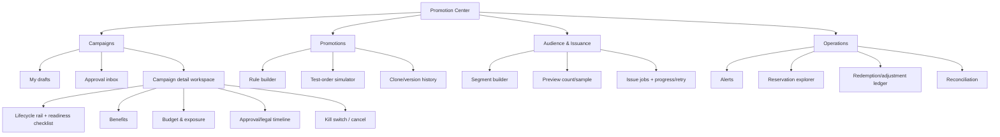

# Audit Promotion Service: vòng đời Admin → Customer và khả năng vận hành

> Ngày audit: **2026-08-19**  
> Phạm vi code: nhánh `main`, commit `9de6badb`  
> Mục tiêu: xác định Promotion Service đang được sử dụng như thế nào từ lúc admin tạo chương trình đến lúc khách hàng sử dụng/hoàn khuyến mãi; đánh giá mức bao phủ nghiệp vụ và độ dễ vận hành của UI.

## 1. Kết luận điều hành

**Kết luận ngắn: Promotion Service đã cover tốt phần “transaction core”, nhưng chưa cover đủ phần “business operations”.**

- Luồng kỹ thuật `preview → reserve → confirm/release/expire → reverse` khá chắc: có idempotency, pessimistic locking, quota/budget, snapshot, outbox, scheduler và reconciliation.
- Ba mô hình `AUTO`, `VOUCHER`, `COUPON` đã đi được từ catalog đến checkout; voucher có ví, coupon cấp riêng qua thông báo, AUTO do engine tự chọn.
- Customer journey ở checkout tương đối tốt: chỉ cho chọn tối đa một manual benefit, AUTO không bị đưa vào danh sách voucher để khách tự chọn, backend trả kết quả authoritative.
- Tuy nhiên UI admin hiện chỉ cho role `ADMIN` vào Promotion Center, trong khi backend thiết kế quy trình nhiều vai trò: Marketing, Finance Director, Legal Compliance và Operations Manager. Vì vậy quy trình maker–checker/legal review trên giao diện **không thể vận hành đúng như thiết kế**.
- Nhiều thao tác backend quan trọng chưa có UI: reject, legal fail, kill switch, cancel campaign, approval history và reservation history.
- Rule builder của admin chỉ cấu hình được một phần nhỏ điều kiện mà engine hỗ trợ. Các chương trình theo payment method, channel, format, seat type, showtime, ngày loại trừ… chưa thể vận hành trọn vẹn bằng UI.
- Tài liệu, UI copy và runtime đang mâu thuẫn về “best-price protection”: tài liệu nói AUTO tốt hơn thì không consume voucher khách chọn; code/test hiện coi voucher/coupon khách chọn là authoritative.

### Phán quyết theo mục đích sử dụng

| Bối cảnh | Đánh giá |
|---|---|
| Demo nội bộ với một tài khoản admin và ít chương trình | **Dùng được** |
| Vận hành thật với phân quyền Marketing/Finance/Legal/Ops | **Chưa đạt** |
| Checkout và bảo toàn số liệu tài chính/quota | **Khá tốt, cần chốt lại một số rule** |
| Tạo chiến dịch phức tạp hoàn toàn qua UI | **Chưa đủ coverage** |
| Điều tra sự cố và audit lịch sử từ UI | **Chưa đủ** |

**Khuyến nghị release:** xử lý nhóm P0 về phân quyền/maker–checker trước khi cho vận hành thật; đồng thời chốt ba quyết định nghiệp vụ về best price, semantics của cancel và cách đếm campaign redemption.

## 2. Phạm vi và phương pháp

Đã audit các lớp sau:

1. Frontend admin Promotion Center, campaign/promotion wizard, issue modal và operations dashboard.
2. Frontend customer Promotion Center, wallet, public voucher, system promotion, promotion chooser và checkout.
3. Promotion API, campaign approval/legal lifecycle, promotion engine, wallet, reservation/redemption và schedulers.
4. Tích hợp Booking/Payment với preview, reserve, confirm, release, refresh và reverse.
5. Business-rule document, API document, automated tests và snapshot dữ liệu demo hiện tại.

### Mức độ bằng chứng

- **Code/static flow:** đã đọc trực tiếp implementation hiện tại.
- **Automated test:** backend Promotion Service chạy **165/165 test pass**, `0 failure`, `0 error`; nhóm frontend được chọn chạy **50/50 test pass**.
- **Dữ liệu demo:** đã đọc snapshot không chứa PII để kiểm tra happy path và rollback.
- **Runtime UI:** trang admin dashboard đã mở được, nhưng khi vào `/admin/promotions` phiên đăng nhập hết hạn và bị chuyển về login. Không có credential hợp lệ để tiếp tục, nên audit UI dưới đây là **heuristic review dựa trên DOM/source và test**, không phải usability test có người dùng và không giả lập screenshot không tồn tại.

## 3. Kiến trúc tổng quan


> Hình trên là sơ đồ thành phần có sẵn trong repository. Luồng vòng đời chi tiết dưới đây được dựng lại từ implementation hiện tại.



### Điểm cần đọc đúng trong sơ đồ

- Campaign điều khiển lifecycle của promotion. Endpoint activate/pause trực tiếp promotion đã bị vô hiệu hóa; publish/activate campaign sẽ kích hoạt promotion phù hợp.
- `cancel` reservation hiện gọi cùng service với `release`, nên trạng thái lưu là `RELEASED`, không có `CANCELLED` trong enum runtime.
- `REVERSED` có tồn tại ở backend và phục vụ refund/compensation sau confirm, nhưng chưa có trong danh sách trạng thái reservation của frontend promotion.

## 4. Vòng đời hiện tại theo từng actor

### 4.1 Admin/Marketing tạo và cấu hình

1. Tạo campaign với code, tên, thời gian, budget, quota, priority, stackable/exclusive và các cờ auto lifecycle.
2. Tạo ít nhất một promotion thuộc campaign. Promotion có loại `AUTO`, `VOUCHER` hoặc `COUPON`, action phần trăm/tiền cố định/miễn phí và conditions JSON.
3. Promotion wizard có bốn bước, preview, validate, clone draft và code generation. Đây là phần UX tốt nhất của admin UI.
4. Campaign chỉ được sửa khi status là `DRAFT` và approval là `DRAFT` hoặc `REJECTED`. Mỗi thay đổi cấu hình reset approval/legal để buộc duyệt lại.

### 4.2 Approval, legal và xuất bản

1. Campaign phải có promotion hợp lệ mới submit được.
2. Budget trên 50.000.000 VNĐ cần Finance Director; thấp hơn cho phép Marketing Manager hoặc Finance Director.
3. Legal review nhận `PASSED` hoặc `FAILED` sau khi campaign đã submit.
4. Chỉ campaign `APPROVED + PASSED` mới publish; kết quả là `SCHEDULED` hoặc `ACTIVE` tùy thời gian.
5. Runtime hỗ trợ pause, activate, kill switch và cancel campaign.

**Khoảng trống vận hành:** UI chỉ có submit, approve, legal pass, publish, activate và pause. Các nhánh reject, legal fail, kill switch, cancel và approval history không có giao diện hoàn chỉnh.

### 4.3 Phân phối tới customer

| Loại | Cách customer nhận/biết | Cách sử dụng |
|---|---|---|
| `AUTO` | Tab “Tự động áp dụng”; không vào wallet | Engine tự đánh giá khi preview checkout |
| Public `VOUCHER` | Tab “Có thể nhận” | Customer claim → vào tab “Có thể sử dụng” → chọn tại checkout |
| Private `VOUCHER` | Admin issue vào wallet từng customer | Chọn tại checkout |
| `COUPON` | Admin issue riêng; mã gửi qua notification, không hiển thị trong wallet | Nhập mã tại checkout |

Customer page hiện chỉ giữ các wallet item còn dùng được. Điều này làm màn hình gọn, nhưng customer không có lịch sử rõ ràng về voucher đã dùng/hết hạn/bị thu hồi và lý do.

### 4.4 Checkout và payment

1. Booking gửi context authoritative: user, movie, cinema, showtime, seat, format, channel, payment method, amount…
2. Customer chỉ gửi tối đa một lựa chọn thủ công: wallet voucher, promotion ID hoặc coupon code.
3. Engine luôn tải AUTO candidates; nếu không có manual thì chọn một AUTO tốt nhất.
4. Nếu có manual, implementation hiện giữ manual làm authoritative; chỉ ghép thêm tối đa một AUTO khi cả promotion và campaign hai phía đều `stackable`, đồng thời không vi phạm `exclusiveCampaign`.
5. Preview chỉ tư vấn; reserve đánh giá lại trong transaction, lock và giữ budget/quota/wallet.
6. Payment success → `CONFIRMED`; payment fail/cancel trước confirm → `RELEASED`; timeout → `EXPIRED`; refund sau confirm → `REVERSED` và tạo adjustment ledger.

### 4.5 Operations

Backend/UI operations dashboard đã có các nhóm tín hiệu:

- reservation hết hạn tồn đọng;
- reversal;
- campaign budget exposure;
- reconciliation mismatch.

Backend cũng có API search reservation, nhưng Promotion Center hiện không tải/hiển thị bảng lịch sử reservation. Khi có incident, operator phải dựa vào API/DB/log thay vì tự điều tra từ UI.

## 5. Ma trận coverage nghiệp vụ

Ký hiệu: ✅ cover; ⚠️ cover một phần hoặc dễ vận hành sai; ❌ chưa có đường vận hành trên UI hiện tại.

| Nghiệp vụ | Backend | UI Admin | UI Customer/Checkout | Nhận xét |
|---|:---:|:---:|:---:|---|
| Tạo/sửa campaign draft | ✅ | ✅ | – | UI edit chưa kiểm tra approval lock trước khi bấm |
| Tạo/sửa/clone promotion | ✅ | ✅ | – | Wizard và clone flow tốt |
| Submit approval | ✅ | ✅ | – | Backend cho resubmit `REJECTED`; UI chỉ hiện submit ở `DRAFT` approval |
| Approve theo ngưỡng budget | ✅ | ⚠️ | – | UI chỉ role ADMIN; không vận hành đúng Finance/Marketing matrix |
| Reject campaign có lý do | ✅ | ❌ | – | Service frontend cũng chưa expose method reject |
| Legal `PASSED` | ✅ | ⚠️ | – | UI dùng comment cố định, nút hiện cả khi chưa submit |
| Legal `FAILED` | ✅ | ❌ | – | Không có lựa chọn/khu vực nhập lý do |
| Approval history | ✅ | ❌ | – | Có API, chưa có view |
| Publish/schedule/activate | ✅ | ✅ | – | Happy path cover |
| Pause campaign | ✅ | ⚠️ | – | Backend hỗ trợ `ACTIVE` và `SCHEDULED`; UI chỉ hiện cho `ACTIVE` |
| Kill switch khẩn cấp | ✅ | ❌ | – | Thiếu thao tác quan trọng nhất khi có revenue incident |
| Cancel campaign | ✅ | ❌ | – | Không có UI |
| Public voucher claim | ✅ | – | ✅ | Có chống claim sai/duplicate |
| Private voucher issue | ✅ | ⚠️ | ✅ | Chọn thủ công tối đa 20 customer hiển thị mỗi query; không segment/import |
| Coupon issue/notification | ✅ | ⚠️ | ✅ | Không có resend/recovery UX trong Promotion Center |
| AUTO discovery | ✅ | ✅ | ⚠️ | Chạy đúng nhưng copy nói “Chọn khi thanh toán” |
| Rule theo movie/cinema/min order | ✅ | ✅ | ✅ | Cover trực tiếp trong wizard |
| Rule theo showtime/payment/channel/format/order/seat | ✅ | ❌ | ✅ runtime | Chỉ tạo được qua API/raw JSON hoặc dữ liệu có sẵn |
| Exclude date/room, purchase/showtime day | ✅ | ❌/⚠️ | ✅ runtime | Wizard chỉ expose day-of-week chung, không đủ ngữ nghĩa |
| Tier/verification | ✅ | ✅ | ✅ | Có fail-closed verification ở engine |
| Best-price giữa manual và AUTO | ⚠️ | – | ⚠️ | Tài liệu và implementation mâu thuẫn |
| Manual + AUTO stacking | ✅ | ✅ config | ✅ | Tối đa 1 + 1, có exclusive campaign |
| Reserve/confirm/release/expire | ✅ | – | ✅ | Atomic/idempotent |
| Refund/reverse confirmed promotion | ✅ | ⚠️ monitoring | ✅ tích hợp | Frontend status list thiếu `REVERSED` |
| Phân biệt cancel với payment failure | ❌ | ❌ | ❌ | Cả hai cùng thành `RELEASED` |
| Reservation/ledger investigation | ✅ API | ❌ | – | Chưa có UI explorer |
| Customer xem lịch sử voucher | ✅ dữ liệu | – | ❌ | Trang chỉ giữ item đang usable |

## 6. Những phần đang làm tốt

### 6.1 Transaction integrity

- Reserve không tin hoàn toàn preview; service đánh giá lại và lock trước khi giữ tài nguyên.
- Quota được kiểm tra ở promotion, user wallet và campaign; budget có used/reserved/remaining.
- Idempotency áp dụng cho các transition nội bộ; checkout scope có unique constraint để tránh double reservation.
- Snapshot promotion/campaign/action/condition được giữ tại redemption, giúp lịch sử không bị thay đổi khi template đổi.
- Có expire scheduler, retry theo record, outbox và reconciliation.
- Refund/compensation không sửa lịch sử cũ mà chuyển `REVERSED` và tạo adjustment ledger.

### 6.2 Customer checkout

- `PromotionChooser` không expose AUTO như voucher cho customer tự chọn.
- Voucher không đủ điều kiện vẫn có thể hiện kèm lý do; item used/exhausted/terminal bị ẩn khỏi chooser.
- Claim-and-use được hỗ trợ trong cùng flow.
- Checkout kiểm tra selected voucher phải xuất hiện trong kết quả backend; khi stack thì hiển thị tổng authoritative từ engine.

### 6.3 Admin authoring cơ bản

- Promotion wizard chia bước rõ, có preview và confirm.
- Có clone draft, code generation, lookup movie/cinema bằng tên và cảnh báo advanced conditions được preserve.
- Campaign table hiển thị đồng thời business status, approval status, legal status, budget used/reserved và redemption count.
- Issue modal có bước kiểm tra danh sách trước khi gửi và thông báo rõ giới hạn hiện tại.

## 7. Findings ưu tiên

### Mức ưu tiên

- **P0:** chặn vận hành production vì rủi ro quyền hạn/tài chính hoặc không có đường xử lý incident.
- **P1:** thiếu nghiệp vụ chính, có thể làm sai giá hoặc gây thao tác thất bại.
- **P2:** ảnh hưởng hiệu suất, khả năng hiểu hệ thống, auditability hoặc chất lượng dài hạn.

### AUD-001 — P0: UI phân quyền trái với quy trình approval/legal backend

**Bằng chứng**

- Tất cả route promotion admin đi qua `adminOnly`, chỉ cho `ADMIN`.
- Backend lại cấp quyền theo từng action cho `MARKETING_MANAGER`, `MARKETING_STAFF`, `FINANCE_DIRECTOR`, `LEGAL_COMPLIANCE`, `OPERATIONS_MANAGER`.
- Approval service bỏ kiểm tra four-eyes và budget authority khi actor là `ADMIN`.

**Tác động**

- Marketing/Finance/Legal/Ops không vào được workspace để làm phần việc của mình.
- Một admin có thể tạo rồi tự approve bằng nút thông thường; quy trình maker–checker chỉ tồn tại trên backend cho các role không thể vào UI.
- Nếu `ADMIN` là emergency override thì hiện chưa có UX riêng, reason bắt buộc hoặc dấu vết override rõ ràng.

**Khuyến nghị**

1. Thay `adminOnly` bằng permission/action capability tương ứng.
2. Cho từng persona thấy đúng queue và action của mình.
3. Không bypass four-eyes cho thao tác thường. Nếu cần superadmin override, tạo action riêng, bắt buộc reason + step-up confirmation + audit event.

### AUD-002 — P0/P1: thiếu control plane để xử lý lifecycle và incident

UI campaign hiện không có reject, legal fail, kill switch, cancel và history. Pause scheduled campaign cũng không có dù backend hỗ trợ.

**Tác động:** khi campaign sai giá/sai audience hoặc cần dừng khẩn cấp, operator phải gọi API thủ công. Đây là rủi ro revenue và kéo dài MTTR.

**Khuyến nghị:** dùng một action menu sinh từ server capabilities; mọi action nguy hiểm có modal nhập reason, hiển thị impact và yêu cầu confirm. Kill switch phải nằm nổi bật trong campaign detail và operations dashboard.

### AUD-003 — P1: rule builder không cover condition engine

UI hiện expose chủ yếu:

- minimum order;
- movie;
- cinema;
- membership tier/verification;
- một day-of-week chung.

Engine còn hỗ trợ showtime, payment method, channel, format, order type, seat type, allowed users, purchase day, showtime day, exclude room type và exclude dates.

**Tác động:** không thể cấu hình chính xác các chương trình kiểu “chỉ online”, “chỉ MoMo”, “Thứ Tư nhưng loại lễ”, “chỉ ghế thường”, “không áp dụng IMAX/VIP”, hoặc “chỉ một số suất chiếu” bằng UI.

**Khuyến nghị:** mở rộng rule builder theo nhóm `Audience`, `Order`, `Showtime`, `Payment`, `Exclusions`; thêm human-readable preview và test-order simulator trước submit.

### AUD-004 — P1: business rule best-price mâu thuẫn với code/test

- Business rule `BR-VOU-05` nói engine phải so sánh manual với AUTO tốt nhất; AUTO tốt hơn thì không reserve/consume manual.
- Engine hiện ghi rõ manual choice là authoritative và test `selectedWalletVoucherIsKeptWhenBetterAutomaticCannotStack` xác nhận voucher 10.000 vẫn được giữ dù AUTO giảm 21.000.
- Checkout frontend cũng coi việc backend không trả selected voucher là kết quả invalid.

**Tác động:** tùy cách PO hiểu, customer có thể trả nhiều hơn kỳ vọng hoặc hệ thống có thể làm trái lựa chọn chủ động của customer.

**Cần quyết định, không nên sửa mù:** chọn một trong hai policy:

1. **Customer choice wins:** giữ manual dù kém hơn; UI phải cảnh báo “Bỏ voucher để nhận AUTO tốt hơn”.
2. **Best price wins:** engine tự bỏ manual khi AUTO tốt hơn; UI thông báo voucher chưa bị sử dụng và checkout phải chấp nhận kết quả đó.

Sau khi chốt phải đồng bộ business rule, engine, frontend validation, copy và regression test.

### AUD-005 — P1: endpoint cancel không giữ được semantics cancel

`POST /internal/reservations/{id}/cancel` gọi `reservationService.release`; enum chỉ có `ACTIVE`, `CONFIRMED`, `REVERSED`, `RELEASED`, `EXPIRED`.

**Tác động:** không phân biệt customer/admin cancel với payment failure hoặc chủ động release. Dashboard, SLA, fraud analysis và customer support mất nguyên nhân nghiệp vụ ở cấp trạng thái; API document cũ vẫn mô tả `CANCELLED` nên gây drift.

**Khuyến nghị:** hoặc thêm `CANCELLED` và reason code chuẩn hóa, hoặc giữ `RELEASED` nhưng bắt buộc `releaseReasonType` (`CUSTOMER_CANCEL`, `PAYMENT_FAILED`, `BOOKING_EXPIRED`, `SYSTEM_COMPENSATION`…) và expose nó trong search/dashboard.

### AUD-006 — P1: action availability của frontend không khớp backend state machine

Ví dụ:

- Edit campaign chỉ check `status === DRAFT`, nên approval `PENDING/APPROVED` vẫn bấm được rồi backend trả 409.
- Nút legal xuất hiện khi `legalStatus !== PASSED`, kể cả campaign chưa submit; action luôn ghi `PASSED` với comment cố định.
- Delete promotion bị disable chủ yếu khi `ACTIVE`, trong khi backend chỉ cho xóa `DRAFT`.
- Delete campaign không kiểm tra promotion/active hold ở client.
- Frontend khai báo `REVERSED` thiếu trong reservation statuses.
- Update request nhận `legalNotificationRef` nhưng configuration policy reset field khi cấu hình thay đổi; contract dễ gây hiểu nhầm.

**Khuyến nghị:** backend trả `allowedActions`/`capabilities` cho mỗi row/detail; frontend render trực tiếp theo capability thay vì tự lặp state machine. Error 409 vẫn cần giữ làm defense-in-depth.

### AUD-007 — P2: issue promotion chưa vận hành được ở quy mô lớn

- Mỗi query chỉ tải 20 active customer, chỉ có “Chọn trang này”.
- “Tất cả người dùng” bị disable; request tối đa 1.000 ID.
- Không có segment, CSV import, preview audience count, dry-run, scheduled issue, approval hoặc progress/retry job.

**Tác động:** thao tác chậm, dễ bỏ sót/chọn nhầm và không phù hợp campaign có hàng nghìn customer.

**Khuyến nghị:** chuyển từ gửi mảng ID đồng bộ sang `AudienceDefinition + IssueJob`; có preview count/sample, approval, progress, retry và downloadable result.

### AUD-008 — P2: copy về AUTO gây hiểu nhầm

- Tab customer ghi “Tự động áp dụng”, đúng với runtime.
- Card lại ghi “Chọn khi thanh toán”; admin model cũng mô tả khách chọn tại checkout.
- Test checkout khẳng định AUTO không được expose như voucher có thể chọn.

**Khuyến nghị copy:** “Hệ thống tự áp dụng ưu đãi tốt nhất khi đơn hàng đủ điều kiện. Bạn không cần chọn hoặc nhập mã.”

### AUD-009 — P2: thiếu history/explorer cho support và audit

- Approval history và reservation search có API nhưng không có UI.
- Customer không xem được voucher đã dùng/hết hạn/revoked.
- Operator không drill down từ monitoring metric tới reservation/redemption/adjustment cụ thể.

**Khuyến nghị:** campaign detail có timeline bất biến; operations có reservation/ledger explorer; customer wallet có tab history và lý do trạng thái.

### AUD-010 — P2: coverage test mạnh ở service, yếu ở page-level operations

- Backend 165 tests và nhóm chooser/checkout/service frontend đã pass.
- Không có component/page test cho `AdminPromotionCenterPage` hoặc `CustomerPromotionCenterPage`.
- Demo data chỉ chứng minh chủ yếu ACTIVE, public/private voucher, AUTO, confirm và release; chưa chứng minh trực quan coupon, scheduled, paused, expired, reversed, legal fail/reject và stacking.

**Khuyến nghị:** thêm role-matrix E2E và scenario fixture cho toàn lifecycle; ưu tiên test action visibility/state guard vì đây là nơi drift hiện tại xảy ra.

### AUD-011 — P2: documentation drift

API document vẫn có đoạn mô tả một benefit/không AUTO discovery, reservation `COMPLETED/CANCELLED` và endpoint validate cũ; implementation hiện dùng tối đa `1 manual + 1 AUTO`, `CONFIRMED/REVERSED` và reservation workflow mới.

**Khuyến nghị:** đánh dấu tài liệu cũ là archived hoặc generate API/state tables từ code; thêm “last verified commit” cho tài liệu nghiệp vụ.

### AUD-012 — cần PO quyết định: campaign redemption count khi stack hai benefit cùng campaign

Một reservation có thể chứa manual + AUTO. Logic consumption hiện gom theo campaign và dùng count theo reservation, trong khi promotion redemption có thể có hai record.

Cần định nghĩa `campaign.maxRedemptions` là:

- số order/reservation được hưởng campaign; hoặc
- tổng số benefit/redemption thuộc campaign.

Hai cách đều hợp lý nhưng quota, dashboard và test phải dùng một nghĩa duy nhất.

## 8. Đánh giá UX admin

Đây là heuristic score dựa trên implementation hiện tại, không phải kết quả user testing.

| Tiêu chí | Điểm / 5 | Nhận xét |
|---|:---:|---|
| Dễ tìm và hiểu cấu trúc | 3 | Có Promotion/Campaign/Operations, filter và status badges; action icon dày và thiếu lifecycle guidance |
| Tạo promotion cơ bản | 4 | Wizard/preview/clone tốt |
| Ngăn thao tác sai | 2 | Nhiều nút hiện sai state rồi mới nhận 409; action quan trọng dùng comment cố định |
| Approval/governance | 1 | Route chỉ ADMIN, thiếu reject/legal fail/history, four-eyes bị bypass |
| Vận hành sự cố | 2 | Có metric nhưng thiếu kill switch và drill-down |
| Vận hành quy mô lớn | 1 | Issue audience thủ công, tối đa 20 item hiển thị/query và 1.000 ID/request |
| Quan sát budget/quota | 3 | List hiển thị used/reserved/count; thiếu detail ledger và forecast |

**Kết luận UX:** dễ dùng cho demo/happy path, nhưng chưa đủ an toàn và hiệu quả cho admin vận hành thật. Vấn đề chính không phải màu sắc hay spacing; đó là information architecture, capability theo role, state-aware action và khả năng điều tra.

## 9. Information architecture đề xuất



### Campaign detail nên trả lời ngay năm câu hỏi

1. Campaign đang ở trạng thái nào, ai phải hành động tiếp?
2. Còn thiếu điều kiện nào để publish?
3. Customer nào/order nào sẽ đủ điều kiện?
4. Budget/quota đã used, reserved và projected bao nhiêu?
5. Nếu dừng bây giờ, active hold và customer đang checkout sẽ được xử lý thế nào?

## 10. Backlog refine đề xuất

### Phase 0 — chốt nghiệp vụ trước khi code

1. Chọn policy `Customer choice wins` hay `Best price wins`.
2. Chọn semantics `CANCELLED` riêng hay `RELEASED + reason type`.
3. Định nghĩa campaign redemption count theo order hay benefit.
4. Xác nhận ADMIN có quyền emergency override không; nếu có, quy định audit/step-up.

### Phase 1 — release blockers

1. Mở route/workspace theo role/permission backend.
2. Enforce four-eyes cho flow thường; tách emergency override.
3. Thêm reject, legal pass/fail, kill switch, cancel, approval history.
4. Cho backend trả `allowedActions`; sửa toàn bộ edit/delete/legal/pause guards.
5. Thêm reason modal, impact summary và audit event cho transition.
6. Expose reservation/reversal detail tối thiểu cho Operations.

### Phase 2 — business coverage và usability

1. Hoàn thiện rule builder cho toàn condition engine.
2. Thêm test-order simulator với context thực tế và giải thích pass/fail từng rule.
3. Refactor campaign detail thành workspace có readiness checklist và timeline.
4. Chuẩn hóa copy AUTO/manual/stacking trên admin, customer và checkout.
5. Thêm audience segment + asynchronous issue job.
6. Thêm customer promotion history.

### Phase 3 — quality và maintainability

1. Page-level tests cho Admin/Customer Promotion Center.
2. E2E theo từng role và toàn state machine.
3. Fixtures cho scheduled/paused/rejected/legal-failed/coupon/stack/reverse/expire.
4. Đồng bộ business rules, API docs và code bằng version/commit marker.
5. Thêm analytics: conversion, claim-to-use, discount cost, breakage, incremental revenue và anomaly alerts.

## 11. Bộ UAT tối thiểu sau khi refine

| # | Scenario | Kỳ vọng |
|---:|---|---|
| 1 | Marketing Staff tạo campaign + promotion | Tạo/sửa được nhưng không tự approve |
| 2 | Creator thử approve campaign của mình | Bị chặn; history ghi rõ |
| 3 | Campaign 49M và 51M | Áp đúng authority matrix |
| 4 | Legal chọn FAILED rồi PASSED | Cả hai action có reason/ref và timeline |
| 5 | Publish campaign tương lai | `SCHEDULED`, tự active đúng timezone |
| 6 | Kill switch campaign ACTIVE | Chặn reserve mới ngay; active hold theo policy đã công bố |
| 7 | Public voucher claim hai lần | Idempotent/đã sở hữu, không cấp trùng |
| 8 | Coupon issue và notification fail | Có retry/recovery và operator thấy trạng thái |
| 9 | Không chọn manual | Engine chọn đúng AUTO tốt nhất |
| 10 | Manual kém hơn AUTO | Kết quả theo policy PO đã chọn; copy rõ; wallet consume đúng |
| 11 | Manual + AUTO stack | Chỉ tối đa 1+1, đủ cả four stackable flags và exclusive rule |
| 12 | Hai request reserve cạnh tranh quota cuối | Chỉ một request thắng, không âm budget/quota |
| 13 | Payment fail, customer cancel, TTL expire | Phân biệt đúng status/reason đã chốt và hoàn tài nguyên |
| 14 | Refund sau confirm | Reservation/redemption `REVERSED`, wallet/quota/budget và ledger đúng |
| 15 | Retry cùng idempotency key | Không tạo reservation/redemption trùng |
| 16 | Operator drill-down alert | Từ metric mở được reservation và adjustment liên quan |
| 17 | Customer xem voucher used/expired/revoked | Có history và lý do dễ hiểu |
| 18 | Issue cho segment > 1.000 customer | Job async có preview, progress, retry và kết quả tải xuống |

## 12. Snapshot dữ liệu demo tại thời điểm audit

Snapshot này chỉ dùng để đánh giá độ đa dạng scenario, không chứa dữ liệu nhận diện customer.

| Dữ liệu | Quan sát |
|---|---|
| Campaign | 1 campaign ACTIVE, APPROVED, PASSED; budget 50.000.000, used 219.000, reserved 0 |
| Promotion | 1 AUTO active private, 4 VOUCHER active; chưa có COUPON seed |
| Wallet | 6 AVAILABLE, 4 USED |
| Reservation | 5 CONFIRMED tổng discount 219.000; 1 RELEASED discount 50.000 |
| Redemption | 5 CONFIRMED; 1 ROLLBACKED |

Demo hiện chứng minh happy path và release, nhưng chưa đủ để review trực quan toàn lifecycle.

## 13. Các file bằng chứng chính

| Nội dung | File |
|---|---|
| Route role admin | `client/src/routes/AppRoutes.jsx` |
| Admin Promotion Center | `client/src/features/promotion/admin/pages/AdminPromotionCenterPage.jsx` |
| Customer Promotion Center | `client/src/features/promotion/customer/pages/CustomerPromotionCenterPage.jsx` |
| Checkout chooser | `client/src/features/promotion/customer/components/PromotionChooser.jsx` |
| Engine selection/stacking | `server/promotion-service/src/main/java/com/project/promotionservice/promotion/service/PromotionEngineService.java` |
| Approval/four-eyes | `server/promotion-service/src/main/java/com/project/promotionservice/promotion/service/impl/ApprovalServiceImpl.java` |
| Campaign state machine | `server/promotion-service/src/main/java/com/project/promotionservice/promotion/service/impl/CampaignServiceImpl.java` |
| Condition engine | `server/promotion-service/src/main/java/com/project/promotionservice/promotion/service/PromotionConditionEvaluator.java` |
| Reservation lifecycle | `server/promotion-service/src/main/java/com/project/promotionservice/reservation/service/impl/PromotionReservationServiceImpl.java` |
| Cancel endpoint | `server/promotion-service/src/main/java/com/project/promotionservice/reservation/controller/InternalPromotionReservationController.java` |
| Business rules | `docs/design/promotion-service/promotion-service-questions-and-business-rules.md` |
| API document cần làm mới | `docs/api/promotion-service-api.md` |

## 14. Prompt gợi ý để gửi báo cáo này cho ChatGPT phản biện

```text
Bạn đóng vai Product Owner + Business Analyst + UX Lead cho hệ thống khuyến mãi rạp phim.

Hãy review audit đính kèm và:
1. Phản biện các kết luận; chỉ ra giả định nào chưa đủ bằng chứng.
2. Xác nhận hoặc sửa mức ưu tiên P0/P1/P2 theo rủi ro doanh thu, compliance và vận hành.
3. Chốt đề xuất cho ba quyết định còn mở:
   - Customer choice wins hay Best price wins?
   - Reservation cần CANCELLED riêng hay RELEASED + reason type?
   - Campaign maxRedemptions đếm theo order hay theo benefit?
4. Đề xuất state/action matrix cho Marketing Staff, Marketing Manager, Finance Director,
   Legal Compliance, Operations Manager và Super Admin.
5. Review information architecture đề xuất và nêu các thay đổi UI cần làm trước production.
6. Chuyển backlog thành acceptance criteria/Given-When-Then có thể giao cho dev.
7. Đánh dấu rõ: MUST trước production, SHOULD sau production, COULD.

Không giả định audit chắc chắn đúng. Nếu thiếu dữ liệu, hãy đặt câu hỏi cụ thể thay vì tự bịa rule.
```

## 15. Kết luận cuối

Promotion Service **không phải đang thiếu toàn bộ nghiệp vụ**; phần lõi tài chính và checkout đã có nền khá tốt. Khoảng trống lớn nằm ở lớp vận hành: ai được làm gì, action nào xuất hiện ở state nào, cách dừng sự cố, cách cấu hình rule phức tạp, cách cấp cho audience lớn và cách điều tra lịch sử.

Hướng refine phù hợp là giữ transaction core, không viết lại engine từ đầu; trước tiên đồng bộ business policy và biến backend capabilities hiện có thành một control plane admin đúng role, đúng state và có audit trail.
