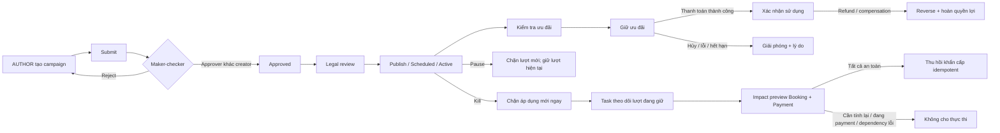
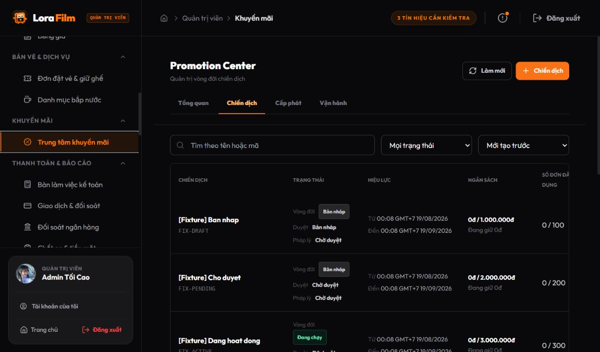
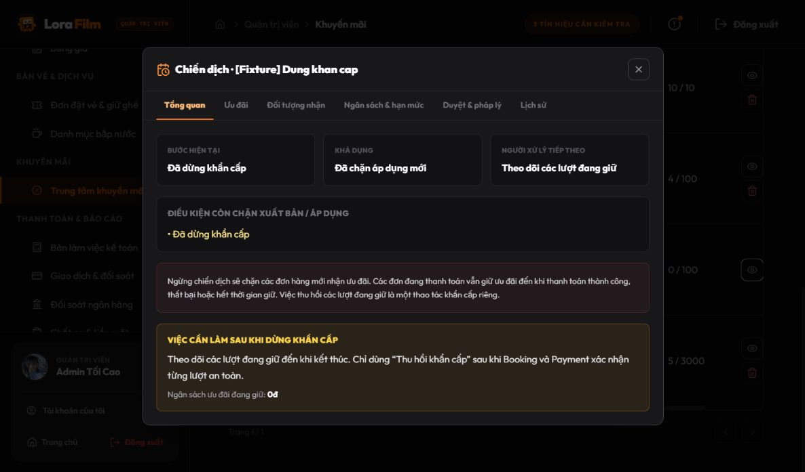
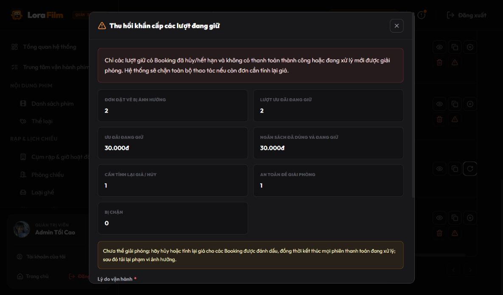
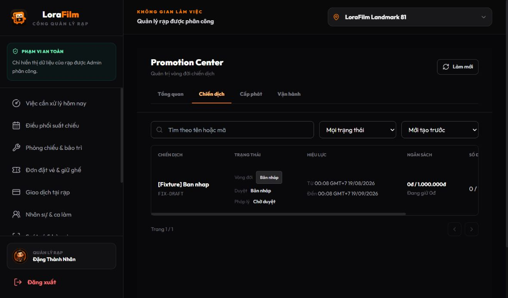
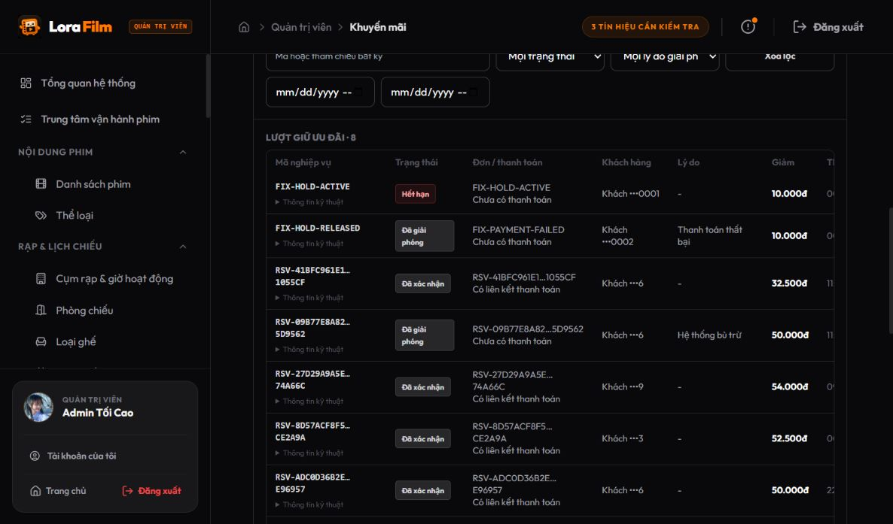
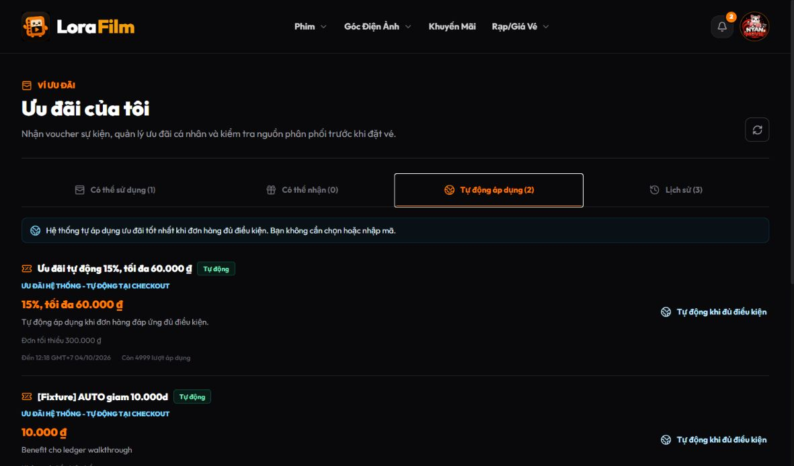
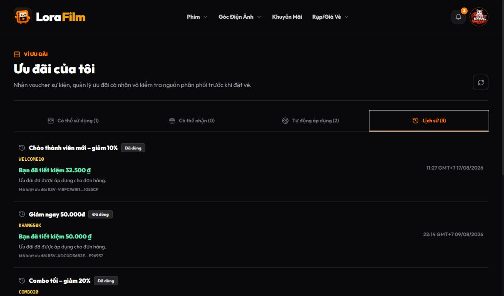

# Promotion Service — pre-commit review pack

> Ngày kiểm tra: 20/08/2026
>
> Trạng thái: đã triển khai hardening theo phản biện và qua final verification, **sẵn sàng commit**
> Mục tiêu review: xác nhận P0/P1 đã được khóa đúng trước khi tạo final commit

## Kết luận ngắn

Ba rủi ro P0 trong phản biện đã được khóa ở backend, không chỉ ẩn nút ở UI:

1. MANAGER bị giới hạn dữ liệu theo các rạp trong JWT; campaign toàn hệ thống không thể đọc hoặc vận hành bằng direct API. Khi tạo campaign, manager phải chọn rõ ít nhất một rạp thuộc phạm vi được giao; backend từ chối `GLOBAL` và mọi rạp ngoài scope thay vì tự mở rộng phạm vi.
2. Force release kiểm tra lại Booking và Payment ngay tại thời điểm execute, phân loại từng lượt giữ, fail-closed khi dependency không phản hồi, dùng impact token/version/idempotency key và không giải phóng item đang thanh toán.
3. `PROMOTION_OVERRIDE` và `PROMOTION_FORCE_RELEASE` không nằm trong ADMIN mặc định; override yêu cầu incident reference và có audit riêng.

Các gate P1 về coupon/best-price, business key quota, migration dữ liệu cũ, state transition, optimistic version, copy vận hành, ngày giờ và business reference cũng đã được bổ sung. Không thay transaction core hoặc theme.

## Vòng đời sau hardening



## Đối chiếu từng must-fix

| Gate | Kết quả | Bằng chứng triển khai và test |
| --- | --- | --- |
| MF-01 — MANAGER row scope | Đã khóa | JWT mang `cinemaPublicIds`; campaign có `GLOBAL`/`ASSIGNED_CINEMAS`; list/detail/create/update/status, promotion target, reservation history và Operations search đều enforce scope. Manager tạo campaign phải gửi `ASSIGNED_CINEMAS` và chọn tập rạp không rỗng là tập con của assignment; `GLOBAL` bị từ chối `422`, rạp ngoài scope bị từ chối `403`. Test direct API còn cover rạp A đọc rạp B `403`, đọc global `403`, pause global `403`, Operations không rò dữ liệu rạp B. |
| MF-02 — Force release an toàn | Đã khóa theo fail-closed | Impact gọi Booking lifecycle-context chỉ đọc và Payment assessment chỉ đọc, phân loại `SAFE_TO_RELEASE`, `REPRICE_REQUIRED`, `BLOCKED_PAYMENT_SUCCESSFUL`, `BLOCKED_PAYMENT_IN_PROGRESS`, `BLOCKED_DEPENDENCY_UNAVAILABLE`. Execute **đánh giá lại toàn bộ dependency state** trước mutation. Regression cover impact từng SAFE nhưng Payment chuyển PROCESSING, Booking đổi lifecycle, hoặc Booking/Payment timeout trước execute: toàn batch bị chặn và `reservationService.release` không được gọi. Execute còn bắt buộc impact token SHA-256, campaign version, actor, exact reservation/version snapshot, expiry, idempotency key, reason và campaign code; stale impact trả `409`; batch mutation dùng một transaction nội bộ để tránh release dở dang. |
| MF-03 — Override đặc quyền | Đã khóa | ADMIN mặc định không có `PROMOTION_OVERRIDE` hay `PROMOTION_FORCE_RELEASE`; MANAGER cũng không có. Emergency stop không kéo theo force release. Override yêu cầu `incidentReference`, reason, campaign code và ghi `EMERGENCY_OVERRIDE [incident]` trong audit. Direct API authorization tests trả `403` đúng contract. |
| MF-04 — quota/coupon invariant | Đã khóa bằng business key hiện có | Một checkout chỉ có một effective reservation nhờ unique `reservation_scope_key = ORDER:{id}` hoặc `BOOKING:{id}`. Chỉ `RELEASED`/`EXPIRED` trả scope để retry; `CONFIRMED`/`REVERSED` giữ canonical business key và historical finalized-key guard chặn reserve lại bằng idempotency key mới. Regression xác nhận không tạo reservation/redemption mới và không chạm engine/budget/quota/wallet. Confirm kiểm tra campaign consumption lịch sử theo booking/order và loại current reservation. Hai benefit cùng campaign chỉ tăng campaign count/user cap một lần; promotion count vẫn tăng theo benefit; retry confirm idempotent. Best-price tie bảo tồn cả voucher lẫn coupon dùng một lần rồi mới xét priority/public ID. |
| MF-05 — full suite | Đã khóa | Không xóa hay disable test trong diff. Promotion chạy bằng `mvn clean test`, không tái sử dụng compiled test cũ. Catalog test dùng ngày động. Client full suite xanh. Chi tiết số liệu ở phần Verification. |
| MF-06 — legacy migration | Đã khóa | `RELEASED` cũ được backfill `LEGACY_UNKNOWN`, `LEGACY_MIGRATION`, `SYSTEM`; migration idempotent, tránh cú pháp phụ thuộc `ADD COLUMN IF NOT EXISTS`. MySQL Testcontainers dựng snapshot có ACTIVE, RELEASED, EXPIRED, CONFIRMED, REVERSED, chạy migration hai lần và xác nhận không đổi sai trạng thái. |

### Quyết định thiết kế đã chốt sau review

- Generic MANAGER chỉ có `PROMOTION_VIEW`, `PROMOTION_OPERATE`, `PROMOTION_AUDIT_VIEW`. `PROMOTION_AUTHOR` là quyền bổ sung qua access profile riêng; thay đổi profile hoặc cinema assignment đều revoke session/JWT cũ.
- MANAGER không được gửi `GLOBAL`, phải chọn rõ ít nhất một rạp thuộc assignment. UI không chọn ngầm toàn bộ rạp và màn xác nhận ghi rõ “Chiến dịch áp dụng tại: …”; backend vẫn là nguồn enforce cuối cùng.
- `REPRICE_REQUIRED` hiện làm force release **không executable**. Hệ thống không tự đổi giá Booking trong cùng request vì chưa có distributed transaction; operator phải xử lý/reprice phía Booking rồi tải lại impact. Đây là fail-closed, không phải giả lập success.
- Không tạo thêm campaign-consumption table. Invariant tương đương được giữ bởi unique effective checkout scope, checkout lock và confirmed-consumption query theo business key booking/order.
- Chưa có recent-login/elevation token trong Auth Service. Vì vậy override/force release được tách khỏi role mặc định và chỉ có thể cấp qua access profile đặc biệt kèm incident reference.

## Đối chiếu iteration improvements

| Mục | Kết quả |
| --- | --- |
| IT-01 — thuật ngữ vận hành | Đã đổi các từ blocker/preview/reservation/confirm/release/budget exposure/ledger sang tiếng Việt dễ hiểu ở màn operator. |
| IT-02 — ngày và trạng thái | Dùng định dạng `dd/mm/yyyy HH:mm` kèm timezone; campaign tách nhãn Vòng đời/Duyệt/Pháp lý; Draft hiển thị pháp lý “Chưa yêu cầu”, chờ approval hiển thị “Chưa bắt đầu”, legal pending mới hiển thị “Chờ đánh giá”; ACTIVE reservation hiển thị “Đang giữ”. |
| IT-03 — business reference | Operations và customer history ưu tiên business reference ổn định, rút gọn trên bảng nhưng giữ đầy đủ ở tooltip; UUID kỹ thuật nằm trong khối “Thông tin kỹ thuật”; customer/email được mask. Customer history gọi đúng trường này là “Mã lượt ưu đãi”, không giả vờ đó là mã đơn hàng. |
| IT-04 — AUTO/history | “Lượt áp dụng”, AUTO là status badge, có “Bạn đã tiết kiệm X”; history hợp nhất AUTO, voucher, coupon và các trạng thái used/restored/expired/revoked. Coupon bị AUTO thay dùng copy “Mã ưu đãi chưa được sử dụng”. |
| IT-05 — approval threshold | `promotion.approval.high-budget-threshold`, policy version và snapshot threshold/capability được lưu khi submit; có boundary test 49.999.999 / 50.000.000 / 50.000.001. |
| IT-06 — transition biên | Sửa cấu hình reset approval/legal; KILLED terminal; CANCELLED không resume; resume sau end thành COMPLETED; mutation gửi expected version và stale action trả `409` với copy tải lại. |
| IT-07 — runbook kill switch | Campaign KILLED có pending task `MONITOR_ACTIVE_HOLDS`; UI hiển thị hướng dẫn theo dõi, ngân sách đang giữ và chỉ thu hồi sau khi hệ thống đặt vé/thanh toán xác nhận an toàn. Modal dùng bốn nhóm nghiệp vụ “Có thể thu hồi ngay / Cần xử lý đặt vé trước / Đang thanh toán / Không xác minh được”, hiển thị rõ trạng thái thao tác và không cho submit nếu impact không executable. |

## Verification cuối

| Phạm vi | Lệnh chuẩn | Kết quả |
| --- | --- | --- |
| Promotion Service | `mvn -q clean test` | **119/119 pass**, 0 fail, 0 error, 0 skipped; 25 Surefire report classes |
| Auth Service | `mvn -q clean test` | **60/60 pass**, 0 fail, 0 error, 0 skipped |
| Booking Service | `mvn -q clean test` | **177/177 pass**, 0 fail, 0 error, 0 skipped |
| Payment Service | `mvn -q clean test` | **112/112 pass**, 0 fail, 0 error, 0 skipped |
| Client full suite | `npm test -- --run` | **650/650 pass**, 164 test files |
| Client lint | `npm run lint -- --quiet` | pass |
| Client production build | `npm run build` | pass |
| Patch hygiene | `git diff --check` | pass; chỉ có cảnh báo LF/CRLF trên Windows |
| Runtime contract | khởi động Booking/Payment/Promotion + gọi internal assessment | port 8083/8084/8087 UP; Booking audit token qua auth và trả business `404` cho ID giả; Payment assessment trả `200`; Promotion health trả `UP` |

### Ba sign-off gate code-level

| Gate từ reviewer | Kết quả cuối |
| --- | --- |
| Impact SAFE → Payment PROCESSING / Booking đổi lifecycle / dependency timeout trước execute | PASS — execute re-assess, trả lỗi trước transaction mutation và test xác nhận zero call tới release |
| Booking/order đã CONFIRMED hoặc REVERSED → reserve lại bằng idempotency key mới | PASS — canonical business key được giữ, finalized-key guard chặn trước engine/save/redemption/budget/quota/wallet |
| Thiếu internal token ở production/default | PASS — không có secret fallback trong tracked config; blank/missing token làm bean construction/PostConstruct thất bại |

Runtime smoke test đã phát hiện và sửa trước review: default URL Booking/Payment từng trỏ nhầm port. Contract hiện dùng Booking `8083`, Payment `8084`, token Promotion → Booking chỉ được `GET lifecycle-context`, và token Promotion → Payment chỉ được gọi assessment read-only. Cấu hình mặc định/production không chứa secret fallback trong Git; ba token bắt buộc đến từ environment và constructor/PostConstruct làm service fail startup khi thiếu hoặc blank. Token local/test chỉ nằm ở cấu hình không dùng cho production và test resources.

### Hai integration gap đóng trong walkthrough cuối

1. Force-release trước đó tái sử dụng Booking `payment-context`. Endpoint này cố ý trả `409` cho booking `CANCELLED`/`EXPIRED`, khiến chính các booking terminal an toàn lại bị hiểu nhầm là dependency unavailable. Promotion nay dùng endpoint `lifecycle-context` chỉ đọc, trả trạng thái vòng đời cần thiết mà không thay đổi contract thanh toán.
2. Payment assessment trước đó dùng chung token có quyền gọi emergency stop. Nay có token assessment riêng; runtime đã xác nhận cùng token này gọi `/assess` trả `200` nhưng gọi `/stop` trả `401`. Booking cũng từ chối token audit này trên `payment-context` và mọi route ghi.

Runtime fixture trước sign-off xác nhận impact phân loại được 2 lượt giữ: 1 lượt an toàn, 1 lượt cần tính lại, 0 đang thanh toán, 0 dependency lỗi; vì còn lượt cần tính lại nên execute bị khóa đúng fail-closed. Regression cuối còn khóa race khi dependency đổi sau impact và zero mutation. Dữ liệu giữ tạm này đã được dọn sau walkthrough.

### Vì sao audit cũ ghi 165 test, report sau refine từng ghi 84?

- `mvn test` không xóa `target/test-classes`. Working tree từng còn compiled class của 6 test source đã bị xóa ở commit cũ `ca708013`, nên Maven chạy cả test không còn trong source và tạo tổng số sai.
- `mvn clean test` xóa artifact cũ rồi compile đúng source hiện tại. Số chuẩn sau hardening và thêm regression test là **119**.
- Diff hiện tại không xóa test source và không thêm `@Disabled`/`@Ignore`.

## Bộ ảnh gửi cùng review

Gửi bảy ảnh dưới đây theo đúng thứ tự; chúng là walkthrough mới sau hardening, không phải ảnh audit cũ.

### 1. ADMIN — campaign-first control plane

Nhãn Vòng đời/Duyệt/Pháp lý, scope và action theo trạng thái.



### 2. ADMIN — KILLED runbook

Pending task theo dõi lượt giữ và copy giải thích ngân sách đang giữ.



### 3. Incident operator — force-release impact

Modal sau sign-off dùng bốn nhóm nghiệp vụ và trạng thái thao tác rõ ràng. Ảnh được chụp sau khi dữ liệu giữ tạm đã dọn nên các bộ đếm về 0; case 1 an toàn + 1 cần xử lý và fail-closed được giữ ở regression test/runtime evidence phía trên.



### 4. MANAGER — row scope theo rạp

Manager thấy workspace Landmark 81, không nhận campaign global/out-of-scope và không có CTA tạo khi chưa được cấp supplemental AUTHOR; cũng không có action duyệt, pháp lý, override hay force release.



### 5. ADMIN — Operations bằng ngôn ngữ nghiệp vụ

Business reference được rút gọn có tooltip, trạng thái và lý do giải phóng đã Việt hóa.



### 6. CUSTOMER — AUTO

Giải thích hệ thống tự chọn ưu đãi tốt nhất và khách không phải nhập/chọn mã.



### 7. CUSTOMER — lịch sử ưu đãi

Tên ưu đãi thân thiện, trạng thái Việt hóa và nhãn trung thực “Mã lượt ưu đãi”.



Nếu ChatGPT chỉ nhận tối đa 4 ảnh, ưu tiên ảnh 2, 3, 4 và 7 vì chúng chứng minh trực tiếp kill policy, safety, manager scope và customer transparency.

## Phạm vi cố ý để backlog

- Full-page campaign workspace/deep link.
- Retention/export customer history.
- Partial refund theo từng item.
- Segment builder, CSV/bulk issuance, rule builder nâng cao.
- Load/chaos/multi-instance invalidation/anomaly alert trước production thật.

Các mục này là P2 hoặc gate trước production, không được trộn vào commit hardening hiện tại.

## Prompt gửi ChatGPT cùng file này và ảnh

```text
Hãy review pre-commit Promotion Service dựa trên review pack và 7 ảnh đính kèm.

Tập trung kiểm tra:
1. MF-01: row-level authorization của MANAGER đã đủ fail-closed ở mọi direct API chưa.
2. MF-02: force release có còn race/gap giữa Promotion, Booking và Payment không; quyết định block REPRICE_REQUIRED thay vì tự reprice có an toàn và vận hành được không.
3. MF-03: việc tách OVERRIDE/FORCE_RELEASE khỏi ADMIN mặc định có đủ thay thế step-up auth ở iteration này không.
4. MF-04: unique effective reservation_scope_key + checkout lock + confirmed consumption theo booking/order có thực sự tương đương campaign-consumption ledger không.
5. Migration legacy và optimistic version có case production nào còn thiếu không.
6. UI trong ảnh có đủ rõ cho admin/manager không hiểu kỹ thuật không.

Phân loại phát hiện thành:
- BLOCKER trước commit
- NÊN SỬA trong commit này
- BACKLOG sau commit

Không đề xuất rewrite transaction core, theme hoặc các tính năng P2 nếu không có lỗi cụ thể. Nếu cần đánh giá code-level, hãy chỉ rõ file/hàm hoặc yêu cầu thêm đúng diff cần xem.
```

## Artifact nên gửi

Để review product/UX: gửi file Markdown này và ảnh.

Để review code-level: gửi thêm working-tree diff/patch hoặc mở draft PR; chỉ gửi report mà không có diff thì reviewer không thể xác nhận implementation detail.
