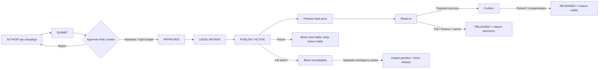
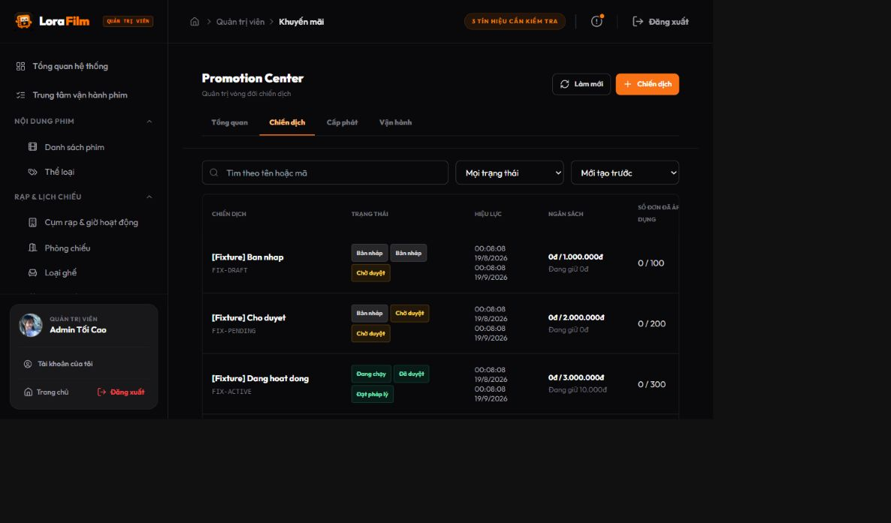
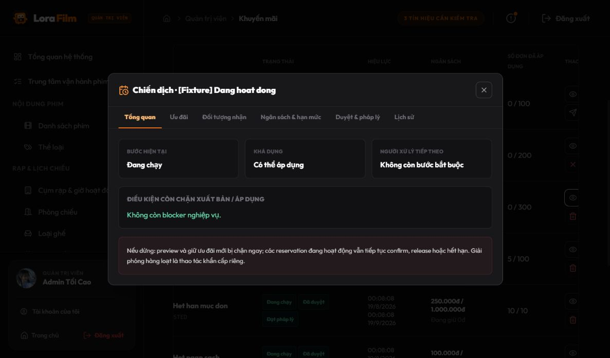
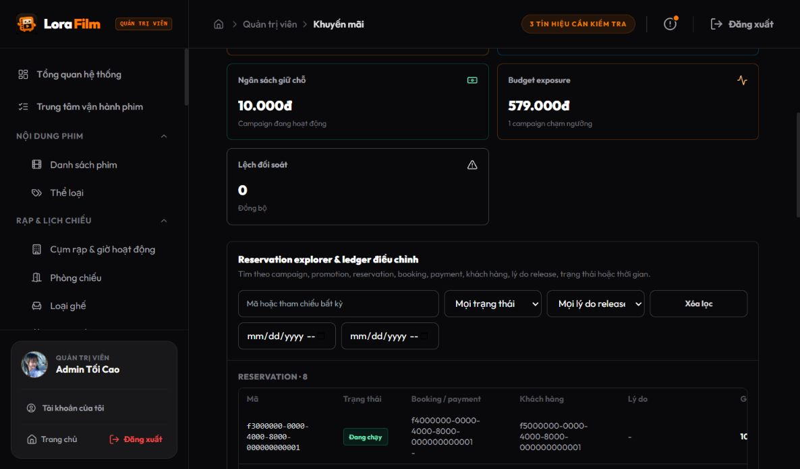
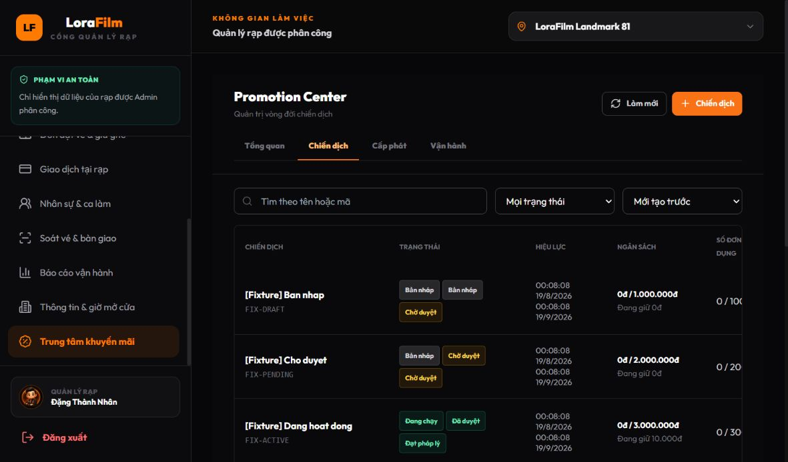
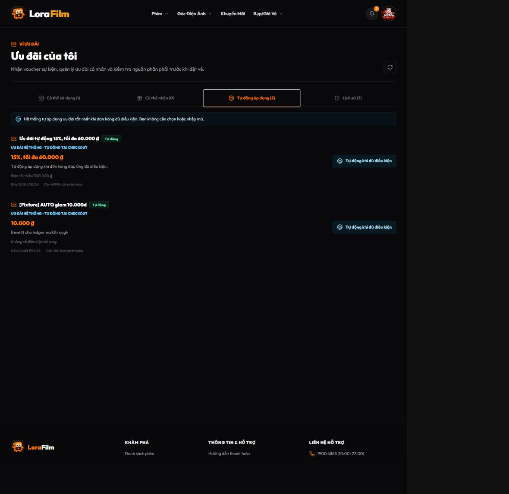
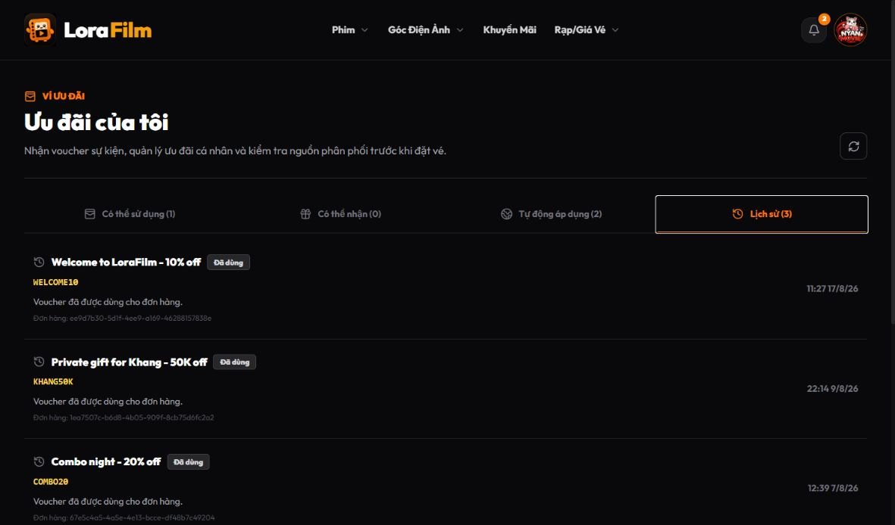

# Promotion Service refine — kết quả triển khai

> Ngày hoàn tất: 2026-08-20  
> Nguồn quyết định: phản biện sau audit và policy đã chốt với product owner  
> Phạm vi: transaction policy, governance, control plane, Admin/Manager UI và customer checkout

## Kết luận

Đợt refine giữ nguyên transaction core nhưng đã bổ sung phần business operations còn thiếu. Promotion Center chuyển sang campaign-first, quyền thao tác do server trả về, maker-checker không còn ADMIN bypass ngầm, emergency stop tách khỏi force release, còn checkout thực thi best-price protection và giải thích rõ khi AUTO thay voucher khách chọn.

## Những policy đã được khóa bằng code

### Best price

- Engine so sánh manual voucher, từng AUTO và các tổ hợp manual + AUTO được phép stack.
- Tie-break ưu tiên phương án không consume wallet voucher.
- Nếu AUTO thay manual, response trả `manualSelectionReplaced` và `additionalSavings`.
- UI báo khoản tiết kiệm thêm và xác nhận voucher vẫn còn trong ví.

### Reservation và quota

- Không thêm trạng thái `CANCELLED`; mọi giải phóng dùng `RELEASED`.
- Release bắt buộc có `releaseReasonType`, `releasedAt`, `releasedBy`, `sourceService`; hỗ trợ `sourceReference` và `reasonDetail`.
- Campaign quota đếm distinct reservation/order; hai benefit cùng campaign chỉ tăng campaign một đơn nhưng vẫn tăng từng promotion và cộng đủ budget.
- Confirm/retry giữ idempotency.

### Governance

Capability contract:

`PROMOTION_VIEW`, `PROMOTION_AUTHOR`, `PROMOTION_APPROVE_STANDARD`, `PROMOTION_APPROVE_HIGH_BUDGET`, `PROMOTION_LEGAL_REVIEW`, `PROMOTION_PUBLISH`, `PROMOTION_OPERATE`, `PROMOTION_EMERGENCY_STOP`, `PROMOTION_AUDIT_VIEW`, `PROMOTION_OVERRIDE`.

- Creator không tự duyệt campaign thường.
- ADMIN không bypass capability ngầm ở route Promotion Center.
- Override là action riêng, yêu cầu capability, reason và nhập lại campaign code; action được audit.
- Server trả `businessStatus`, `approvalStatus`, `legalStatus`, `availabilityStatus`, `allowedActions`, `blockedReasons`, `pendingTasks`.
- Frontend chỉ render action có trong `allowedActions`.

## UI đã refine

Admin/Manager top navigation:

`Tổng quan | Chiến dịch | Cấp phát | Vận hành`

Campaign detail gồm:

`Tổng quan | Ưu đãi | Đối tượng nhận | Ngân sách & hạn mức | Duyệt & pháp lý | Lịch sử`

- Reject, legal pass/fail, pause/resume, cancel, kill switch và override đều có UI.
- Kill switch hiển thị rõ active holds không tự bị release.
- Force release là action riêng, có impact preview, reason và nhập lại campaign code.
- Operations Explorer tìm theo campaign, promotion, reservation, booking, payment, customer, status, release reason và thời gian; kết quả tách reservation/redemption/adjustment ledger.
- Nhãn quota campaign là “Số đơn đã áp dụng”; quota promotion là “Số lượt ưu đãi”; customer cap là “Tối đa mỗi khách”.

Customer:

- AUTO dùng copy: “Hệ thống tự áp dụng ưu đãi tốt nhất khi đơn hàng đủ điều kiện. Bạn không cần chọn hoặc nhập mã.”
- Voucher public chưa nhận có badge “Có thể nhận”, không còn bị gọi là “Đang áp dụng”.
- Lịch sử ví có `Đã dùng`, `Hết hạn`, `Đã thu hồi`, `Đã hoàn lại` dựa trên wallet và immutable redemption ledger.
- Điều kiện áp dụng được trình bày bằng tiếng Việt và giải thích mức tiền còn thiếu khi checkout chưa đạt minimum order.

## API/DB bổ sung

- `GET /api/admin/promotion-operations/search`
- `GET /api/admin/promotion-campaigns/{id}/force-release-impact`
- `POST /api/admin/promotion-campaigns/{id}/force-release`
- `POST /api/admin/promotion-campaigns/{id}/approval/override`
- `GET /api/customers/me/promotion-history`
- Migration: `docs/database/mysql/migrations/20260819_promotion_governance_refine.sql`
- Optional local fixture: `docs/database/mysql/fixtures/20260820_promotion_operational_states.sql`

## Mức độ cover nghiệp vụ sau refine

| Nhóm nghiệp vụ | Kết quả hiện tại | Bằng chứng chính |
| --- | --- | --- |
| Campaign lifecycle | Đã cover core | Draft → submit → approve → legal → publish/active → pause/resume/cancel/kill; server trả trạng thái, blocker, task và action hợp lệ |
| Maker-checker & quyền | Đã cover core | Creator không tự duyệt; không còn ADMIN bypass; high-budget, legal, emergency và override là capability riêng |
| Phân phối | Đã cover 3 model | AUTO không cần chọn; VOUCHER public cần nhận vào ví; COUPON cấp riêng và dùng bằng mã |
| Best price checkout | Đã cover core | So sánh manual/AUTO/stacking; manual có thể bị thay; tie không consume voucher hoặc coupon dùng một lần; UI giải thích khoản tiết kiệm và quyền lợi còn lại |
| Reservation & quota | Đã cover core | Idempotent reserve/confirm/release; finalized business key không thể reserve lại; campaign đếm distinct order; promotion đếm benefit; release taxonomy có nguồn và actor |
| Recovery & emergency | Đã cover core | Pause/kill chặn lượt giữ mới nhưng không âm thầm release; force release tách riêng và có impact preview + confirm code |
| Monitoring & audit | Đã cover vận hành cấp 1 | Dashboard, cảnh báo exposure, explorer theo business reference, reservation/redemption/adjustment ledger |
| Customer transparency | Đã cover core | Phân loại dùng được/có thể nhận/AUTO/lịch sử; AUTO copy đúng; history lấy từ wallet + immutable redemption ledger |

Kết luận: luồng promotion cốt lõi từ Admin/Manager đến checkout và hậu kiểm đã đủ để vận hành có kiểm soát. Các khả năng nâng cao như segment builder, bulk import/job, forecast, anomaly detection và load/chaos verification vẫn là phase sau, không phải lỗ hổng của transaction core hiện tại.

## Verification

- Promotion Service: **119/119** tests pass bằng `mvn clean test`, gồm security scope, force-release execute revalidation, finalized business-key guard, best-price entitlement, startup token guard và migration snapshot MySQL chạy hai lần.
- Auth Service: **60/60** tests pass; generic manager không có AUTHOR, supplemental profile và session revocation có regression.
- Booking Service: **177/177** tests pass; có regression cho lifecycle-context read-only, token scope và missing audit token fail startup.
- Payment Service: **112/112** tests pass; có regression cho assessment token không gọi được emergency stop và missing token fail startup.
- Toàn bộ client suite: **650/650** tests pass trên 164 test files; test ngày của catalog đã dùng ngày động.
- Client ESLint và production build: pass.
- `git diff --check`: không có whitespace error; chỉ có cảnh báo line-ending LF/CRLF của Windows.
- Con số test Promotion 165 trong audit cũ có lẫn compiled test class đã bị xóa từ một commit cũ nhưng còn trong `target`; `mvn clean test` xác nhận source hiện tại có 25 report class và không có test bị xóa/disable trong working-tree diff.

## Walkthrough runtime ADMIN → MANAGER → CUSTOMER

Walkthrough chạy qua UI thật tại `localhost:5173`, gateway, Eureka, auth-service, promotion-service và MySQL. Hai integration gap được phát hiện trong lúc walkthrough — gateway chưa route Operations Explorer và customer promotion history — đã được bổ sung vào route promotion-service rồi kiểm tra lại thành công.

### ADMIN — campaign-first control plane

- Có đúng bốn khu vực: `Tổng quan | Chiến dịch | Cấp phát | Vận hành`.
- Fixture thể hiện draft, pending, active, paused, order exhausted, budget exhausted và killed.
- Action thay đổi theo `allowedActions`; draft chưa được business approve không còn lộ legal review.

Chi tiết campaign có đúng sáu tab, hiển thị riêng bước hiện tại, khả dụng, người xử lý tiếp theo, blocker và giải thích rõ tác động khi dừng.

Operations Explorer tải được reservation và redemption ledger, có filter status, tám release reason, business reference và thời gian. Fixture xác nhận cả active hold và `RELEASED / PAYMENT_FAILED`.

### MANAGER — capability-limited operations

- Sidebar có `Trung tâm khuyến mãi`; route `/manager/promotions` truy cập được.
- Generic manager chỉ có view/operate/audit; không có AUTHOR mặc định. AUTHOR chỉ được cấp bằng supplemental access profile và việc thay profile hoặc cinema assignment đều revoke session cũ.
- Manager-author phải chọn rõ ít nhất một rạp được phân công khi tạo campaign; UI không mặc định toàn bộ và backend từ chối `GLOBAL`/rạp ngoài scope.
- Không render `Phê duyệt`, legal review, `Dừng khẩn cấp`, override hay force release; vẫn có thao tác vận hành thông thường như pause/resume khi server cho phép.

### CUSTOMER — AUTO và lịch sử ví

AUTO hiển thị đúng contract: hệ thống tự áp dụng phương án tốt nhất, khách không cần chọn hoặc nhập mã; toàn bộ copy “khách chọn tại checkout” đã được loại khỏi customer và admin configuration UI.

Tab lịch sử tải từ endpoint mới và hiển thị transaction đã dùng kèm promotion, mã, booking và thời gian. Tài khoản walkthrough có 3 giao dịch `Đã dùng`; các trạng thái `Đã hoàn lại`, `Hết hạn`, `Đã thu hồi` được cover bởi cùng response model khi dữ liệu tương ứng tồn tại.

## Điểm nên nhờ reviewer/ChatGPT phản biện tiếp

1. Ngưỡng high-budget và escalation SLA nên lấy từ configuration nào, ai sở hữu và thay đổi qua quy trình nào?
2. Sau kill switch, giữ nguyên active reservation là policy đã chốt; có cần timer hoặc runbook bắt buộc để operator quyết định force release trong thời gian xác định không?
3. Customer history nên giữ vô hạn hay áp dụng retention/pagination/export theo yêu cầu pháp lý và CSKH?
4. Trước production cần bổ sung load test concurrent reserve/confirm, failure injection cho payment event và dashboard metric/alert ngoài ứng dụng.

## Giới hạn chủ động giữ ngoài scope

Không triển khai CSV import, segment builder, bulk job UI, forecast, anomaly detection, analytics mới, engine rewrite hoặc theme rewrite.

## Pre-commit hardening bổ sung sau walkthrough cuối

Walkthrough force-release bằng dữ liệu thật đã phát hiện hai gap tích hợp mà unit test ban đầu chưa lộ ra:

- Booking `payment-context` cố ý từ chối booking terminal bằng `409`, nên không phù hợp để Promotion đánh giá một lượt giữ trên booking đã `CANCELLED`/`EXPIRED`. Booking nay có `GET /internal/bookings/{publicId}/lifecycle-context`, chỉ trả trạng thái vòng đời cần thiết cho audit an toàn.
- Promotion không còn dùng token có quyền emergency stop của Payment. Token `PROMOTION_TO_PAYMENT_ASSESSMENT_TOKEN` chỉ được gọi `/assess`; gọi `/stop` bằng token này trả `401`. Tương tự, token audit của Booking chỉ đọc được `lifecycle-context`, không đọc `payment-context` và không gọi route ghi. Cấu hình production/default không có secret fallback; Booking PostConstruct, Payment controller constructor và Promotion dependency-client constructor đều fail startup nếu token thiếu hoặc blank.

Sau sign-off, execute force-release còn đánh giá lại Booking/Payment ngay trước mutation. Regression cover Payment chuyển PROCESSING, Booking đổi lifecycle và timeout của từng dependency sau khi impact từng SAFE; mọi trường hợp đều chặn toàn batch với zero release. `CONFIRMED`/`REVERSED` cũng giữ canonical business key và reserve mới cùng booking/order bị từ chối trước khi engine, reservation, redemption, budget, quota hoặc wallet bị chạm tới.

Runtime fixture cuối có hai lượt giữ trên campaign KILLED: một lượt `SAFE_TO_RELEASE`, một lượt `REPRICE_REQUIRED`. Impact trả 1 an toàn, 1 cần tính lại, 0 đang thanh toán, 0 dependency lỗi và không cho execute. Đây là hành vi fail-closed mong muốn.

UI cuối cũng được làm rõ thêm:

- “Force release” được đổi thành “Thu hồi khẩn cấp”; modal nói rõ ngân sách đã dùng/đang giữ và chỉ thu hồi các lượt an toàn.
- Operations Việt hóa trạng thái/lý do, rút gọn business reference nhưng giữ giá trị đầy đủ ở tooltip.
- Customer history không gọi reservation UUID là booking code; dùng nhãn trung thực “Mã lượt ưu đãi” và tên ưu đãi thân thiện.

Ảnh walkthrough cuối nằm tại `screenshots/17-hardening-admin-campaigns.png` đến `screenshots/23-hardening-customer-history.png`. Bộ ảnh và prompt review được đóng gói trong `promotion-service-precommit-review-pack-20260820.md`.

Verification cuối: Promotion **119/119**, Booking **177/177**, Payment **112/112**, Auth **60/60**, client **650/650**; client lint và production build đều pass.
