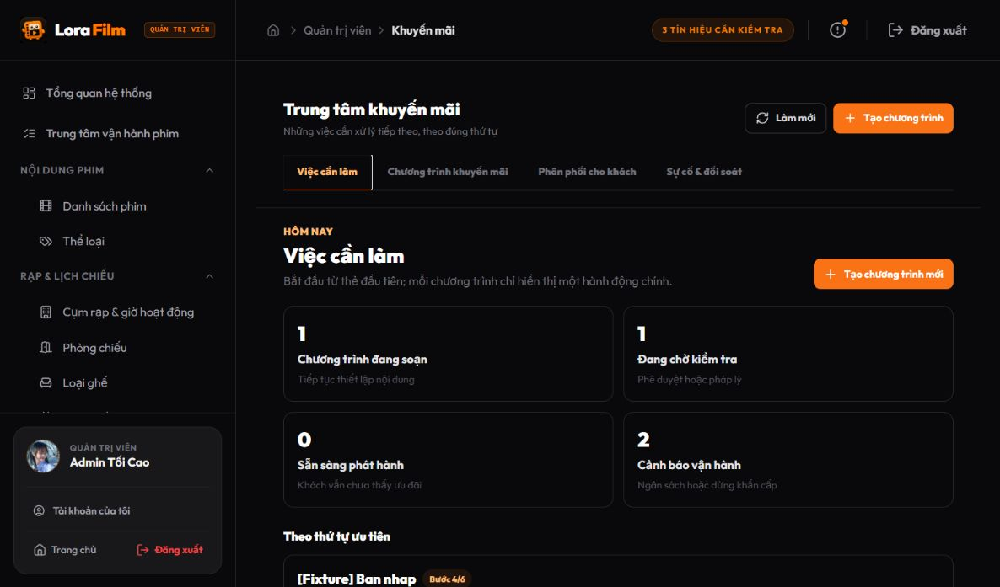
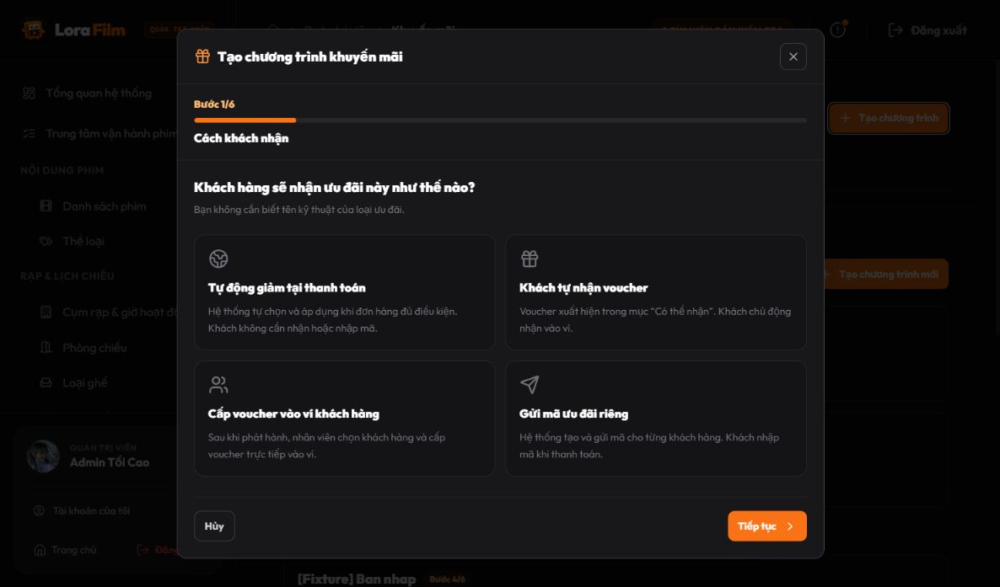
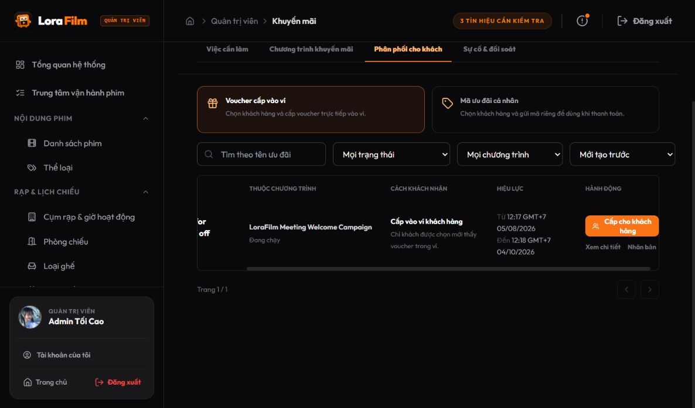
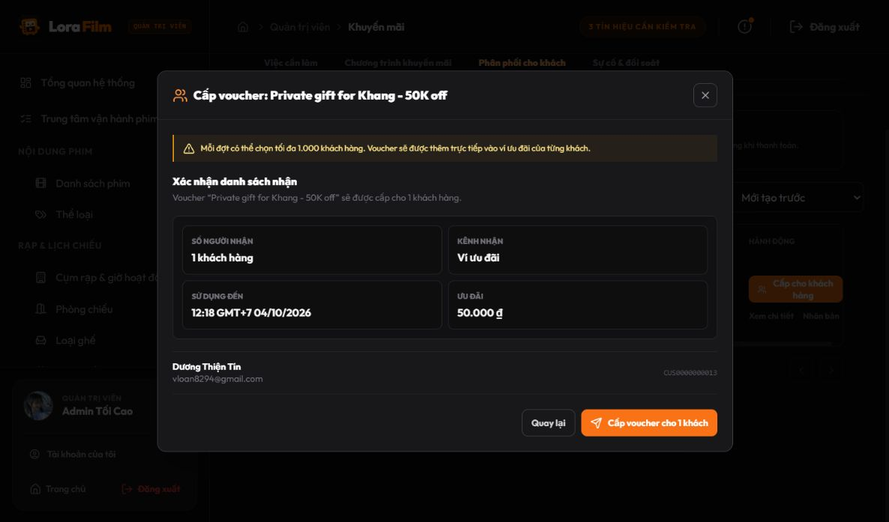

# Promotion UI task-first refactor — review pack

Ngày kiểm tra: 20/08/2026  
Phạm vi: UI quản trị Promotion Center; không thay đổi thêm hợp đồng backend trong đợt này.  
Trạng thái tại thời điểm lập tài liệu: thay đổi đang ở working tree, chưa commit.

## 1. Kết quả chính

UI quản trị đã được chuyển từ cấu trúc theo entity/kỹ thuật sang cấu trúc theo việc người vận hành cần làm:

1. `Việc cần làm`
2. `Chương trình khuyến mãi`
3. `Phân phối cho khách`
4. `Sự cố & đối soát`

Màn mặc định là bảng việc cần làm. Mỗi chương trình chỉ có một hành động chính, được suy ra từ `allowedActions` và trạng thái vòng đời do backend trả về.

Luồng tạo mới hợp nhất việc tạo chương trình và ưu đãi đầu tiên thành wizard 6 bước. Bước đầu tiên hỏi bằng ngôn ngữ nghiệp vụ: khách hàng sẽ nhận ưu đãi như thế nào. Người vận hành không cần chọn `AUTO`, `VOUCHER`, `COUPON`, `publicVisible`, priority hay stacking ở luồng mặc định.

Trang phân phối chỉ còn hai công việc thực sự cần nhân viên thao tác:

- Cấp voucher trực tiếp vào ví khách được chọn.
- Gửi mã ưu đãi riêng cho khách được chọn.

Ưu đãi tự động và voucher khách tự nhận không còn xuất hiện như một “distribution job”.

## 2. Vòng đời mới nhìn từ admin

```text
Chọn cách khách nhận
        ↓
Thiết lập quyền lợi + phạm vi + thời gian/hạn mức
        ↓
Xem trước nội dung phía khách hàng
        ↓
Tạo chương trình + ưu đãi đầu tiên + gửi duyệt
        ↓
Phê duyệt / pháp lý / phát hành theo allowedActions
        ↓
AUTO hoặc voucher công khai: khách sử dụng trực tiếp
Voucher riêng hoặc coupon: nhân viên vào “Phân phối cho khách”
        ↓
Theo dõi sử dụng; xử lý sự cố và đối soát khi cần
```

Nếu việc tạo chương trình thành công nhưng tạo ưu đãi hoặc gửi duyệt thất bại, UI giữ lại chương trình và hướng dẫn người vận hành mở lại để tiếp tục; không báo thành công giả.

## 3. Các quyết định UX đã áp dụng

- Dùng “chương trình” và “ưu đãi” ở luồng chính; mã nội bộ, priority, trạng thái cấu hình và quy tắc dùng chung được đưa vào phần nâng cao.
- Bảng chương trình chỉ hiển thị: tên, việc tiếp theo, hiệu lực, kết quả sử dụng và một CTA chính.
- Chi tiết chương trình giải thích bước hiện tại, ai cần xử lý và khách hàng sẽ nhận được gì.
- Wizard có bước xem trước phía khách hàng trước khi gửi duyệt.
- Nút phân phối dùng nhãn hành động đầy đủ: `Cấp cho khách hàng` hoặc `Gửi mã cho khách hàng`.
- Trước khi cấp, UI cho xem lại số người nhận, kênh nhận, hạn sử dụng và giá trị ưu đãi.
- Voucher công khai không có nút cấp riêng; voucher/coupon riêng chỉ được cấp khi chương trình đã phát hành hoặc lên lịch.
- Quản lý rạp có quyền author chỉ nhìn và chọn được các rạp đã được phân công.

## 4. Ảnh cần gửi cho ChatGPT review

### 4.1. Màn mặc định — bảng việc cần làm



Điểm cần review: thứ tự thông tin, khả năng hiểu bốn ô tổng hợp và việc mỗi campaign chỉ có một hành động chính.

### 4.2. Bước đầu wizard — chọn cách khách nhận



Điểm cần review: người không biết domain có phân biệt được tự động giảm, voucher tự nhận, voucher được cấp vào ví và mã riêng hay không.

### 4.3. Trang phân phối riêng



Điểm cần review: admin có hiểu ngay đây là nơi chọn người nhận, không phải nơi tạo/chỉnh quyền lợi hay không.

### 4.4. Xác nhận trước khi cấp voucher



Điểm cần review: mức độ an toàn trước thao tác hàng loạt và sự rõ ràng của số người nhận, kênh nhận, hạn dùng, quyền lợi.

## 5. Acceptance coverage

Automated component tests đi hết ba kịch bản và kiểm tra payload gửi backend:

| Kịch bản | Kết quả mapping |
|---|---|
| Tự động giảm tại thanh toán | `promotionType=AUTO`, `publicVisible=false` |
| Voucher 50.000đ khách tự nhận | `promotionType=VOUCHER`, `publicVisible=true` |
| Voucher 50.000đ cấp riêng vào ví | `promotionType=VOUCHER`, `publicVisible=false` |

Các test cũng kiểm tra:

- Điều hướng task-first và một CTA chính.
- Bốn cách khách nhận ở bước đầu wizard.
- Trang phân phối không còn AUTO/voucher công khai.
- Manager không có quyền author không thấy CTA tạo.
- Manager có quyền author chỉ chọn được rạp được phân công.

Kết quả kỹ thuật:

- Targeted Promotion Center tests: `7/7` pass.
- Toàn bộ client tests: `654/654` pass trên `164` test files.
- ESLint trên file triển khai và test: pass.
- Vite production build: pass.
- Browser walkthrough với tài khoản admin: pass đến bước review cuối của wizard và bước xác nhận cấp voucher; không bấm submit nên không tạo dữ liệu test.

Tiêu chí “người không biết domain hoàn thành trong 5 phút” đã được cover về số bước và khả năng thực thi, nhưng chưa thể coi là usability test chính thức. Cần một người chưa biết nghiệp vụ thao tác có bấm giờ; không nên dùng automated test để thay cho bằng chứng này.

## 6. Phần còn chủ động giữ lại

- `Sự cố & đối soát` vẫn là màn chuyên viên, nên có số liệu vận hành và bộ lọc sâu.
- Mã nội bộ, thứ tự ưu tiên, trạng thái kỹ thuật và quy tắc dùng chung vẫn tồn tại trong phần `Thiết lập nâng cao`/`Thông tin kỹ thuật` để phục vụ điều tra.
- Chức năng “cấp cho tất cả khách hàng” chưa có ở backend; UI chỉ cho chọn tối đa 1.000 khách mỗi đợt và nói rõ giới hạn.
- Bản ghi fixture trong ảnh dùng tên kỹ thuật để QA trạng thái; dữ liệu production cần tên chương trình thân thiện hơn.

## 7. Câu hỏi đề nghị ChatGPT phản biện

1. Bốn khu vực điều hướng đã đúng mental model của admin vận hành chưa?
2. Bốn lựa chọn “cách khách nhận” có chỗ nào dễ nhầm, đặc biệt giữa voucher tự nhận và voucher cấp vào ví?
3. Wizard 6 bước có quá dài không; bước nào nên gộp mà không làm tăng lỗi vận hành?
4. Bảng việc cần làm đã đủ để admin biết “tôi phải làm gì tiếp theo” mà không nhìn mã/trạng thái kỹ thuật chưa?
5. Bản xem trước phía khách hàng nên bổ sung dữ liệu gì để tránh phát hành nội dung khó hiểu?
6. Xác nhận cấp voucher đã đủ an toàn cho thao tác hàng loạt chưa?
7. Còn P0/P1 nghiệp vụ hoặc UX nào khiến chưa nên commit không?

## 8. File thay đổi chính

- `client/src/features/promotion/admin/pages/AdminPromotionCenterPage.jsx`
- `client/src/features/promotion/admin/pages/AdminPromotionCenterPage.test.jsx`

