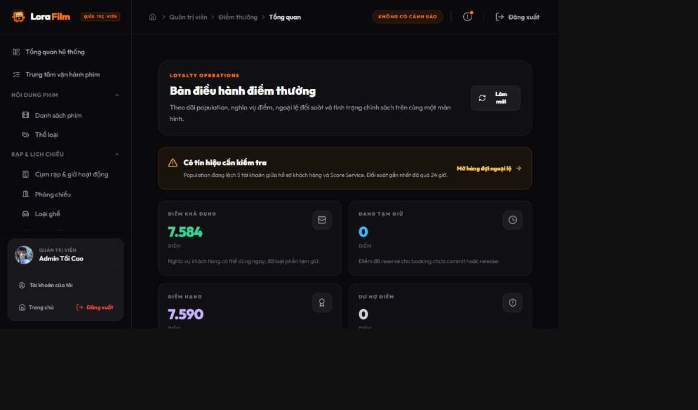
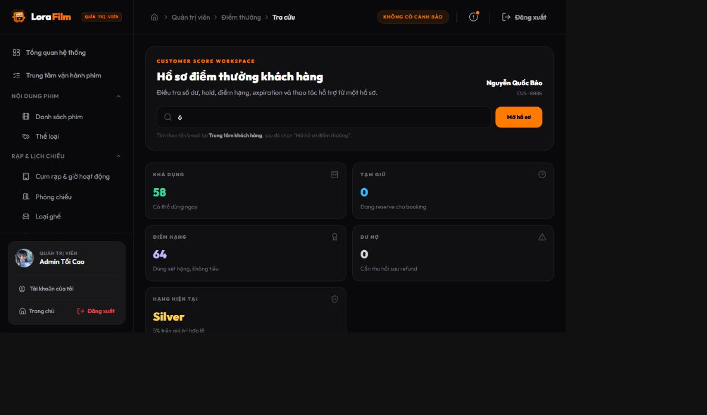
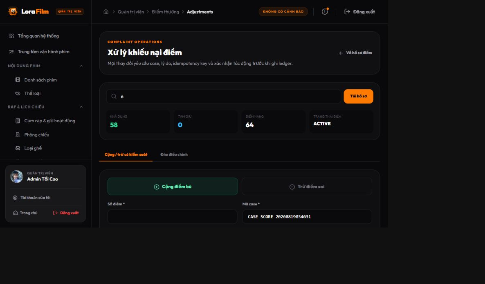
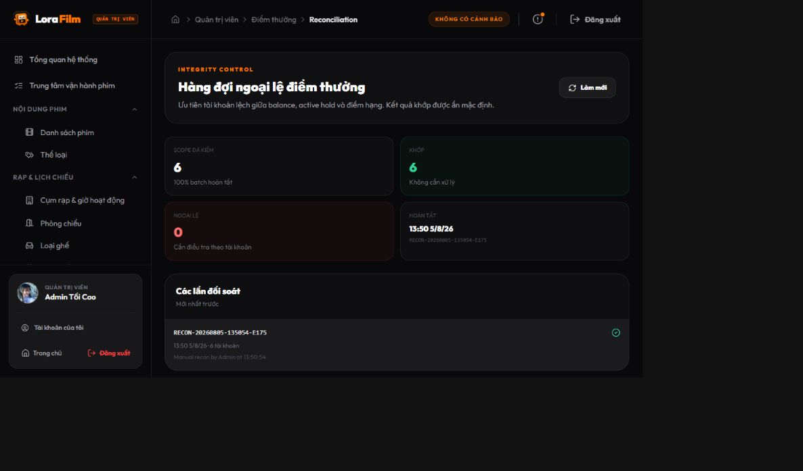
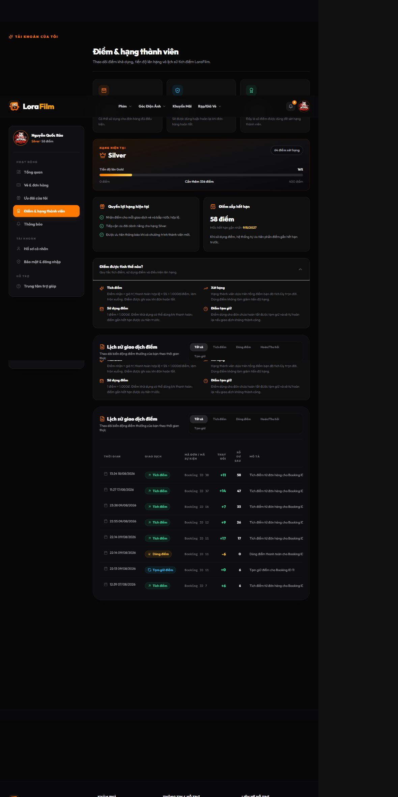

# Audit vòng đời Score Service — 19/08/2026

## Kết luận điều hành

Sau hai vòng audit/refine (gồm phản hồi mentor), module đã **đủ rõ ràng để demo và đưa vào UAT trên dữ liệu seed**. Đây chưa phải kết luận “UAT hoàn tất”. Luồng chính không còn là các màn CRUD rời rạc: admin có thể phát hiện bất thường, tra khách theo thông tin quen thuộc, kiểm tra sổ giao dịch, điều chỉnh có kiểm soát, đóng băng riêng tài khoản điểm và theo dõi đối soát theo từng loại hàng đợi.

Module **chưa nên được gọi là production-ready end-to-end** cho tiền thật cho đến khi hoàn thành các gate P0 ở cuối tài liệu. Lý do chính không còn nằm ở hình thức UI mà ở độ phủ dữ liệu và đối soát xuyên service.

## Bằng chứng từ dữ liệu seed

| Chỉ số | Giá trị quan sát | Ý nghĩa vận hành |
|---|---:|---|
| Hồ sơ customer | 3 | Population do user-service trả về |
| Score account | 8 | Population do score-service quản lý |
| Chênh population | +5 | Cần xác minh mapping/backfill trước go-live |
| Score account active / frozen | 8 / 0 | Admin nhìn được trạng thái nghiệp vụ điểm riêng với trạng thái đăng nhập |
| Điểm khả dụng toàn hệ thống | 7.584 | Số có thể tiêu, đã trừ phần tạm giữ |
| Điểm đang giữ | 0 | Nghĩa vụ chưa commit/release |
| Điểm xét hạng | 7.590 | Tách khỏi điểm khả dụng |
| Điểm đã dùng | 6 | Được tính từ ledger thực, không còn hard-code `0` |
| Outstanding | 0 | Chưa có nợ điểm cần thu hồi |
| Đối soát gần nhất | 6/8 account, 75% | `0 mismatch` không đồng nghĩa toàn bộ population đã sạch |
| Customer kiểm thử | Account 6 — 58 khả dụng, 0 giữ, 64 xét hạng | Khớp giữa admin workspace và customer loyalty center |

## Vòng đời admin sau refine

1. **Phát hiện:** “Bàn điều hành điểm thưởng” hiển thị available, held, tier points, outstanding, issued/redeemed/expired, population gap, độ phủ và tuổi của lần đối soát gần nhất.
2. **Định danh:** admin tra theo tên, email, số điện thoại, mã khách hàng hoặc ID tài khoản. ID kỹ thuật chỉ còn là phương án dự phòng cho tài khoản điểm chưa liên kết hồ sơ khách.
3. **Điều tra:** workspace score hiển thị số dư, hold, điểm hạng, outstanding, trạng thái, công thức hiện hành, ledger và snapshot của từng nghiệp vụ.
4. **Điều chỉnh có kiểm soát:** bắt buộc mã vụ việc, lý do và bước xem lại số dư; mã chống gửi trùng do hệ thống tự sinh, không yêu cầu admin hiểu idempotency. Việc ảnh hưởng điểm hạng là lựa chọn riêng có cảnh báo. UI không tự nhận là hệ thống quản lý khiếu nại đầy đủ vì chưa có trạng thái case/owner/SLA.
5. **Đảo điều chỉnh:** chỉ chọn giao dịch điều chỉnh thủ công gần đây và yêu cầu xác nhận; backend chặn đảo lặp.
6. **Giảm rủi ro tức thời:** admin có thể đóng băng/mở lại tài khoản điểm với lý do và mã vụ việc mà không khóa đăng nhập. Khi đóng băng, hành động chủ động dùng điểm và điều chỉnh thủ công bị chặn; hoàn điểm, thu hồi điểm, giải phóng điểm tạm giữ và sự kiện hệ thống vẫn tiếp tục để giữ sổ giao dịch toàn vẹn.
7. **Quản lý chính sách hạng:** UI hiển thị khoảng `0–399`, `400–999`, `từ 1.000`; local/UAT cho phép chỉnh có xác nhận, còn production build mặc định chỉ đọc. Version/effective-time vẫn là gate trước khi cho phép policy write ở production.
8. **Đối soát:** tách rõ tiến độ lần chạy (6/6, 100%), độ phủ hệ thống (6/8, 75%), tài khoản chưa kiểm tra (2), chênh lệch số dư (0) và lệch liên kết hồ sơ (5). Mỗi nhóm có hàng đợi và CTA riêng; màn rỗng không còn ngụ ý toàn hệ thống sạch.
9. **Truy vết:** nhật ký admin ưu tiên thời gian, người thao tác, khách/phạm vi, nghiệp vụ, lý do/mã vụ việc và kết quả; mã action, HTTP, IP, correlation và payload được đưa vào drawer kỹ thuật.
10. **Điều hướng:** nhóm “Khách hàng & điểm” còn bốn điểm vào: Trung tâm khách hàng, Bàn điều hành điểm, Chính sách hạng, Kiểm soát & nhật ký. Viewer/adjustment/audit là drill-down theo ngữ cảnh.

## Vòng đời customer sau refine

1. Booking/payment hợp lệ phát sinh điểm theo công thức: `giá trị hợp lệ × tỷ lệ hạng ÷ 1.000đ`, làm tròn xuống.
2. Khi dùng điểm cho đơn chưa hoàn tất, điểm chuyển sang **tạm giữ**; sau đó commit nếu thành công hoặc release nếu thất bại/hủy.
3. Customer luôn thấy riêng **điểm khả dụng**, **điểm tạm giữ** và **tổng điểm xét hạng**; dùng điểm không làm giảm tiến độ hạng.
4. Sổ giao dịch có bộ lọc tích/dùng/hoàn-thu hồi/tạm giữ, dùng nhãn `Mã đặt vé` thay vì giả định ID nội bộ là mã đơn công khai.
5. Điểm được quản lý theo bucket hết hạn, ưu tiên dùng lô gần hết hạn trước.
6. Refund/revoke/expired/manual adjustment đều có nhãn nghiệp vụ phía customer; trạng thái score bị khóa có banner riêng.
7. Tổng quan tài khoản chỉ chọn suất chiếu ở tương lai; dữ liệu kiểm thử hiện hiển thị đúng “Chưa có suất chiếu sắp tới”.

## Các sửa đổi kỹ thuật quan trọng

- Dashboard lấy số phát hành, đã dùng, hết hạn và trạng thái đối soát từ repository thay vì số giả.
- Sửa invariant đối soát điểm hạng: cộng chênh `accumulatedAfter - accumulatedBefore`, không cộng mọi giao dịch ledger dương. Vì vậy hoàn điểm dùng (`REFUND_REDEEM`) không còn làm phình điểm xét hạng.
- Enrich response admin với available/held/outstanding/status, source, case/correlation, snapshot rate/tier/balance.
- Bổ sung API freeze/unfreeze score account có audit và outbox event.
- Freeze chỉ chặn hold/redeem chủ động và manual adjustment; earn/refund/revoke/release/commit do hệ thống vẫn chạy. Có test khóa tài khoản nhưng vẫn nhận earn, đồng thời chặn redeem.
- Bổ sung API phân trang danh sách tài khoản điểm để UI chỉ ra chính xác account chưa đối soát và account chưa liên kết hồ sơ khách.
- Export score yêu cầu quyền `SCORE_EXPORT`, có audit xuất dữ liệu và chống CSV formula injection. Export danh sách khách có xác nhận cảnh báo PII và cũng chống CSV formula injection.
- Ledger mới ghi snapshot đầy đủ cho earn, hold, commit, release, redeem, refund, revoke và expiration.
- Liên kết theo ngữ cảnh customer → hồ sơ điểm → điều chỉnh có kiểm soát/nhật ký/đối soát giúp giảm tra cứu thủ công bằng ID kỹ thuật.
- Công thức customer được sửa theo đúng backend; loại bỏ claim sai “10.000đ = 1 điểm”.

## Gate còn lại trước go-live

### P0 — bắt buộc

1. **Khép population:** xác định vì sao user-service có 3 customer nhưng score-service có 8 account; backfill hoặc loại orphan rồi chạy đối soát đủ 100%.
2. **Đối soát xuyên service:** lần đối soát hiện xác nhận ledger ↔ projection/hold nội bộ. Cần thêm invariant đối chiếu booking/payment/refund source event để phát hiện giao dịch gốc bị thiếu, trùng hoặc sai trạng thái.
3. **UAT write-flow xuyên service:** ký nghiệm thu cho booking → giữ điểm → payment → ghi nhận/hoàn điểm → refund/revoke, gồm retry, event trùng, out-of-order, timeout và partial failure. Automated test đã pass nhưng không thay thế UAT tích hợp trên môi trường triển khai.
4. **RBAC/PII/export:** review ma trận quyền thực tế tại gateway và từng service; kiểm chứng masking email/phone/CCCD, quyền `SCORE_EXPORT`, audit tải dữ liệu và giới hạn phạm vi theo vai trò.
5. **Lịch đối soát và SLA cảnh báo:** chạy tự động theo lịch, cảnh báo khi coverage < 100%, run quá hạn, mismatch hoặc outbox thất bại; manual run chỉ dùng cho điều tra.
6. **Backfill dữ liệu lịch sử:** các giao dịch seed cũ (đặc biệt HOLD) chưa có held/rate/source snapshot chính xác. Code mới bảo đảm event tương lai, nhưng dữ liệu cũ cần migration nếu giữ khi go-live.

### P1 — hardening vận hành

1. Maker-checker/approval cho điều chỉnh vượt ngưỡng, thay đổi policy hạng và unfreeze account nhạy cảm.
2. Version/effective time cho chính sách hạng để có thể schedule, rollback và giải thích chính xác policy tại thời điểm giao dịch.
3. Case management đầy đủ (nếu nghiệp vụ thực sự cần): trạng thái, người phụ trách, SLA, evidence/attachment và quyết định cuối. Nếu không, giữ tên “điều chỉnh có kiểm soát”.

## Quyết định business còn mở

Các mục sau không nên để frontend tự suy đoán; cần Product/BA/Finance chốt và đưa vào acceptance criteria:

1. **Eligible amount:** tích điểm trên tiền vé, bắp nước, phí, thuế và phần sau voucher/promotion theo công thức nào.
2. **Vòng đời hạng:** điểm xét hạng là trọn đời, theo năm dương lịch hay rolling window; điều kiện giữ/giáng hạng.
3. **Thời điểm khả dụng:** điểm được phát hành khi thanh toán, khi vé được sử dụng hay sau thời gian hoàn/hủy.
4. **Dư nợ điểm:** có chặn dùng điểm mới, tự cấn trừ earn tương lai hay cần thu hồi thủ công; SLA và cách hiển thị cho customer.
5. **Semantics đóng băng:** bản hiện tại chọn chặn hành vi chủ động/manual, không chặn system compensation. Quy tắc này cần owner nghiệp vụ ký xác nhận.

## Dữ liệu UAT đề xuất

- **Hồ sơ sạch:** customer ↔ score liên kết đủ, ledger đầy đủ, đối soát khớp, không outstanding.
- **Hồ sơ bất thường:** thiếu liên kết hoặc chưa đối soát, có hold/outstanding/mismatch để chứng minh alert → queue → viewer → audit hoạt động end-to-end.

## Kiểm chứng đã chạy

- Client production build: **pass** — Vite, 2.275 modules.
- ESLint toàn client: **pass**.
- Client score tests: **4/4 pass**.
- Backend score-service full suite: **106/106 pass**.
- Live UI audit bằng hai vai admin/customer: **pass cho read-flow và navigation**. Browser audit không ghi dữ liệu: không submit điều chỉnh điểm, freeze hay manual reconciliation. Write-flow đã được kiểm chứng bằng automated integration tests nhưng **UAT write-flow vẫn pending**.

## Ảnh audit

Ảnh dưới đây là bộ bằng chứng audit trong cùng thư mục (đường dẫn tương đối, có thể mở khi gửi nguyên thư mục/repository). UI đã được re-audit sau feedback mentor; một số ảnh cũ vẫn dùng nhãn trước khi đổi “khiếu nại” thành “điều chỉnh có kiểm soát”.

